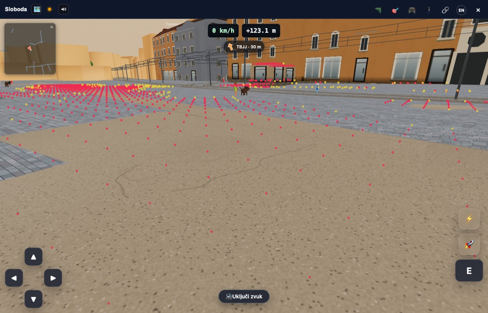
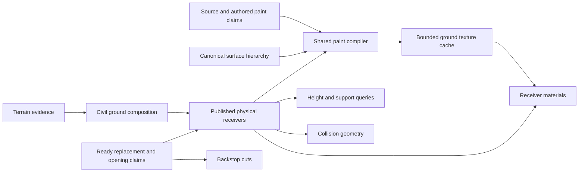
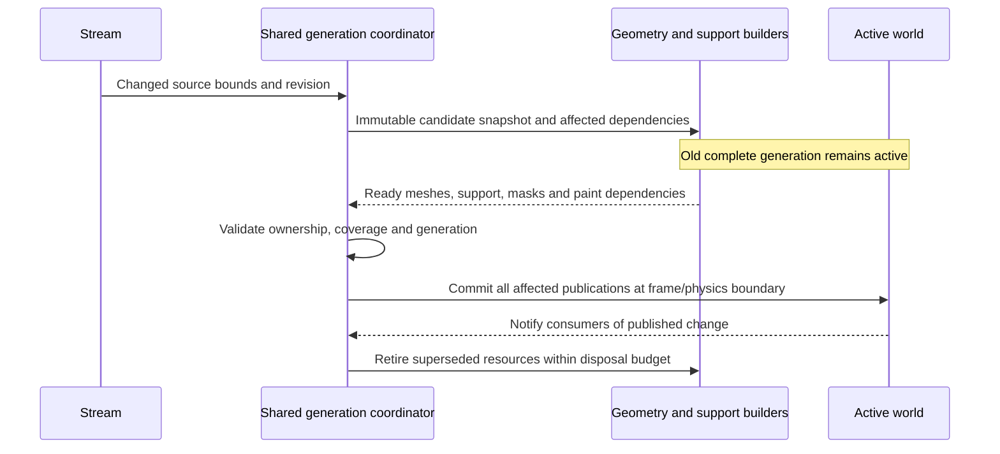

# Station3D ground hierarchy: reviewed implementation plan (2026-09-11)

Station3D model world. Reviewed against local `main` at
`e6d5749c3f4cf9745a1d6f7488006386aaf8ad4a`, including the uncommitted surface-audit tooling,
on 11 September 2026. **This is the implementation specification. The first integrated paving/shared-ground
increment is deployed as `3c61a248`, with publication repair `5035de3e`; wider appearance migrations and full-plan acceptance remain.**

For a short step-by-step status and remaining effort estimates, use the
[ground engine delivery tracker](station3d-ground-delivery-tracker.md). This document retains the
architecture and detailed acceptance requirements.

## Recommendation

Keep the direction: **compose the appearance of surfaces sharing the same physical ground, instead of
making independently draped colour meshes compete in depth.** Keep the existing semantic hierarchy and
civil-ground authorities. Add a shared paint compiler and bounded texture cache beneath those contracts.

The important qualification is **one receiving surface per physical patch and level**, not one height or
one colour at every X/Z coordinate. A bridge deck, the road below it and a tunnel floor can overlap in plan.
A raised pavement, rail formation, quay or road crown is physical geometry even when its top looks flat.
The compositor changes appearance; it cannot establish their shape or replace their collision surface. Openings,
receiver ownership, support, collision and publication belong to the shared simulation engine and its contracts;
they must remain independent of viewport, DPR, browser and device. Presentation policy may select resolution or LOD.

The draft identified real defects, but needed these corrections before implementation:

1. Separate **colour, support and backstop removal**, using the existing claim capabilities. Painting a
   road must not make bare terrain the universal driving surface.
2. Bind paint to a **receiver and vertical band**. A global rank texture cannot represent stacked roads.
3. Publish terrain, its matching sampler and dependent contact/support geometry as coherent generations.
   Moving the terrain notification after its own mesh swap alone leaves other layers stale.
4. Prove the compositor in a small, representative vertical slice before migrating whole categories.
   Existing roads are already batched; fewer meshes do not establish a frame-time improvement.
5. Budget **all** textures, mip levels, staging resources and update work. “One cascade per frame” does
   not bound either CPU or GPU cost.
6. Repair audit blind spots and retain independent geometry/raster checks before using its zero count as
   a release gate. Remaining mesh layers must participate from the first cutover; campaign bakes are
   regenerated downstream from the completed shared-engine contract.

**Direction check, 12 September:** retain this architecture, but constrain the next implementation unit.
Finish the partial rail read/cancellation changes already underway, then deliver a complete production
ground slice at Jelačić: explicit physical receiver, receiver-bound paint, matching support/removal inputs
and bounded publication/cache updates. Use shared engine rules and ordinary source identities; the location
is a validation fixture, not a hard-coded world exception. Admit the dependencies that actually contact
that receiver. Do not expand prerequisite cleanup to unrelated world consumers before demonstrating this
end-to-end slice. A public terrain-provider replacement still requires its full consumer contract; keep
that replacement scoped until it is satisfied, rather than weakening the contract to obtain a screenshot.
The slice must preserve support and coverage, reduce its migrated visible conflicts and pass comparable
movement/update-cost tests before category-wide migration. The embankment and underpass/stacked-deck
cases remain required before wider cutover. Regenerate and validate campaign bakes after the shared-ground
work; existing terrain/drawing artifacts do not constrain its design. The existing GPU prototype and stationary v17 capture
do not satisfy these gates. Desktop/native movement and update performance remains an explicit acceptance gate;
device tuning and the final phone check follow engine cutover and are not prerequisites.
Screen size, pixel density and the consuming application may select renderer quality and cache budgets;
they must not change ground ownership, height/support queries, removal rules or publication semantics.

## Recorded decisions retained

The decisions recorded in `MEMORY.md` on 11 September remain:

- Work on `main`, without a production feature flag. Each completed cutover removes the old path for its
  migrated scope. A standalone prototype and frozen baseline are validation tools, not two production engines.
- Approximately **100 MB of desktop GPU memory for the ground cascades** was accepted. That is an
  approximate allowance, not evidence that an unspecified attachment layout fits it. The implementation
  must enumerate retained and peak allocations; mipmaps and staging are not free additions to it.
- Terrain becomes the default for Zagreb transit tram/walk too; an explicit `?elevation=0` still disables
  it. Terrain-on operation remains the performance target.
- **12 September clarification:** campaign terrain/drawing bakes are downstream outputs. Define the sound
  shared-engine receiver, rendering and support contracts first, then regenerate the bakes. Do not add
  compatibility adapters or retain old rendering behavior to accommodate existing campaign artifacts.
  Validate the regenerated packs before publishing them with the updated engine.
  The old capture code recursively subdivides and removes terrain triangles around cutouts, so its
  saved topology is not guaranteed to remain a uniform grid. “Arbitrary triangles” meant that saved
  representation, not random or unstructured live terrain. Real openings may still require clipped
  triangles in the final shared receiver contract; that is an engine requirement to solve upstream,
  not a reason to preserve the current bake format or its separate carving rules.
- **Final device decision:** after shared-engine cutover and desktop/native movement acceptance, run one physical
  iPhone 16/Safari validation with the actual iOS/Safari build, drawing-buffer size and pixel ratio recorded.

The 11 September review edited the plan only. Implementation began on 12 September from
`4a042f076886478d171329b0500999a22e23c4bb`; commits and deployment remain separate actions.

## Current implementation status (16 September)

**Delivery reset, 14 September:** retire the earlier 42% estimate. It mixed implemented code,
unaccepted integration and future category migrations, so it did not describe a usable release.
Track the following milestones instead; passing more tests does not advance a release by itself.

| Deliverable | Release state | Evidence / next decision |
|---|---|---|
| Source ownership, formation identity and curb refresh repairs | Included in the production checkout | Ground checkpoint `73959798` is an ancestor of deployed `76f33463`. The read-only release audit checked the server checkout and matching public/docroot build manifest and curb source. This is earlier shipped work, not a new pending release. |
| Receiver paving and coherent ground publication | **Deployed: `3c61a248`, publication repair `5035de3e`** | Four scene checks settle; actual receiver paint/hole proof passes. All three final adjacent production/candidate driving pairs meet the measured mean/p95/stutter and initial resource gates. Five identical-route cleanup cycles return every measured resource to baseline. The isolated 300.3 ms stationary interval and 41–139 s after-stop drain tail remain explicit limitations. See the [integrated release record](station3d-ground-integrated-release-2026-09-15.md). |
| Coastal precision and source recovery | **Deployed: `1f5ffa24`** | Exact final build publishes terrain after a 5 km continuation. Matched moving/stationary cadence has no measured regression; post-movement drain is 33.47 versus 106.68 s. Deployed generated code matches the qualified build after consistent chunk-filename renaming. See the [coastal recovery record](station3d-ground-coastal-recovery-2026-09-15.md). |
| Road/cycle/parking/construction appearance | V15 deployed as `0f73ef18`; underpass correction deployed as `08e9e294` (engine `6d78916f`) | V13 passes 329 grouped headless checks. The 16 September extended pair is valid: moving mean/p95/stutters, stationary mean/p95 and resource growth pass. Stationary intervals over 50 ms are 22 versus 18 (user accepts rounded limit 20, previously 19.8). Both worlds drain without errors. A leaked unit test was removed before timing; all frames and prior attempts remain recorded. V14 reuses the existing dense-cell tree for point support: the retained query tests 120 instead of 3,459 triangles with the same height and no additional persistent index. Its 69 focused checks pass. V14 remains above stutter limits against the retained production capture. V15 additionally chunks marking-buffer conversion/normals and removes a redundant copy; 29 relevant checks pass. Its valid candidate-only capture passes movement, mean/p95, resources and drain. The user subsequently accepts brief 50–100 ms hitches: 22 of 29 stationary intervals fall there. Seven exceed 100 ms versus production six; moving counts are 12 versus 5. The old 50 ms count alone no longer blocks this increment; half-second pauses remain documented. No further unchanged retry is scheduled. The clean-main deployment rebuilt 36 JavaScript modules; explicit generated-name mapping verifies all 36 public modules and 136 import edges against frozen V15 bytes. Per user instruction, candidate checks now reuse production evidence rather than rerunning production for each candidate. V11 checkpoint `36313aca` is pushed to its feature branch. The isolated underpass correction passes 108 headless checks and retains its native coverage proof; its 36 public modules / 136 import edges match the frozen build. See the [appearance checkpoint](station3d-ground-appearance-2026-09-15.md) and [underpass release](station3d-underpass-ground-release-2026-09-15.md). |
| Remaining surface migrations, near detail, obsolete-path removal, regenerated packs and terrain defaults | Unfinished | Separate subsequent increments, retaining the full acceptance requirements below. |

**15 September release decision:** qualify the bounded integrated increment. Moving mean is
24.5–33.5% lower and p95 54.1–60.2% lower across the three adjacent pairs against production
`592859b6`; every pair individually passes its applicable gates, including the stationary capture
with a 300.3 ms interval. That isolated tail was investigated and retained, with no new recurring
counterpart established. Its cause is unresolved. All finite ground/building queues drain with no
generation failures; 41–139 s after-stop completion remains latency work in delivery step 1.
The existing thresholds are unchanged. This qualifies receiver paving and the shared publication
increment; it does not establish the full route/mode/night/detail matrix, every surface migration,
regenerated campaign packs or final device acceptance. Those remain under the requirements below.

The appearance batch is the ordinary road/cycle/parking/construction part of technical step 5.
Tram-corridor colour still belongs to that milestone and will be verified alongside adjoining rail
dressing; releasing the ordinary receiver family alone does not mark all of step 5 complete.

**15 September short-comparison decision (historical):** the frozen appearance build remains held. Waypoints now
match within 0.30 m, but baseline host admission fails (84.6% clean, minimum 90%); raw candidate
moving p95 also exceeds the unchanged limit. The existing camera controller completes the route
in about 13.5 s, so this is a short path check rather than sustained acceptance. Both worlds publish
four ground generations and drain without errors. All raw frames and screenshots are retained.
No new candidate, build or unchanged retry is scheduled; establish a causal blocker before opening
another engine change. See the current [appearance record](station3d-ground-appearance-2026-09-15.md).

The following dated records are historical development checkpoints. Their open gates describe the
capture at that time; use the current release record and delivery tracker for present status.

**15 September, Kambelovac recovery checkpoint:** the supplied project 64 start reproduced
`Terrain storage boundary did not stabilize` before driving. The repair keeps the same four-operation
and 1 mm limits, but nodes edges through occupied Float32 rounding cells before Boolean normalization;
rounding endpoints alone could reintroduce a new intersection indefinitely. Source openings/islands,
complete directed boundaries, winding and shared render/support compilation remain checked.
Camera-window requests now advance independently of failed or active work, coalescing a successor
without repeatedly retrying unchanged invalid input. Cut signatures budget shared ring objects once,
retain a separate reference cap and preserve complete selected geometry under the unchanged source
vertex ceiling. The exact start and a 911 m forward approach pass native verification; six forward-run
generations publish and ground work drains without errors. The 71 focused checks and production
compile pass. This is a local correctness checkpoint, not full-route or frame/resource acceptance.
See the [repair record](../output/terrain-train-project64-repair-20260915/README.md).

The [release-state receipt](../output/surface-audit/ground-implementation/ground-release-reset/release-reset-receipt.json)
records what was inspected. No deployment was performed during this reset. The accumulated local cutover
crosses terrain, road, rail, curb, planner and physics publication; detaching its coordinator is not a safe
small release switch. Preserve that work and finish a bounded stabilization batch instead of constructing
another runtime path to bypass it.

**Immediate batch and stop conditions:**

The latest [scheduling checkpoint](../output/surface-audit/ground-implementation/ground-scene-work-headroom/README.md)
corrects a measured source of publication delay: the scheduler treated display waiting as occupied CPU
time, reducing construction to its minimum even when scene work used about 11 ms of a 25 ms interval.
It now uses measured scene work while preserving aggregate/class allowances and previously charged work.
The focused 41-test batch and production compilation pass. The
[three-pair current-main walking screen](../output/surface-audit/ground-implementation/ground-current-main-walk-v11/README.md)
passes the relative frame-time and stutter gates: mean frame times improve by 5.3–13.0% and p95 by
32.6–33.4%. A subsequent bounded drain capture finishes all queues about 130.8 seconds after movement
stops, with no captured failures. Two mixed generations take 63.040 and 84.220 seconds elapsed. Their
recorded coordinator CPU excludes a separate rail-dressing queue, so the residual is not all idle wait.
The current correction defers building retries against coordinator-held road formations and runs rail
dressing inside the coordinator's existing budget. Its 70 focused checks and compilation pass, but
its valid native check needs about 150 seconds after movement stops to drain. The consolidated compiler's
separate 2 ms cap leaves much of the existing near-work allowance unused. The
[allowance correction](../output/surface-audit/ground-implementation/ground-compiler-share/README.md) lets
the combined queue share up to 6 ms without raising class/aggregate limits. Its 46 focused checks and
compile pass; its valid native run drains about 69.4 seconds after movement stops, with five publications,
no captured failures and movement mean/p95 of 23.836/33.3 ms. This is a single-run improvement; the
completion tail, broader movement cases and remaining scene/resource gates stay open.
Earlier walking pairs with missing recorded inputs are rejected and provide no performance pass.

The next [player-car admission pair](../output/surface-audit/ground-implementation/ground-current-main-drive-v12-screen/README.md)
is rejected for a real candidate failure: generation 2 reports `ground-topology-precision` because a
terrain input opening/island collapses in Float32 storage, and the loading watchdog times out. The
previous ground stays published. Movement numbers from that incomplete world cannot qualify performance.
The [bounded capture](../output/surface-audit/ground-implementation/ground-drive-retraced-ring/README.md)
identifies an exactly retraced ten-point path, which has no filled interior. The guard now checks exact
directed-edge cancellation before diagnosing a lost opening; real collapsed geometry and the 1 mm
precision limit remain protected. The captured regression and 67 focused checks pass, as does compilation.
The corrected drive reaches proper ready in 62.639 seconds and publishes five generations without a
ground failure. Its capture still fails acceptance: 30 later lane-marking road-graph URLs were missing
from v12, and construction does not drain within the additional 180-second observation. Sealed v13
completes the raw road-graph horizon; the comparison driver's separate fixture-metadata omission is
also fixed. The scheduler admission correction removes a callback-order stall while retaining overrun/fairness
protection; 59 focused checks pass. Its native check reaches ready in 51.642 s and drains eight
publications without a ground failure, but still needs six road-surface URLs absent from v13. It remains
invalid for performance acceptance, and complete drain takes 207.450 s after movement stops.

The [requested-source batch](../output/surface-audit/ground-implementation/ground-requested-source-batch/README.md)
addresses fragmentation of one requested corridor across several generations. Once the coordinator
owns publication, admission captures a bounded requested tile set, including pending payloads, before
capturing source dependencies and changes. Later requests cannot enlarge that set. Existing frame,
network, retry and decoded-input limits remain. The old code fails the finite-corridor regression;
52 focused checks and compilation pass. Sealed v14 supplies the complete road/building dependency
envelope (9,716 verified responses). Its integrated driving capture is valid: 50.632 s to ready, five publications, no captured errors and
all 50 timed host samples clean. Ground and scheduled queues drain 136.542 s after movement stops. The completion tail
remains substantial. The matching v14 current-main pair is valid with 50/50 clean timed host samples
in each capture: movement mean/p95 improves from 31.789/58.3 ms to 25.492/34.1 ms, and intervals over
50 ms fall from 163 to 13. This single pair does not establish complete release acceptance. Resource
counts need equally settled source coverage; final diagnostics collected after an extra candidate drain
must not be treated as timed-endpoint counts. The active scheduler follow-up explicitly distinguishes dependency waits from next-frame yields.
Held building jobs lend unused shares to runnable producers with bounded retry probes; GPU/frame
pacing and the aggregate/class caps retain their normal behavior. Seventy-four focused checks pass.
A broader all-DEFER experiment timed out; a subsequent 30 Hz display preflight on low battery prevents
attributing its longer frames to the code. The powered comparison starts both scenes with 1,118
buildings: movement mean/p95 is 33.520/64.780 ms on main and 29.689/40.900 ms on the candidate;
settled mean/p95 is 29.634/45.480 and 31.694/34.400 ms. This is one compatible pair.

**15 September completion-check correction:** the ground-drain observer omitted the independent
building replacement and aggregate-assembly lifecycle. At its reported completion, this candidate
still had 41 terrain rebuilds queued behind two active replacements. The preceding requested-source
capture likewise did not prove complete world drain. Preserve those raw reports and their timed
evidence, but withdraw the all-world completion interpretation. Startup and post-timing checks now
require idle building construction, reservations, replacements, invalidations and aggregate assembly;
13 focused harness checks pass. The same frozen candidate subsequently **passes the corrected
completion check**: four publications, 1,411 buildings, zero pending construction, replacement or
aggregate work, and stable full drain 90.917 s after movement stops. All 49 timed host samples are
clean, with no captured errors; the largest captured coordinator visit is 44 ms. This continuation
used draw-attribution diagnostics: it proves finite completion, but its elapsed and frame costs
include instrumentation effects. See
[the completion record](../output/surface-audit/ground-implementation/ground-building-drain-v14/README.md).

A long frame again includes heavy pedestrian support queries. The bounded correction excludes
hidden subtrees before roof raycasting and supplies merged meshes with the bounding boxes already
computed during assembly. It preserves the exact eligible roof triangles and passage/water/ghost
rules. Forty-seven focused checks and compilation pass. The draw-attribution capture still has a 381.7 ms
movement interval and takes 137.983 s after movement stops to fully drain. This correction does not
establish frame-tail acceptance. The follow-up bounded idle-cache retirement lowers the initial
source-façade cache peak from 585.5 MB to 206.4 MB at the same 1,118 buildings, but creates more cache
entries. That capture used **draw-attribution diagnostics**, not the normal timing observer;
its 708.1 ms interval and 330.175 s completion tail include instrumentation effects, including on
adaptive construction budgets. It is not accepted for release and cannot establish normal-runtime
timing. Different driven poses/coverage and one busy host sample further prevent attributing the
change to cache trimming alone. See the [delivery tracker](station3d-ground-delivery-tracker.md)
for the current gate and withdrawn timing forecast.


The latest [terrain residency correction](../output/surface-audit/ground-implementation/ground-terrain-window/README.md)
reuses the published physical graph for unchanged-evidence window updates. Its native 13-tile update
takes 5.35 seconds / 88 ms compiler CPU, versus 33.22 seconds / 888 ms for the earlier window transition;
49 tiles and the other receivers remain published. Explicit GPU waits and bounded rail-to-road grade
invalidation are also implemented. Headless boundary checks and the short ordinary walk pass, but
mixed streamed-source generations remain too slow. The next work is their repeated physical preparation;
this window result does not admit the complete paving cutover or later migrations.

**18 September, Kambelovac → Split residency correction:** project 160 reproduced the visible loss at
km 36+0. Rails and buildings kept streaming, but the initial 49 terrain receivers ended while one mixed
road/rail generation remained private at 1.26 million steps / 74.8 seconds CPU. Residency obligations now
form a priority transaction: they reuse the currently published physical graph and its exact cutouts,
may preempt an unpublished mixed preparation, and continue at transit speed while the physical source
closure stays pending until movement slows. The same headed run retained terrain at km 36+765 and had
published seven generations. A separate captured cutout triangle exposed a storage-halo boundary contact;
zero-area contact outside the receiver is now omitted while any collapsed opening with positive receiver
area still fails closed. The focused 65-test batch and production build pass. This closes the visible
run-out mechanism; bounded mixed-source preparation remains the architectural latency work below.

**19 September, moving rail-window correction:** the same route exposed a second, independent horizon
at about 3.5 km from the start. Coordinated mode disabled the rail layer's ordinary moving-window rebuild,
while the priority terrain leaf continued to recenter terrain alone. The cab followed the authored
EVRF2000 profile past the fixed rail cells, exact rail openings and rail collision, so it eventually ran
under newly resident terrain. A residency publication now recompiles the already-published rail feature
set at the current 400 m center and atomically publishes rail meshes, exact rail cutouts, terrain and all
three collision families. It does not re-solve the alignment or consume pending streamed source changes.
The single headed route check ran continuously from km 34+280 through km 40+807. The rail center advanced
from `(0, 0)` to about `(6001, 1494)` across 24 published ground generations with zero hard failures;
rails, formation and the open cutting remained visible at the reported km 40+705 failure point.

The subsequent [construction reuse batch](../output/surface-audit/ground-implementation/ground-source-reuse/README.md)
adds retained construction forks, order-stable terrain-cut signatures and byte-bounded small-geometry
upload batches. Its ordinary-world inspection reached 13 published generations with no ground failures,
but initial mixed-source updates still took 42–72 seconds. The final native export was blocked by the
automatic approval review service's usage limit, so there is no complete receipt or final queue-empty
claim. Follow-up local fixes take construction reuse from the latest published graph and distinguish
actual road recompilation from unchanged aggregate neighbours in telemetry. Browser access has since
resumed; the coastal checkpoint and remaining performance blocker are recorded below.

1. Route late managed rail refreshes to the shared owner; the ordinary publisher must not retain a
   request that only the disabled ordinary frame loop can consume.
2. Fix update fan-out before increasing budgets. The bounded alignment correction now preserves
   distant road profiles and their geometry generations while rebuilding affected support. Its real-model
   regression fails on the old implementation and passes on the correction. This removes one cause of
   fan-out; it does not establish timely updates for the complete coordinator.
3. Verify the enabled cutover's affected consumer contracts and one integrated release candidate.
   Station/water openings and supported planner modes cannot be waved through merely because the
   Jelačić fixture passes. Add only fixes required by this enabled path; do not start the later category
   migrations or near-detail work while this release is blocked.
4. Run fast headless tests for the completed batch, then one headed inspection and matched
   current-main movement/performance comparison. Re-run only the failed or materially changed scenario.
   Preserve the existing evidence rather than rebuilding a new frozen browser site for each small edit.

Release acceptance still requires correct visible ownership, physical support/openings and finite,
localized streaming work, with the performance limits below. A successful screenshot or capacity increase
alone is insufficient. If the integrated result exposes another broad architectural prerequisite,
reassess the release boundary before extending the refactor. Report the next deployable increment as soon
as these gates pass; completion of every later migration is not a prerequisite for that notification.

**Result of the combined stabilization check:** the 243-file headless batch passes all 1,866 tests
across the initial run and one localhost-permission retry; production bundle compilation also passes.
One headed ordinary-world Jelačić session then completes 13 generations with no captured page errors,
no ground failures and empty ground/network queues. A normal-control 40.46 m walk records no ground
miss, floor guard or airborne sample. The source's 1,614 recorded hashes remain unchanged during the run.
However, the streamed corridor generation still takes **217.60 seconds elapsed / 9.37 seconds compiler
CPU** and stages **34,867,088 bytes of road geometry**. This is a different, ordinary-world fixture from
the earlier synthetic planner route; do not report it as a percentage speedup over v83. The short walk
is not sustained movement-performance acceptance. The browser run stopped at this failed latency gate;
repeating later scene gates or a full baseline comparison would not make this candidate releasable.
See the [combined check](../output/surface-audit/ground-implementation/ground-release-reset/native/README.md).

**Architecture correction before further cutover:** keep one shared ownership/support contract, but
make its transaction unit the affected physical dependency closure. A local update must not require
re-preparing the loaded world's unrelated receiver/support tables or holding whole source families
until that work completes. Use the existing identities, retained reads and aggregate partitions to
prepare affected resources and reuse unchanged publications. Establish the actual preparation/wait
breakdown and transaction bounds before another implementation batch; do not try to make this pass by
raising the candidate ceiling or frame budget. Source capture, publication and invalidation must use the
same bounded dependency set. A change that exceeds that set needs an explicit spatial partition or
documented dependency expansion, with its real physical neighbours kept coherent. The existing whole-world
coordinator integration is preserved locally while this boundary is corrected; later surface migrations
remain on hold. This is a change to execution and transaction granularity, not a second set of ground rules.

| Steps | Status | Remaining work before acceptance |
|---|---|---|
| 0–2: evidence, identity, curb invalidation | Largely implemented and verified | Repeat their applicable scene checks on the final integrated source. |
| 3: coherent ground generations | Integrated; acceptance in progress | Planner, station and water/coast adapters connected. Accept station/coast behavior and the explicit flat-world planner path, finish remaining geometry/support consumers, and verify refreshes during movement with bounded preparation/publication. |
| 4: compositor proof and first paving cutover | Production paving slice implemented locally | Complete Jelačić, embankment, underpass and stacked-deck visual, support, coverage and comparable movement gates. |
| 5–8: category migrations and near detail | Pending | Migrate each receiver family after step 4 passes; preserve physical geometry and validate markings in motion. |
| 9–10: retirement, regenerated packs, default terrain | Pending | Remove obsolete paths, regenerate campaign packs downstream, verify five teardown cycles, then validate terrain-on defaults. |

The shared coordinator publishes terrain, road/rail formations, road structures, road/rail/curb
receivers, planner civil structures/openings, ownership masks and required vehicle colliders at the
pre-controller boundary. Authored Grić openings and clipped road structure floors use the same topology
and captured physical support. The planner now enters this coordinator through bounded preparation;
its source callbacks enqueue work and its root, support, masks and query state advance together.

The v81 source passes **1,860 headless tests across 242 files**, with unchanged hashes. Regressions cover
actual Three geometry and Rapier publication/rollback, cancellation through shader preparation, missing
terrain evidence, sloping excavation bottoms, and actual walking support. Detached receivers classify
opening applicability from identity/vertical relation while retaining unpublished renderer permissions.
Their clipped material variant bypasses the obsolete planner bitmap channel without mutating active
materials or duplicating textures.

The latest completed [native checkpoint, v81](../output/surface-audit/ground-implementation/ground-planner-support-v81/native/README.md),
publishes three complete generations for a descending, bent planner route, with zero failed generations,
no pending ground/network work and no captured page errors. Bounded probes agree between actual floor
triangles, opening lower boundaries and walking support. The planner returns no floor beyond its physical
edge; ordinary outside-ground recovery remains separate. A recorded 25.185 m return walk through the
normal keyboard handler ends exactly on published support, with no ground miss or floor guard. This
is controller correctness evidence, not a matched movement-performance run.

The synthetic v80/v81 route supplies mode-less local levels with terrain enabled. The normal planner
caller, `transit.js:plannerCabTrackElevationProps()`, supplies absolute EVRF2000 heights in terrain-backed
model sessions, ASL in photo sessions, and mode-less levels only in the explicit flat world. Consequently,
the synthetic route's rail/civil height mismatch (about 1.05 m at one probe) is a fixture/API mode mismatch,
not evidence of a regression in ordinary absolute-height planner sessions. Do not change the shared height
semantics merely to make that mixed-mode fixture pass. Its publication, physical-floor and opening probes
remain useful bounded evidence; native acceptance must also exercise the actual supported caller modes.
The station opening adapter now joins the shared boundary after rail construction and before receiver
clipping. Its lower boundaries follow actual upward floor triangles, and geometrically clipped receivers
skip the old analytic entrance discard. The 71-test station batch and production bundle compilation pass;
the publication fixture controls the visual factory/GPU driver while using real geometry/query/Rapier
code. The actual instanced surface-cut access factory is now checked through a 7.18 m deep cut; full
station/native acceptance and the remaining consumers are pending.

The 14 September coastal increment captures vector sea faces and coastal construction privately. Its
terrain openings start at the stored replacement faces; island holes and finite source windows remain
intact. Roads and viaduct foundations consume the candidate coastal inputs. Urban quays classify against
candidate road faces. Final coastal ground uses the same ordered terrain cut compiler as the DTM, and
its clipped support joins the shared collider publication. Construction retains its pre-earthwork ground
so a road does not consume its own removal on the next solve. Source changes with identical stored
coastal geometry retain the geometry, masks, support and civil registration. Coast evidence preparation
yields; source/geometry limits remain independent of display quality. Raster water removal is disabled
for terrain whose exact openings have been compiled.

The focused 177-test coastal/station/dependency batch passes in 0.95 s, and the production bundle compiles.
This includes actual coast/quay factories and Rapier publication, rollback, cancellation, removal, changed
earthworks and GPU-fence cleanup, with materials/GPU execution controlled in headless fixtures. It does
not establish native visual or frame-time acceptance. A dense synthetic coast exposed Float32 boundary
collapse; triangulating the stored boundary fixes it. The unsimplified 2,048-vertex stress case still took
about 1.36 s of compiler CPU across cooperative visits, and a cold simplified case had a 27.9 ms maximum
visit. These diagnostic costs remain subject to the performance gate; they are not a passing frame-time
receipt.

The [verified entrypoint checkpoint](../output/surface-audit/ground-implementation/ground-entrypoints-verified/README.md)
records proper station ready in 77.287 s across three publications and flat planner ready in 28.171 s,
with drained queues and no captured page/ground failures. The station cut is 5.998923 m deep with 36
instanced treads; floor query versus mesh support differs by at most 1.49e-7 m, and all 36 probes just
above the treads lie in the opening union. Three probes 1 cm below treads remain inside the combined rail/access opening
union. Flat planner floor query versus mesh support differs by at most 4.62e-14 m. This is static
physical agreement, not a controlled stair walk or full visual release; steps 1–3 remain open.

The earlier [native coastal checkpoint](../output/surface-audit/ground-implementation/ground-native-fixed/README.md)
finishes seven publications with empty ground/network queues and no captured page or ground failures.
Its normal-control 41.44 m promenade walk has no ground miss, floor guard or airborne sample. This
verifies the fully removed terrain-tile publication and Float32 normalization correction in the real
scene. That run still fails the performance gate: mixed generations take 30–45 s and three new rail-source
admissions take 161–224 ms in one main-thread visit. A spatial nearest-segment index preserves exact
nearest/tie behavior, and a single-result cache avoids resolution for unchanged source inputs. The next
correction makes dense context matching, coverage clipping and tunnel clearance resumable under the
existing generation queue, holding and releasing the source lease across yields. Synchronous callers
drain the same compiler. The expanded 140-test batch and production compilation pass. The
[native follow-up](../output/surface-audit/ground-implementation/ground-rail-source-slices/README.md)
finishes seven publications without failures, all preparation visits below 50 ms (maximum 47.4 ms),
and a supported 40.15 m walk. Mixed generations still take 34.5–51.6 s. This clears the observed rail
source visit blocker, not the complete performance gate.

**Loading-phase scope, 14 September:** the user explicitly permits aggressive construction while the
opaque loading screen freezes play. Initial source selection must request the same finite ring and
view corridor that an unchanged pose will need after reveal. Deferring that corridor until gameplay
unnecessarily moves startup work onto movement budgets. Loading may therefore use a larger bounded
construction allowance, with regular event-loop returns for downloads, Worker replies and progress UI;
interactive budgets and cooperative item limits remain in force during play. The new source-delivery
gate complements existing geometry/publication queues and excludes the optional far-building horizon.
Native verification caught two additional restrictions: source admission waited for all old builders
before sealing their input, and the four-tile delivery buffer kept downloads idle during construction.
Admission now seals first, waits for that captured work, then transfers ownership; held sources may
buffer up to 32 tiles while loading. The reveal condition also includes the coordinator's admission,
publication and successor obligations. Small detached geometry uploads now share a loading-only
renderer allowance of 2 MiB, 16 batches or 4 ms per frame, whichever binds first; an existing indivisible
larger geometry remains one upload. Explicit shader/fence waits and interactive upload deferrals remain.
Road and curb admission also retire their legacy initial-tile gates when the shared coordinator takes
ownership. Detailed buildings select their initial view corridor during loading. The 119-test batch and
production compilation pass. Earlier candidates are
[rejected watchdog results](../output/surface-audit/ground-implementation/ground-initial-loading/README.md).
The [complete-view checkpoint](../output/surface-audit/ground-implementation/ground-loading-complete-view/README.md)
reaches proper `ready` in 65.38 s with no data/network/ground backlog, then remains idle for 4.64 s at an
unchanged pose. Its subsequent 40.38 m walk stays supported; four publications finish without captured
errors. All 748 captured runtime source hashes remain unchanged. The 69.95 s post-walk mixed update and
the unmatched full-frame performance results keep the wider release gate open. The user's corrected
65-road-request count does not justify request batching based on the discarded 1,198 figure.

The [v82 checkpoint](../output/surface-audit/ground-implementation/ground-curb-scheduling-v82/native/README.md)
passes **1,862 headless tests across 242 files**, with unchanged source hashes. Curb draping now checks
elapsed time after every vertex, with a 0.5 ms target and a finite vertex ceiling. A controlled full-refresh
pair retains byte-identical buffers for 57 curb meshes and 21 support surfaces. Elapsed time falls from
41.78 to 35.92 seconds and recorded compiler CPU from 5.54 to 4.93 seconds; both host captures report
approximately ×1.10, clean. This is one stationary scheduling comparison on the qualified fixture above.
The older v81 74.57-second and v76 102.1-second publications have different work/arrival histories and
must not be used as its baseline. The v75 one-tile curb update remains localized-work evidence:
17.4 ms compiler CPU without an upstream rebuild.

An isolated GPU readback of an **actual published terrain receiver and its production paint shader/pages**
matches 4,045 paving pixels and 51 intentional-hole pixels. Disabling paint on the private diagnostic
material produces 4,045 failures; the real material remains unchanged. This verifies that receiver's
coverage/material binding, not other surfaces' occlusion or the complete world audit. The CPU audit
continues to report `gpuVerified: false`.

A subsequent 25.795 m normal-control walk records 34 samples agreeing exactly with published support,
without a ground miss or floor guard, while a successor prepares. However, turning into another streaming
corridor exposes a **road replacement capacity failure**: the complete ground candidate inherits the
ordinary publisher's 32 MiB aggregate-group ceiling. Old support remains active, but subsequent generations
fail and the network queue does not drain. The [v83 replay](../output/surface-audit/ground-implementation/ground-road-capacity-v83/native/README.md)
successfully publishes a 42,169,244-byte road candidate (40.22 MiB) under a separate 64 MiB complete-candidate
ceiling; ordinary 32 MiB aggregate groups and individual upload limits remain unchanged. Its 34 walking
samples and final post-publication support agree exactly, without a ground miss or floor guard. However,
that generation takes 301.66 seconds elapsed and 10.73 seconds recorded compiler CPU, and a subsequent late
rail-clearance callback queues a request on the disabled ordinary publisher. This blocks the next shared
generation despite zero capacity failures. The local v84 correction routes that request to the shared
coordinator; its focused tests pass, including a regression that fails with the old branch. Its native
replay is deliberately grouped with the update fan-out correction. The v83 replay establishes the capacity
fix, not queue-drain or movement-performance acceptance.
Timely full updates, the remaining paving/embankment/underpass/stacked-deck cases, matched current-main
movement runs and five teardown cycles remain acceptance requirements.

The [verification history](station3d-ground-implementation-evidence-2026-09.md) retains the detailed source
versions, diagnostics, rejected comparisons, fixtures and receipts. Use the current status above and the
acceptance table below to decide what is complete; historical “pending” notes describe their own version.

## What the existing evidence establishes

### The four saved scene audits

The local reports exist in `output/surface-audit/validate/`, with matching PNGs and a `summary.json`.
They are **ignored local artifacts**, not portable committed fixtures. Their JSON was read back during
this review; the document image was inspected. These were not fresh browser runs of a new
implementation, and they contain no clean-host performance comparison.

Each report sampled 120 × 120 cell centres at 1 m spacing: **14,400 samples**. “m²” below means the
sample count multiplied by 1 m², an estimate of plan area. Pair totals can overlap and must not be added
to obtain unique affected area. “Inversion” is the CPU audit's classification, not a framebuffer readback.



| Pose / report basename | UTC capture time, 2026-09-11 | Unique flagged samples | Selected findings: sampled m² · worst geometric gap |
|---|---|---:|---|
| Jelačić / `zagreb-jelacic-paving` | 16:54:28 | 2,167 | terrain over sidewalk: 1,346 · 30.3 cm; buffered sidewalk over sidewalk: 308 · 12.9 cm; sidewalk/terrain near overlap: 360; floating sidewalk: 58 · 40.0 cm |
| Savska / `zagreb-savska-tram-bike` | 17:01:06 | 733 | cycleway/road near overlap: 502 · paint up to 8.5 mm below road; terrain over buffered sidewalk: 81 · 18.9 cm; possible void: 53; floating carriageway: 28 · 41.4 cm |
| Petra Kružića underpass / `zagreb-kruziceva-underpass` | 17:04:54 | 424 | terrain over buffered sidewalk: 146 · 26.3 cm; road over cycleway: 43 · 10.9 cm; buffered sidewalk over cycleway: 23 · 11.2 cm; terrain over road: 22 · about 10 cm |
| Split Riva / `split-riva-lidar` | 17:08:38 | 4,650 | duplicate sidewalk: 4,379 · equal height; terrain over sidewalk: 463 · 35.1 cm; buffered sidewalk over sidewalk: 75 · 22.8 cm; floating sidewalk: 37 · 95.4 cm; terrain over pedestrian edging: 21 · 1.04 m |

The original headline called all 2,167 Jelačić samples inversions. The JSON contains **1,671 inversion
records**, 434 coplanar records and 62 floating records. The 2,167 figure is the unique flagged total.

Savska has `settled: false`. It is an **incomplete capture, not a lower bound**: later publication can
add conflicts or remove temporary voids and stale geometry. It must be recaptured before setting budgets.
The other three satisfy the probe's current, limited settle heuristic; that is not proof all queues drained.

All reports record an initially loaded detail window. That alone does not establish LiDAR provenance at
every sample: the configured detail source is `best-available`. Future fixtures must retain the source
metadata/mask and resolved lattice, rather than infer source resolution from a pose name.

| Pose | Latitude | Longitude | Heading |
|---|---:|---:|---:|
| Jelačić | 45.813215 | 15.976903 | 143.5 |
| Savska | 45.80305 | 15.96705 | 0 |
| Kružićeva | 45.805671 | 15.992536 | 304 |
| Split Riva | 43.50785 | 16.43915 | 90 |

### Verified implementation facts

This table describes the reviewed baseline; the implementation status above records subsequent changes.

The registry already compiles semantic claims into GPU contracts; it is misleading to say the GPU
“never sees the hierarchy.” The failure is that offsets, stencil, masks, geometry, publication and
support do not consistently implement the same decision for the same physical patch.

| Concern | Current implementation and implication |
|---|---|
| Semantic authority | `core/surface-hierarchy.js` separates colour, support and backstop-cut capabilities. Rank requires a proven same-level relationship; unknown relationships preserve surfaces. Civil design order is separately terrain → rail → road → sidewalk → path → building. Keep these rules. |
| Terrain sampling | `TerrainGrid.sampleHeight()` reads the source with bilinear interpolation. `TerrainReference.sceneYAtLocal()` and its evidence counterpart use the rendered piecewise-planar lattice, including its triangle diagonal. Those are intentionally different APIs. Do not introduce another bilinear support sampler. |
| Terrain resolution | `world/terrain.js` uses 400 m tiles with a 20 m base lattice. The effective Croatia profile requests a best-available detail window of ±550 m and a 4 m mesh lattice. A 1 m source is not a 1 m rendered mesh. Height quantization comes from API `encoding.scaleM`; it is not universally hard-coded to 10 cm. |
| Session policy | `applyAnchorStyle()` selects national Croatia terrain with spatial presentation; the old Zagreb presentation block is not the effective terrain window. Zagreb transit remains opt-in today. Sloboda adds `elevation=1` only when no elevation option was supplied. Required GTA/campaign/scenario/project policies also honour an explicit off switch. |
| Publication race | `TerrainReference.replaceGrid()` changes the reference and synchronously notifies listeners. Base-stream and detail-window paths call it before `queueTerrainTileRebuild()`. Compiler snapshot installation is asynchronous. Published-tile readiness checks exist, but there is no atomic terrain-plus-consumers generation switch. |
| Curbs/manholes | Curbs track rail/road formation and alignment changes, but do not subscribe to terrain changes. Their dependency scan and tile generation controller can be extended. Manholes are merged into curb tiles, so they share the curb refresh obligation. |
| Paving stencil history | `39f76e9a` (19 August) made paving write terrain-replacement stencil. `675c382d` (24 August) correctly stopped real 3D terrain reading those plan-only paving bits: they could erase an intervening embankment. Do not restore that reader. |
| Backstop removal | The formation mask is 3072² over 3200 m, about **1.042 m/texel**. Its operations cover formations/excavations/openings, not ordinary pedestrian paint. `terrainBackstopReplacement` is written in `roads.js` and has no runtime reader. A colour compositor does not replace the formation-cut contract. |
| Existing batching | Roads use regional aggregates, and lane markings already share aggregate geometry. Extra offscreen raster passes, uploads and ground shader sampling must be counted against the draws actually removed. |
| Campaign replay | Capture retains claims but omits raw stencil state. Replay calls `applySurfacePublicationDrawContracts()`, which restores draw order, polygon offset and depth properties, **not** `applySurfaceStencil()`. Formation shader cutouts are carved into captured geometry. New paint therefore needs explicit capture/replay support. |

Principal sources: [hierarchy](../website/station-3d/core/surface-hierarchy.js),
[terrain reference](../website/station-3d/core/terrain-grid.js),
[terrain runtime](../website/station-3d/world/terrain.js),
[locations](../website/station-3d/core/locations.js),
[terrain policy](../website/station-3d/core/terrain-request.js),
[curbs](../website/station-3d/world/curbs.js),
[material authority](../website/station-3d/world/surface-material-authority.js),
[campaign pack runtime](../website/station-3d/world/campaign-world-pack.js).

### Inventory: appearance versus physical geometry

“Flat” below means a material painted on an existing receiver, not a visually horizontal object.
Offsets are current technical values, not proposed physical thicknesses or a guarantee of visibility.
Terrain listeners enqueue/rebuild work; a “refresh” does not mean a synchronous, coordinated swap.

| Producer | Current height / rendering path | Migration treatment |
|---|---|---|
| Terrain | Piecewise-planar 20 m / 4 m lattice; water stencil and formation cutout | Retain the receiver, its support and backstop responsibilities. |
| Grass, parks, forest, land use | Decor drapes, nominal +16 mm, passive stencil reader; greenery can use a 12,000-triangle cap and 32 m edge target | Paint material coverage. Trees and other physical vegetation remain separate. |
| Ordinary carriageway | +20 to +28.4 mm; drape edge target consults local terrain step, with a 1,200-triangle budget | Paint only where the road has no independent physical profile. Keep road surface semantics for friction/navigation. |
| Engineered and aligned roads | Formation/civil/vertical-alignment heights; separate 8,000/2,000 triangle budgets and 4/8 m edge targets | Retain formation/deck/crown receiver geometry and matching support. Paint asphalt onto that receiver. |
| Buffered sidewalks and paths | Usually +43 mm on composed civil ground; buffered paths yield to carriageways by stencil | Paint conforming material. Retain actual steps, ramps, raised tops and structural paths. |
| Explicit sidewalks/pedestrian areas | Usually +43 mm; ordinary road-surface drape budget; pedestrian stencil does not remove 3D terrain | Same receiver rule; preserve physical elevation and polygon holes. |
| Cycleways and bike paint | Nominal +49 mm. Expanded ribbon corners are sampled, but ribbons are not generally refined to the terrain triangulation | Paint on the owning ground/road receiver; preserve raised cycle tracks and crossings. |
| Tram/rail trackbed and flat edging | +75/+81 mm nominal layers; rail chords/render cells, including resampling of long OSM segments; rail prepass | Distinguish material dressing from a physical ballast/formation top. Never flatten rail support or steel/sleeper geometry. |
| Lane markings | 14 cm strips; **3 m dash + 3 m gap**, 6 m texture period; four-corner sampling through a separate height path | Quality-gated paint or a receiver-bound near detail path. Current aggregate mixes vertical levels and declares `UNKNOWN`; split by receiver before migration. |
| Level crossings | Apron corners use bare terrain evidence, ramping from 15% to 100% of the nominal 75 mm offset; paint uses +86 mm | First resolve the actual road/rail crossing surface. Material migration alone cannot correct a wrong height source. |
| Parking / parking markings / construction | Decor drapes at +52/+54/+56 mm | Paint their appearance; retain any real support/relief and existing material semantics. |
| Curbs, curb ramps, manholes | Curb profiles include real relief (typically 18 cm); manholes belong to their curb tile | Geometry; rebuild render and collision from the same published receiver. |
| Edging and terrain seam collars | Pedestrian/passive technical offsets +47/+35 mm; seam collars extend below adjacent ground | Paint only decorative strips. Remove a collar only after its sealing role is unnecessary. |
| Road/rail earthworks, retaining walls | Formation cross-sections and explicit terrain replacement | Geometry and directional backstop ownership; outside the flat paint ladder. |
| Water, shores, banks, quays | Water levels/cutouts plus shore and urban-coast replacement geometry | Separate water/opening contract. A quay top is a receiver; its walls and coastline remain geometry. |
| Bridge decks, underpasses, platforms, buildings/foundations | Structural/alignment/base geometry | Separate receivers where applicable; preserve grade separation, openings and contact geometry. |
| Planner/proposal surfaces | Separate authored heights, drapes and cutouts; planner elevation already has claims/publication | Include as shared-engine producers. “Not registered” was too broad; inventory actual missing claims per path. |
| Catch-all ground plane | y = 0; hidden when terrain is active | Visual backstop only; never invent evidence-backed support from it. |

Implementation sources: [roads](../website/station-3d/world/roads.js),
[decor](../website/station-3d/world/decor.js),
[lane markings](../website/station-3d/world/lane-markings.js),
[level crossings](../website/station-3d/world/level-crossings.js),
[rails](../website/station-3d/world/rails.js),
[planner elevation](../website/station-3d/world/planner-elevation.js).
Google reality-mesh carving remains a separate renderer backend, outside this model-world migration.
Shared claim/publication changes must still avoid regressions in that backend.

### Triangulation and depth: the actual guarantees

The nominal ladder remains non-monotonic: buffered sidewalks are 43 mm above their sampled base while
carriageways start at 20 mm; several later classes are only 2–3 mm apart. Executing
`auditSurfaceLevelLadder()` gives **14 candidate pairs near/below its nominal 3 mm threshold, 12 without
recognized stencil arbitration**. This is not “12 of all 14 possible pairs.” Floating-point rounding
also admits nominally equal-to-3-mm differences. The test needs an explicit threshold tolerance.

With a conventional 24-bit perspective depth buffer, near plane 0.5 m and far plane 2000 m, the approximate
one-bin eye-depth spacing is `d² × (far − near) / (far × near × (2²⁴ − 1))`. The audit uses the
near-equivalent `d² / (near × 2²⁴)` approximation:

| Eye-space depth | Approximate depth-bin spacing |
|---:|---:|
| 50 m | 0.30 mm |
| 150 m | 2.68 mm |
| 300 m | 10.73 mm |
| 600 m | 42.92 mm |
| 1,000 m | 119.21 mm |

These are **precision estimates, not universal minimum world-Y gaps or proof of flicker**. Projection,
view angle, polygon offset, actual framebuffer depth format and draw state matter. The current scene
uses a 0.5–2000 m perspective camera without logarithmic depth. The audit assumes 24 bits instead of
measuring the framebuffer. See [Khronos depth precision](https://wikis.khronos.org/opengl/Depth_Buffer_Precision).

More importantly, agreeing at vertices or using equally small edges does not make two triangulations
coplanar. A headless check using the current terrain builder and plan-triangle query demonstrated this:

- A 4 × 4 m cell has corner heights `(a,b,c,d) = (0,1,1,0)` metres.
- The terrain uses the `b–c` diagonal: its centre is 1 m high.
- Paving with the same vertices, the opposite `a–d` diagonal and +43 mm offset has centre height 0.043 m.
- Terrain exceeds paving by **0.957 m** despite identical sampled corner heights before the offset.

This is a synthetic counterexample, not a measurement of Jelačić. Exact conformance requires splitting at
the receiver's triangle boundaries, or painting directly on that receiver. Raising the refinement cap
alone provides no such guarantee. `refineTriangulatedSurface()` also relaxes its edge threshold when a
pass exceeds the budget, so a requested edge size is not a guaranteed maximum.

The draft's detailed production-data drape table (720/989/1,140 triangles, 81–82 cm errors and uncapped
variants) lacks a retained reproducible input/driver in the reviewed evidence. Those specific results
remain **unverified** and are not acceptance baselines. Step 0 must preserve the polygon, terrain payload,
anchor, refinement settings, source revisions and independent comparison code before using such numbers.

### Identity: stable IDs need correct provenance and lifetime

The observed negative polygon IDs are rejected by `osmElementKey()`. With no GeoJSON feature ID,
`roadFeatureKey()` falls back to `tile:<tile>:<index>`. The Split report contains the same
`-1679868001` footprint in two regional publications at the same height. Jelačić's saved audit has zero
duplicates; the earlier separate claim of four copies is not established by that report.

The proposed unconditional `osm:relation-part:<relation>-<part>` decoder is unsafe. Both importers use
`-(sourceId * 1000 + partIndex + 1)` for relation polygons, but the simulation importer also uses it for
additional parts of a **way**. Road rows do not preserve `osm_type`, and the packing has no part-count
bound check. A negative number alone cannot prove relation provenance.

For existing data, introduce a **dataset-scoped polygon-part identity preserving the exact synthetic
ID**, without inventing an OSM relation link. Keep it separate from ordinary positive way IDs. Detect
conflicting geometry/provenance for one key; do not silently merge it. If an authoritative relation link
is required, carry original type, ID and part identity through the importer/API. New multipart writes
must guard the packing limits or use explicit source fields; part ordinals are only stable within the
source geometry revision.

Deduplication must include tile membership/reference counts, deterministic replacement selection and
generation checks. Evicting one tile must not remove a feature another tile still references. Legitimate
clipped fragments in an endpoint that explicitly supplies stable part provenance may share an entity ID,
but must have disjoint published interiors. **The current `/roads/cab` endpoint does not clip to its bbox.**
Its SQL filters with `ST_Intersects(surface_geom, g)` and returns the full corrected polygon and centreline.
Its taper context is bbox-dependent, so the same full way can have different end shapes in adjacent
responses. Verified Koranska and Držićeva records retain identical full centrelines but different full
polygons in the [portable regression fixture](../website/station-3d/__tests__/fixtures/ground-road-full-variants.json).
A geometry hash is therefore a content revision, not a second owner or evidence of a legitimate fragment.

The client selects one immutable revision from the currently loaded contributions using a stable lexical
revision order and reports conflicting variants. The API supplies no authoritative revision/quality field;
this tie-break does **not** establish which shape is newest or geometrically best. Selection is independent
of delivery order, recomputes on replacement/eviction, and retains the old published geometry until its
successor is ready. The source API's request-dependent taper construction remains an upstream consistency
limitation; frontend deduplication does not prove every selected end shape agrees with `/roads/curbs`.
Removing duplicate draw calls is not enough if duplicate support, cutouts or paint commands remain.

Sources: [entity keys](../website/station-3d/core/entity-key.js), `roadFeatureKey()` and aggregate publication
in [roads](../website/station-3d/world/roads.js),
[simulation importer](../scripts/lib/croatia-simulation-import.mjs), and
the upstream cadastral road importer, `cadastre-data/roads/fetch-osm-roads.js` (`relationPartOsmId()`).

## Target architecture

### Preserve the three independent decisions

| Decision | Authority | Rendering/physics consequence |
|---|---|---|
| Which material is visible here? | Published, same-receiver/same-level paint claims, ordered by canonical rank | Ground material composition; markings can win colour without supplying support. |
| What holds the walker, vehicle or placed object? | Published physical receiver, with height, normal, evidence and reachability | Ground query and collision compiled from the same receiver snapshot. |
| May lower ground be removed? | Explicit directional replacement/opening claim plus ready replacement backstop | Terrain/formation cut or clipping; paint coverage alone never grants this permission. |

Extend the existing claim/publication system, rather than build a second registry in the compositor.
Each receiver is a published terrain tile, civil formation top, raised pavement, deck, floor or quay patch.
A logical receiver can span tiles; render chunks are an implementation detail. Receiver records identify
physical owner, vertical band, bounds, geometry/support generation and readiness.

Geometry storage must preserve a nearby origin from source conversion through
clipping, support capture and collider construction. Subtract that origin before
Float32 storage; add it only in double-precision queries or when rebasing into the
active physics/render frame. A stable geographic anchor does not require large
Float32 mesh coordinates. The existing floating render origin cannot repair
precision lost during earlier CPU preparation. Its current GTA-only capability
also needs review when finishing shared engine defaults. The
[coastal recovery record](station3d-ground-coastal-recovery-2026-09-15.md) documents
the reproduced failures and required origin/ownership contracts.

A paint record needs source entity/part and revision, polygon rings including holes, receiver binding,
surface class, material recipe and bounded invalidation region. Compile its rank from `surface-hierarchy`.
Resolve physical applicability before sorting. `UNKNOWN` does not mean “ground”; bridges and their
undersides must never consume ground paint merely because their X/Z coordinates match.

Two surfaces on the **same bridge deck** may still be rank-comparable, even though both are grade-separated
from the terrain. Resolve the pair's relationship; do not skip all claims carrying a grade-separated flag.
For equal class/rank, remove duplicate identities first. Where distinct real features still overlap,
define deterministic source/style precedence centrally and diagnose conflicting authoritative claims;
network arrival order, material sort order and render-tile ownership must not choose the winner.



**Support is not a texture readback.** Keep a spatial CPU representation of the published receiver and
paint records. Queries return owner/band/generation, height, normal and evidence status; material queries
can additionally supply friction or surface type. GPU colour/rank is not collision evidence. Shader-hidden
triangles must not remain active support by accident.

In GTA, `buildRoadSurfaceCollider()` currently consumes published rendered-road triangles, and the GTA terrain
collider builder already aligns its samples to the terrain lattice. Preserve exact road support for engineered/raised roads.
Only the technical offset of truly conforming paint disappears. Synchronize the replacement collider and
controller support transition; do not let a paint migration reactivate analytic formation fallback over
missing published geometry. Vehicle recovery must continue using the actual Rapier collider.

### Paint appearance, keep lighting live

Paint low rank first, high rank last; disable depth competition in the offscreen paint pass. Preserve
polygon holes and coverage, stable world UV scale/orientation, existing material distinctions, and layer
visibility semantics. The texture holds **unlit material information**, not a screenshot shaded at noon.
Sunlight, lamps, shadows, fog and exposure remain part of the normal receiver shading pass.

The selected paving representation is one R8 categorical material/coverage attachment, with zero
uncovered, and a page-local float recipe table. Full entity identity remains in the CPU index. Fetch
categorical IDs exactly, without colour-space conversion or ordinary colour mip averaging; filter the
eligible materials after receiver/rank rejection. Do not infer ownership from blended RGB.

Repeating patterns are independent of ownership texel density. Keep original pixel detail and stable
world UV scale in a shared, immutable sRGB texture array; receiver shading samples it using explicit
gradients calculated before nonuniform coverage branches. A coarse coverage page must not blur every
stone or concrete grain in its interior. Roughness, metalness and normal influence come from the captured
recipe, while lighting remains live. Revision leases and bounded layer capacity cover both active and
staged recipes. See [Three.js colour management](https://threejs.org/manual/en/color-management.html) and
[DataArrayTexture layer updates](https://threejs.org/docs/pages/DataArrayTexture.html). New material
categories must state any additional attachment, pattern layer or parameter before increasing allocations.

Keep the retained shader modifications composable: urban ground, formation mask,
planner cuts and floating render origin already modify ground materials. The paint adapter must preserve
necessary normal, shadow and cutout behavior. Patch shared material/compiler APIs, not campaign code.
Shadows and contact AO need explicit review: decorative ground should not acquire artificial shadow
geometry, while real curbs, embankments and raised surfaces retain it.

### Cache and scheduling contract

Camera-centred cascades are the initial cache design to prove. They are **not** the semantic source of
truth. One undifferentiated X/Z cache is eligible only for the ordinary ground receiver. Stacked decks and
floors need receiver-isolated pages/patches or a retained receiver-bound detail path with the same policies;
include their allocations and draws in the budget. Do not copy three full cascades for every bridge.

- Anchor texture coordinates to the permanent world frame. Snap cache origins to a texel/page grid and
  add movement hysteresis; moving the camera a fraction of a texel must not repaint the world or make it swim.
- Maintain a spatial index of immutable paint commands. Camera motion updates exposed strips/pages;
  source edits invalidate the union of old and new bounds. A removal clears the dirty region and replays
  **all intersecting contributors in rank order** so the next rightful layer reappears.
- Reuse retained texels with toroidal addressing or bounded page copies. Simply moving an orthographic
  camera and repainting an entire target is not a partial update.
- Count feature processing, triangulation, draw submissions, painted texels, attachment bandwidth and
  mip generation. Reuse the shared work scheduler; split large features into bounded jobs. One cascade,
  one polygon or one `renderer.render()` call can still exceed a frame budget.
- Distinguish cooperative CPU yields from GPU/frame barriers. Object scans and already-prepared
  resources may continue within the existing millisecond allowance. Ground uploads group at most eight
  small geometries within 256 KiB; a larger already-admitted geometry remains a single upload. This
  bounds grouping without increasing the individual geometry limits. Shader starts retain separate
  readiness fences, exposed to the coordinator instead of polled behind an adapter.
- Publish a region only when its required ranks and channels are complete. Old pages remain valid until
  their successors are ready. Texture mapping, validity and data change together, before a world draw.
  Partial in-place writes must not expose half-composited ranks across frames.
- Bound retained source records, page count, dirty queue length and staging bytes. Coalesce superseded
  revisions without repeatedly cancelling useful immutable work or starving publication during movement.
- Define filtering halos/gutters, cascade transition regions, minification and toroidal-wrap handling.
  Filtered colour may blend only compatible receiver data. Never blend receiver identity or allow paint
  from the opposite cache edge to leak through mipmaps.
- A terrain height refinement that retains the same receiver footprint/material does not require a colour
  repaint. A changed formation footprint, receiver assignment, topology or style **does** invalidate paint.
- Reuse compiled civil construction only when its captured source/session, terrain evidence, station
  inputs and world mode still match. Apply downstream ownership changes to a private compiled copy;
  do not feed the previous receiver's withdrawn walls/openings back into construction. Operand arrival
  order within one terrain-cut operation is not a physical change; subtract/restore layer order is.
- Terrain mesh residency alone does not change road/rail design. A window-only update with the same
  terrain evidence reuses the published physical design, recentres every bounded receiver disabled by
  coordinated mode, and rebuilds only its location-dependent mesh, exact cut operands and collision.
  Those receivers, affected terrain meshes, queries and collision families publish together. Changed
  evidence or mixed source changes take the physical dependency path. Residency alone must not consume
  or acknowledge pending source changes.
- On a teleport, origin rebase, quality change or context restore, rebuild coverage using the existing
  world readiness mechanism and valid coarse coverage where available. Never re-use a texel for a new
  world location before its replacement is ready. Outside valid cache coverage, preserve a defined opaque
  base receiver; do not silently declare missing near paving complete or remove support.

Incremental updates and transition regions are established techniques, but not performance evidence for
this engine. See [NVIDIA's clipmap implementation](https://developer.nvidia.com/gpugems/gpugems2/part-i-geometric-complexity/chapter-2-terrain-rendering-using-gpu-based-geometry).
If cascades fail their proof, evaluate bounded world-tile material pages **under the same receiver and
claim contract** before increasing memory or returning to independent drapes. Do not implement both caches
as permanent production alternatives.

### Honest memory and detail estimates

For three square cascades, storage is `Σ(width × height × bytesPerTexel × mipFactor × copies)`.
Count each attachment separately; `4/3` approximates a complete 2D mip chain. These calculations are
allocation estimates, not GPU measurements:

| Rejected full-attachment example: two RGBA8 attachments per cascade | 2048² | 1024² |
|---|---:|---:|
| Base levels, one copy | 96 MiB (100.7 MB) | 24 MiB (25.2 MB) |
| Full mip chains on both, one copy | 128 MiB | 32 MiB |
| Full mip chains on both, two complete copies | 256 MiB | 64 MiB |

These examples exclude depth/stencil, MSAA, additional receiver pages, scratch/copy targets, CPU mirrors,
source geometry and old/new geometry during publication. A categorical attachment would normally have no
ordinary mip chain; calculate the actual chosen layout. The local Three.js r184 render target defaults
include `depthBuffer: true`; paint targets must explicitly disable unnecessary depth/stencil and MSAA.
See [RenderTarget options](https://threejs.org/docs/pages/RenderTarget.html).

**Prefer bounded scratch pages and fewer/compact channels over doubling the whole cache.** The recorded
roughly 100 MB desktop allowance does not authorize 128–256 MiB by omission. The current R8 pages, pattern
array and material table total 37.38 MiB, itemized in the v31 evidence above. Step 4 must show retained and
peak totals within the accepted envelope. Halving ownership-page dimensions quarters their storage and
halves boundary precision; it does not reduce independent repeating-pattern detail. Presentation tiers
are downstream policy choices, not engine ownership or collision rules.
Select formats and quality tiers using actual renderer limits: texture size, sampler count, renderable
attachments and framebuffer completeness. Capability limits are not a free-memory measurement; verify
allocation and context-loss behavior in the native engine checks. Device-specific validation is last.

The current paving slice uses these full square widths, before overlap margins/gutters:

| Cascade | Full width | At 2048 texels | At 1024 texels |
|---|---:|---:|---:|
| Near | 128 m | 6.25 cm/texel | 12.5 cm/texel |
| Middle | 1024 m | 50 cm/texel | 1 m/texel |
| Far | 4096 m | 2 m/texel | 4 m/texel |

The usable half-width is smaller once transition bands and hysteresis are reserved. “2 m beyond 256 m”
was missing its finite extent. Tie far coverage to the visible ground footprint, camera height and fog;
an aerial camera may need a coarser level even while stationary in X/Z.

A 14 cm marking spans **2.24 near texels on desktop and 1.12 on the reduced tier**, before oblique viewing
and minification. Therefore crisp near markings are not guaranteed. A 1.5× edge-width / SSIM 0.9 test may
be a useful diagnostic, but cannot alone approve a material: freeze crop masks, resolution and reference,
measure edge displacement and contrast, and inspect movement, shimmer and cascade transitions. A mostly
unchanged road background can dominate SSIM while the thin marking disappears.

If markings need a near detail path, its paint must bind to the actual receiver and share the same
coverage/ownership. Prevent double painting and fade only compatible material detail. Keeping the old
independently draped decal with a larger epsilon would retain the original defect.

### Atomic terrain and dependent publication

Current steady-state terrain sampling already matches the terrain lattice. Fix the **publication race**
without replacing that sampler or confusing numerical agreement with source-data accuracy.

A candidate generation includes an immutable terrain snapshot, affected tile set plus seam/dependency
halo, render-compiler state, receiver/support geometry and required cutout/paint changes. Build against
that candidate off-scene while active consumers keep the published snapshot. Use bounded regions; do not
turn a ±550 m refresh into an unbounded whole-world barrier.

**Model publication scope:** the current road formation token replaces the complete profile/index
generation and clears its model-wide dirty state. A regional bounds query is an invalidation aid, not a
partial model commit. Admission must therefore cover the complete affected dependency closure of the
captured model changes, including old and new receiver footprints and their seam halo. It cannot select
an arbitrary first batch of dirty terrain tiles and acknowledge the whole model. Reuse unchanged receiver
geometry, cap the affected closure before GPU preparation, and retain the old complete generation if it
does not fit. If normal streaming requires splitting that closure, implement explicit partial publication
and dirty acknowledgements; do not silently discard the remaining model obligations. Incoming changes
during preparation must remain pending independently of the captured generation.

Keep incoming terrain evidence separate from published support. Formation builders may need source
evidence beyond the currently rendered tile ring; provide that explicit candidate read without exposing
it as active collision or visible coverage. Merely replacing every `ctx.terrain` use with a partially
populated published-tile view would withhold those build inputs and can prevent dependencies from ever
becoming ready. Initial terrain publication may precede dependent creation during bootstrap; subsequent
updates must use the complete affected dependency group.



The commit performs bounded pointer/scene/index swaps, not triangulation, texture allocation or expensive
collider construction. Prepare GPU resources before promotion; off-scene Three.js geometry by itself does
not prove uploads/shader compilation are warm. Prepare collision data and time any unavoidable Rapier
installation separately; fail the budget if this cannot be kept bounded.

Use the existing session frame order deliberately. `scene/animate.js` invokes its before-render hooks;
the cab hook then steps the active controller **before** calling shared layer `onFrame` methods. GTA drains
its prepared collider work before `fixedStep.advance()`. Therefore publish a completed ground group near
the start of the shared `cabStep()`, after restoring absolute render coordinates/startup work and before
controller support queries or physics ticks. Layer hooks and scheduled builders may prepare the next group;
they must not independently promote its required members later in that same frame. Merely registering a
new `onBeforeRender` hook after the cab hook would place it too late for that frame's physics. A coordinated
nearby road/collider update must also bypass GTA's ordinary two-second rendered-road content coalescing by
acknowledging the staged collider inputs with the complete group. Distant changes outside the active physics
region retain the ordinary bounded streaming behavior. The live road adapter now prepares an aggregate with its matching query index and affected GTA road
colliders, then submits them to that boundary; the layer driver no longer promotes them itself. Curbs
now do the same for tile builds and evictions, retaining exact visible support buffers and preparing one
combined query/physics replacement. Terrain submits individual tile entries, and the ownership mask has a
reversible entry on that boundary. Extend these adapters to the complete prepared dependency group; do not
add a second independently timed terrain promotion path.

For terrain itself, promote the matching reference, compiler snapshot and meshes before notification.
For physical dependents, stage contact/support successors against the candidate too, or retain the old
receiver and its old query coherently until that dependency group can publish. Delayed independent
re-draping must not expose new ground beneath an old curb/road collider. Include fine/coarse boundary tiles,
formation edges and contact seams in validation. A global reference switch must not change queries for
still-old tiles outside the committed set; a tiled active snapshot must resolve those tiles explicitly.

Preserve the complete terrain-provider contract during that split. Existing consumers use datum conversion,
nullable evidence, normals/foundations, per-point lattice spacing, change notifications and attached
road/rail providers as well as height queries. GTA now uses the explicit whole-footprint lattice query
described above. A tiled mixed-resolution provider needs a common aligned subdivision over
the entire collider footprint, not a single global detail rectangle, minimum spacing or centre sample.
Keep the method meanings distinct: `heightAt()` / `sourceSceneYAtLocal()` sample source heights;
`sceneYAtLocal()` samples the rendered lattice with visual fallback; `evidenceSceneYAtLocal()` samples
that same lattice with a nullable evidence gate. “Evidence” does not mean raw bilinear terrain. Normals,
vehicle pitch and foundations must compose through the correct published lattice on both sides of tile
boundaries. Attached road/rail models and rendered rail footprints are separate derived state and must
join their required publication group; copying their latest pointers onto a tiled sampler is insufficient.
Regenerated bakes must carry the final receiver topology and cuts needed by that contract, rather than
forcing the live engine to infer them from old artifacts. The generic snapshot helper
accepts an explicit owner; the road, curb and alignment build paths now retain and release derived reads.
The deferred partial rail/structure paths now retain those reads; complete the terrain candidate and
dependent publication contract before switching the public provider. The v25 candidate adapter covers road
triangles only. Retiring a parent's last owner while an unretained derived callback still calls it is invalid;
keeping every past read alive would pin old source mosaics and eventually exhaust admission. Size the
read-owner limit from the bounded producer/cache/waiter population, including partial acquisition peaks;
the source-byte limit alone does not bound the number of handles. Tests must
cover those derived lifetimes and movement-driven retirement, not just standalone terrain lease disposal.

Cancellation/stale worker replies cannot discard the obligation to rebuild. Retain a durable ledger until
actual publication, as existing road rebuild logic does. Failure leaves the old complete generation active;
an opening cannot remove its backstop first. Unavailable evidence remains `null`, never a zero-height sample.
The bitmap helpers `publishedFormationClaim()` and `publishedOpeningClaim()` encode ready flags;
their caller must establish that permission. The managed path now enters through
`prepareGroundOwnershipGenerationSteps()`, validates prepared road backstops and matching structure
receivers, and requires the rail receiver's captured formation read. Its exact cuts and staged mask
join those receivers at the common boundary. The standalone mask driver stops after ownership transfers
to the coordinator; loading waits for the initial complete generation and its pending successors.
A completed source model alone still cannot authorize visible removal. Preserve these caller checks
through startup, crossing-only refreshes, cancellation and future adapter changes.

Capture the complete dependency graph, including crossing and suppression flags. Copying the profile
array does not make the profiles immutable: the current mask task retains objects whose flags can change
during crossing updates. Candidate geometry, cutouts and support must consume the same retained read.
Keep the civil construction order explicit: terrain → rail construction → road profiles → final rail/road
receivers. Rail construction includes rail neighbours, its own tunnel mouths and station access. Capture
that result before roads withdraw rail boundary faces for crossings and underpasses. Road profile design
retains this earlier construction read; path draping, receiver masks and final support use the later rail
read with those withdrawals. Feeding the final withdrawals back into the same road solve creates a circular
dependency and can oscillate between two ground shapes. The two reads have distinct purposes and owned
lifetimes; neither can substitute for the other. Road/rail source changes start a fresh construction pass,
while receiver-only changes cannot silently change the road design input. Validate a real withdrawn batter
and underpass opening, as well as retained support outside the opening, before enabling this order live.
Validate external inputs for the whole group before its first mutation; a dependent entry must not reject
an earlier member's successful promotion as a foreign revision change. Stage one combined replacement for
each shared query/physics state table, so separate entries cannot overwrite one another's prepared revision.

Check preparation side effects as well as explicit publication calls. The former
`prepareRoadFeature()` → `groundCoverNoteRoadRing()` path appended footprints and scheduled shared
mask redraws while the feature was detached. That path has now been replaced by source-owned footprints
inside the reversible road aggregate entry, including removal and unchanged-coverage reuse. The GPU mask
still uses its existing delayed repaint, and other producers such as building pads need owned lifetimes.
The common generation must include the actual prepared mask/appearance payload, not merely the footprint
table or a request to redraw it later.

Acceptance distinguishes three tolerances: terrain mesh/query numerical agreement (target ≤1 mm in the
active local play area), the documented approximation error of each physical collider, and the accuracy
of DGU/LiDAR evidence. One is not a claim about the other. Verify interiors and diagonals, not only vertices.
Keep current exact-road and aligned-terrain collision contracts; do not widen their tolerances to pass.

**Cutouts require shared physical topology.** The former `triangleInsideTerrainCutout()` path tested
vertices, edge midpoints and the centroid, then discarded or retained a whole terrain triangle. This does
not prove containment for concave regions, protected islands or small openings. Two
[production-query counterexamples](../output/surface-audit/ground-implementation/ground-mask-boundary-v35/cutout-counterexamples.json)
use the triangle `(0,0), (6,0), (0,6)` and a 0.4 m square around `(1,1)`: a protected square between the
seven samples loses its collider, while an opening there retains terrain collision. Neither error is a
terrain-height tolerance. Before underpass/opening cutover, compile the committed opening boundaries into
matching receiver/support topology, using bounded spatial clipping or another method with a demonstrated
boundary-error bound and preserved topology. Increasing the number of point samples alone cannot provide
that guarantee. Reuse unchanged interior lattice triangles and process only intersecting boundary cells;
cap candidate complexity and retain the old complete generation on overflow. Share that upstream result
with regenerated bakes. The visual mask may approximate an edge only within the stated physical boundary
tolerance; its texel resolution must not decide whether a passage exists or which surface supports it.

The coordinated terrain and receiver compilers now clip these boundaries and preserve unchanged
interiors. A sloping planner excavation uses the actual stored floor triangles as its footprint and
piecewise affine lower boundary. Ground below that floor remains intact; floor gaps do not authorize
openings. The same boundaries feed point queries and terrain-worker clipping. Target applicability is
independent of the receiver's preparation/publication state, while permission to replace visible ground
still requires the complete publication. A receiver already clipped in geometry must bypass the matching
bitmap-discard channel; otherwise that bitmap can erase geometry the three-dimensional contract retains.

### Incremental migration must remain renderable

Painting a high-ranked sidewalk onto terrain while an old road mesh still draws above it will not fix
precedence. Before any category loses its colour mesh, every overlapping surviving producer must either:

- consume the same composite **on its valid physical receiver**, or
- suppress only the colour proven replaced on that same receiver, with a published visible replacement,
  or migrate in the same cutover.

A global “higher rank at X/Z means discard” is prohibited: it would erase bridge/underpass surfaces or
backstops. Depth, shadow and support behavior need their own decisions. Physical receivers remain even
when their material comes from a higher-ranked paint claim. Layer hiding/inspection must recompute the
visible paint contribution; hiding one material must not remove its physical deck.

Planner/proposal adapters and inspectors must understand the new representation at the first live cutover.
Campaign capture/replay follows the completed engine work: regenerated packs retain receiver geometry,
physical support, source paint records/material recipes and versioned coverage/cutouts. A camera-relative
cache must not be their only ground data. Version the final schema/compiler contract, regenerate affected
packs and validate their matching loader together. Compatibility with existing terrain/drawing artifacts
is not required. All world rules stay in the main engine; campaign code supplies authored data.

**16 September land-use increment:** delivery step 5 is deployed as `fe976f35` and passes 124 focused
headless checks and the final candidate-only native comparison against saved production V15.
Moving mean/p95 is 24.90/33.80 ms versus 25.80/35.10 ms; resource category peaks grow 2.51%,
and ground work drains without failures. The street/lawn view and real inspector hide/restore
check also pass without changing physical support. Land-use fills and decorative bands share the
existing compositor; the separate terrain-land-use mask is retired. The bounded pattern library
adds grass and soil (six layers total), with allocations and retained-source admission estimates
recorded in the [land-use checkpoint](station3d-ground-landuse-2026-09-16.md). Structural collars,
water geometry and physical support remain independent. Public/server verification covers all 36
modules and 136 import edges against the qualified V3 build. This does not complete the final matrix.

**19 September moving-corridor correction:** a 70 km/h Split train exposed two different scheduling
requirements that must remain separate. The exact rail graph now supplies one shared predictive focus
to the existing terrain, road, curb and rail streams: 20 seconds of route distance plus an 80 m base,
capped at 800 m (about 485 m at 70 km/h including the bounded braking-distance term). This is an input to the ordinary world sources, not a second
train renderer or a duplicated set of queues. Infrastructure queues share the existing `near` class and
receive 75% of that class while competing with ordinary scene work; ordinary work receives 25%, and
either side borrows unused time. The total interactive frame allowance is unchanged.

The same run also found a stronger liveness defect: 25 road source tiles containing 255 features were
resident, while the coordinated ground publisher exposed zero road tiles because every physical source
change was classified non-priority for as long as the train moved. Motion may therefore never be a reason
to defer road, rail or curb publication. `terrain-window` and `ground-window` remain small preemptive
transactions, but the full physical successor continues under the bounded surface tier. After removing
the motion latch, a single continued headed run retained 19 published road tiles / 95 features past the
reported km 41+175 point while source residency advanced to 29 tiles / 223 owners.

Coastal water follows the same ownership principle. The sea compositor owns only mapped ocean, bay and
strait polygons at the sea datum. Terrain-relative decor owns rivers and lakes. Ownership is decided for
each polygon from mapped-sea coverage; the presence of sea elsewhere in a 3 km request must not suppress
Jadro or another inland polygon. At Jadro the resulting inland-water mesh contains 26,544 vertices and
seven shore meshes; the separate sea surface is about 800 m away from the inspected position.

The same 43,113-segment rail set exposed one unbounded main-thread pass: whole-network tunnel-portal
reconciliation took 193–203 ms every time the rail construction model rebuilt. The result is still one
shared formation model, but the pass now consumes the existing cooperative boundary-opening iterator
and yields after roughly 0.5 ms of work. A continued project 160 run through km 41+175 reached km
42+110 with four successful atomic publications, eight normal busy/stale rejections and zero hard
failures. Hard-failure counters in the performance overlay now retain the last failure code so a
cumulative count can be diagnosed without recovering a vanished console message.

An exact reload at km 41+175 then exposed the retained code: `ground-topology-precision` in the coast
receiver. Integer world clipping had returned the same opening point twice; independently reconstructed
barycentric weights differed by about 1.3 × 10^-11 m, forming a zero-width triangle which necessarily
collapsed in Float32. Transformed opening projection now removes only faces containing vertices within
1 nm before receiver storage. Real thin openings still use the existing 1 mm fail-closed validation.
The same exact-point load published its first complete generation with zero hard failures.

## Implementation sequence and acceptance

Each row is an implementation milestone, not a requirement for one large commit. Complete independently
reviewable changes on `main`; do not publish an intermediate state that fails its applicable gates.

| Step | Work | Required acceptance before cutover |
|---:|---|---|
| 0 | **Make evidence trustworthy.** Preserve small real polygon/terrain fixtures and capture provenance; repair audit gaps below; add budget enforcement and missing poses/scenarios. Freeze source/served-code hashes and the baseline. | Audit fails for missing coverage, stale runs, missing poses and timed-out settlement. Real receiver/paint fixtures have an independent expected result. No renderer migration. |
| 1 | **Stable polygon identity and lifetime.** Handle the existing dataset's negative part IDs without guessing source type; fix cross-tile membership, duplicate publication and stale replacements. | Both arrival orders, eviction of either tile, reload, geometry revision and conflicting provenance tests pass. Split's duplicate interior becomes zero in a complete audited capture; legal clipped fragments survive. |
| 2 | **Terrain invalidation for curbs and manholes.** Connect terrain bounds/revisions to the existing curb dependency scan, generation controller and durable rebuild obligations. | A coarse→fine update changes affected render/support output, leaves unaffected tiles untouched, survives supersession and settles. Manholes follow the same tile. A source-text subscription test alone is insufficient. |
| 3 | **Coherent terrain/receiver generations.** Implement the staged transaction above in shared engine APIs, including the required consumer and physics boundaries. | Mesh/query agreement during every published frame, no mixed-revision support or cutouts, old generation retained on failure, watertight edges, bounded commit/upload costs. Test late updates and movement, not only initial load. |
| 4 | **Compositor proof and first paving cutover.** Add pure `core/ground-composite-plan.js` planning/invalidations, renderer adapter, CPU paint index and isolated receiver bindings. Prototype Jelačić paving, an embankment, an underpass and stacked decks, including surviving mesh interaction. | Correct material/receiver/support decisions, zero migrated same-receiver conflict samples with maintained coverage, ≤ accepted total/peak memory, clean-host movement and visual gates. No wider migration until this passes. |
| 5 | **Road/cycle/parking/construction appearance.** Migrate per coherent receiver family; include tram-corridor colour. Preserve engineered tops, raised paths and road/rail support. Repair crossing height ownership before painting it. | No road/cycle inversions; unchanged physical profiles/reachability; cutouts and support agree. Measure net world plus compositor cost against the frozen baseline. |
| 6 | **Land use and decorative edging.** Fold their material coverage into the same cache; remove redundant land-use shader sampling after parity. | Polygon holes, forests/parks, urban ground, shores and visibility toggles retain their intended appearance. Remove only redundant drapes/collars. Regenerated-pack parity follows in step 9. |
| 7 | **Markings and crossing dressing.** Run the near-resolution and temporal quality gate in the native renderer. Select composite-only or receiver-bound near detail based on evidence; device validation follows engine completion. | Narrow lines, zebras and cycle markings remain legible at 5 m, at walker eye height and oblique views; no swimming/shimmer/seams or duplicate near/far paint. |
| 8 | **Rail material dressing.** Migrate only trackbed/flat edging that are material decoration; retain physical ballast, formation tops, steel, sleepers and platforms. | Street-running track, ballasted track, crossings and bridge/tunnel rails preserve support and geometry. Remove the rail prepass only after all its surviving readers/writers are accounted for. |
| 9 | **Remove obsolete paths.** Retire migrated depth offsets, drape code, unused mask/stencil consumers and stale pack formats; rebake final packs and verify teardown. | All migrated colour pairs have direct compositor/receiver tests. A zero ladder count caused by deleting offsets is not proof. Inventory remaining stencil/cutout uses; water and structural openings stay correct. |
| 10 | **Terrain on by default for transit.** Change Zagreb tram/walk policy and tests; retain explicit off semantics. | Existing `elevation=1` scenarios show no regression; separate no-parameter startup/coverage/movement cases meet pinned absolute budgets. Resolved policy/source/lattice is recorded. |

The −30% draw-call / −20% render-time numbers came from the earlier **road-batching** migration plan.
They are not a verified prediction for an already-batched compositor baseline. Track them as stretch
outcomes if still useful; the blocking criteria are correctness, bounded resources and measured total
frame behavior. Do not manufacture a gain by counting only the final world pass.

## Validation that can reject the design

### Repair the audit before trusting its budget

At review time, the audit had the gaps below. The implementation evidence above identifies the repaired
parts; remaining GPU/source-index limitations still apply. It is not an exact GPU replay:

- It reads ordinary mesh triangles and the first material; skips instanced, batched and skinned meshes.
  Ordinary merged road aggregates are still included. It must retain per-entity ranges/material groups
  and identify skipped/ineligible geometry explicitly.
- Stencil writes are assumed to pass depth. Polygon offsets, camera occlusion and all shader discards
  are not reproduced. Terrain formation queries are analytic; the displayed mask has finite texels and
  its own publication timing. A CPU model alone cannot certify screen-space visibility.
- `classifySurfaceStack()` removes discarded hits from the expected-winner set. A wrongly discarded
  sidewalk over otherwise visible terrain can therefore report clean. Expected coverage must come from
  source/published claim intent, independently of the rendering result being checked.
- It skips every claim marked grade-separated, missing conflicts **within one elevated deck**. A small
  probe found `resolveSurfaceClaimDecisions()` correctly choosing sidewalk on `deck:1` while the audit
  returned zero violations for road 20 cm above it. Fix pair-relative receiver/band comparison.
- Floating is a geometric proximity heuristic, not a collision/support test. An unclaimed visible roof
  can mask a void, and missing/unclaimed surfaces cannot certify a valid ground layer.
- The four saved runs contain **14,950–52,598 unverified discard hits each**. These are hit counts, not
  distinct m². They must be reported beside coverage and never disappear silently when meshes become paint.

Add independent fixtures for receiver selection, rank, holes, same-rank overlap, intentional openings,
formation/terrain intersections, duplicate identities, reversed arrival order, failed/stale publication
and equal-geometry revision changes. Compare the CPU paint result with an offscreen owner/coverage render
at controlled pixels, and compare support against actual receiver/collider triangles. Keep selected
oblique in-world views: a vertical ray cannot expose an embankment slit or undersurface contamination.
GPU readback is for bounded diagnostics/tests, not the runtime support path.

Budgets must pin pose, sample grid, source and code revisions, terrain profile, publication generation,
visibility settings and audit schema. Gate unique flagged cells **and** per-type/pair counts, worst gap,
expected painted/physical coverage, unverified/skipped counts and missing features. Do not accept a zero
result from an empty scene. Maintain a boundary/fine-sampling set for curbs, holes and paint narrower than
1 m; a 1 m audit grid cannot resolve those by itself.

The pre-implementation probe's settle signature was only `[surfaces, triangles, terrainRevision]`; it ignored
same-count geometry changes, paint/material changes and pending dependent work. Replace it with bounded
publication/content revision checks and relevant queue/readiness state. `--budget` validation is now
implemented; `performance/station3d/surface-audit.budget.json` now pins the frozen foundation baseline.
The pre-implementation probe logged errors/timeouts without failing an acceptance gate. Its replacement uses non-zero exits for
failed readiness, page errors, incompatible artifacts or exceeded budgets. Reject unknown options so an
unimplemented `--budget` cannot silently appear to pass. Reusing an existing report requires matching
provenance, not merely finding a file with the same pose name.

### Performance proof

No FPS, memory-residency or compositor update measurements were produced by the original document review.
The subsequent native paint proof and v34 paired survey/settled results are recorded above; they do not
yet establish full performance acceptance.

Reuse `tools/perf-baseline.mjs`, `tools/perf-trace.mjs` and `core/perf-run-contract.js`. Freeze the exact
pre-change source/served bundle and fixture data, not just `main`'s branch name or an old manifest ref.
**Baseline reuse, as explicitly requested on 16 September:** retain the qualified production captures
and measure only the changed candidate for each coherent batch. Match URLs, options, camera path,
simulated hour, presentation policy, API/data and Chrome/GPU; record host conditions and capture dates.
Refresh a baseline only when its production revision, inputs, scenario, browser/GPU or host evidence
makes it unsuitable. Do not rerun production merely because the candidate changed. Viewport and DPR
are presentation inputs, never receiver or collision inputs. Keep audit overlays/readback off during timing.

Source equality and equal key-hold times do not establish an equal camera workload. Admit actual
positions and headings as well: the existing distance-controlled walking corridor records and checks
each waypoint. A pristine authored driving vehicle taking damage invalidates that controlled drive;
retain its raw capture as integration evidence. Compare equal-duration stutter counts, reporting route
duration separately. The final scenario matrix can reuse its qualified production captures; a bounded
increment uses one candidate capture against its matching saved reference. Reuse one browser for related
checks. Do not repeat unchanged captures to seek a pass or expand engine scope solely because
incomparable timings differ. For the current 60 s stationary appearance check, the user accepts
brief 50–100 ms hitches without treating their count alone as this increment’s release blocker. The earlier 20-count threshold and all raw data remain recorded. Report larger pauses separately; other mean/p95, resource and correctness gates are unchanged.

The original tracked manifest contains Zagreb GTA **walking**, Zagreb tram and Split project 64.
`performance/station3d/ground.scenarios.json` now adds `gta-drive` and `dense-road-settled`; their live
captures still need admission before making claims about driving or settled draw reduction.
Keep Split as secondary evidence. Include dense Zagreb, Grič slopes, an exposed rail embankment,
Kružićeva, Donja Lomnica's overpass and Split quay/coast. Exercise vehicle speed, diagonal movement,
rotations, cascade boundaries, terrain-window refresh, teleport/respawn, origin rebasing, campaign replay
and session close/reopen. For streaming races include multiple runs lasting at least four minutes.

Record startup/readiness, settled and movement phases separately, including:

- Mean/p95/p99 frame intervals, worst frames and equal-duration stutter counts.
- CPU hooks, renderer submission time, out-of-loop work, largest item and upload/commit cost.
- Scheduler headroom must distinguish occupied scene work from display waiting; refresh cadence alone
  must not force construction to the starvation allowance. Charge all queue work against the same
  aggregate/class limits, including work already spent when the scene-cost measurement is updated.
- **All passes**: compositor, copies/mips, world and shadows; total draws/triangles/programs.
- Dirty area/pages, contributor count, redraw reason, queue depth/age, publication latency and retries.
- Retained and peak CPU/GPU allocations by purpose; resource counts through five open/close cycles.

`scene/animate.js` measures time around `renderer.render()` and after-render hooks; that is not a direct
GPU timer. Offscreen work in earlier hooks can disappear from the reported world-render number, and
Three.js per-render statistics can reset between passes. Accumulate/reset accounting over the complete
frame. Use asynchronous GPU timing when supported and valid, or report GPU timing unavailable alongside
whole-frame evidence. Avoid `gl.finish()` or synchronous readback in the performance run.

Blocking gates:

- No >10% sustained frame-time or p95 regression in any comparable movement case; investigate tail spikes
  and equal-duration stutters. Retain the prior stutter gate: `max(baseline × 1.10, baseline + 1)`.
- No new recurring main-thread item >50 ms, unbounded rebuild fan-out/backlog, retry loop or build failure.
  Choose and record smaller CPU/GPU slice targets in the presentation policy after engine acceptance;
  50 ms is a failure ceiling, not a desirable update budget.
- Relevant finite build/dirty queues drain after movement stops; streaming updates make progress while
  moving. Missing paint cannot be hidden behind an improving frame time.
- Allocation layout and peak replacement memory fit the recorded allowance and tested quality tier.
  Preserve the prior +5% gate for unrelated resource growth; the cascade allowance is a specific exception.
- Five open/close cycles return owned resources to the warmed shared baseline; no context loss or growing
  retained page/source/collider pool. Lower-quality devices must pass their own native-GPU evidence.

Before default-terrain rollout, pin absolute startup/frame/memory/coverage budgets for no-parameter
tram/walk cases in a separate manifest. Comparing newly enabled terrain against flat-mode FPS is not a
meaningful compositor A/B. Existing terrain-on benchmarks remain the comparison for this migration.

### Visual and physical proof

Capture fixed noon and 22:00 crops with deterministic procedural texture seeds and unchanged lighting.
Check walker eye height, oblique street views, overhead views and camera height changes. Include paint
edges/holes, curb contact, rail ballast/crossings, banks/quays, underpass roofs and shadowed surfaces.
Record motion clips or frame sequences for shimmer and swaps; still crops alone do not verify them.

Walk and drive across receiver boundaries before, during and after refresh. Verify actual support owner,
normal, band and collision generation, including below a bridge and inside a cut. A surface that looks
correct but changes reachable floor, puts wheels in the ground or exposes an unsupported opening fails.

## Verification performed for this review

- Read current code and retained JSON reports; inspected the Jelačić image; checked the three cited commits.
  Factual searches were independently assisted by `gpt-5.6-luna` workers and critical paths were spot-checked.
- Ran **280 focused Node tests; 280 passed, 0 failed**. Covered hierarchy/claims/publication/audit, road
  stack/stencil, rendered road/rail support, terrain grid/tile/readiness/collider/detail/snapshot,
  civil composition/cutouts, formation geometry/refresh, entity IDs, campaign capture/support/carving,
  GTA road/recovery and curb readiness/draping. Local log: `/tmp/station3d-ground-hierarchy-review-tests.log`.
- Executed additional headless counterexamples for opposite terrain/paving diagonals, same-deck audit
  omission, discarded expected paint and campaign draw-contract replay without stencil restoration.
  Checked cascade allocation arithmetic and local Three.js r184 render-target defaults.
- A worker's earlier broad `npm test` invocation hit sandbox `listen EPERM` failures in unrelated
  localhost voice-server tests. It is not reported as a full-suite pass. No browser suite or new live
  performance baseline was run for this documentation-only change.

Focused tests verify current contracts and expose gaps; they do not establish that a future compositor
passes. Implementation steps must add behavioral regressions that fail for the original defect and then
pass with the fix. Source-string wiring checks may supplement those tests, not replace them.

Reproduce the focused run from the repository root (brace expansion in zsh/bash):

```sh
node --test website/station-3d/__tests__/{surface-hierarchy,surface-claim,surface-publication-registry,surface-audit,road-surface-stack,road-surface-stencil-contract,rendered-road-surface,rendered-rail-surface,terrain-grid,terrain-tile-geometry,terrain-publication-readiness,terrain-collider-grid,terrain-detail-window,civil-ground-composition,formation-terrain-cutout-query,ground-ownership-mask-task,road-surface-terrain-refresh,road-formation,entity-key,campaign-pack-capture-three,campaign-pack-support,campaign-pack-terrain-carve,gta-road-surface,gta-surface-recovery,curb-terrain-drape,curb-readiness-contract,terrain-snapshot-cooperative}.test.mjs
```

## Running the current audit

On a live, settled Station3D model-world session:

```js
__s3dSurfaceAudit()                          // 120 × 120 m, 1 m cell-centre samples
__s3dSurfaceAudit({ radiusM: 150, stepM: 2 })  // wider, coarser diagnostic
__s3dSurfaceAudit.last                       // most recent report
__s3dSurfaceAudit.clear()                    // remove overlay points
```

The existing unattended driver launches headed Chrome and closes its own context. Start a no-cache local
server first; port 8091 below is an example, not a promise a server is currently running. Use a new output
directory or `--force` when recapturing. Reuse requires a complete frozen cassette, matching code/source
hashes, pose/options and a valid settled report; a matching filename alone is insufficient.

```sh
run-job start surface-audit /usr/bin/env node tools/surface-audit-probe.mjs --run --base http://localhost:8091 --out output/surface-audit/review-baseline
run-job start surface-audit /usr/bin/env node tools/surface-audit-probe.mjs --pose 45.813215,15.976903,143.5,jelacic --base http://localhost:8091 --out output/surface-audit/jelacic-recheck
```

The driver constructs `/sloboda/@<lat>,<lon>/?lang=hr&heading=<heading>&elevation=1&pitch=-20&time=12`.
It rejects missing readiness, page errors and incompatible provenance. Without an explicit `--budget`,
a successful exit means **capture valid**, not that surface counts pass an acceptance budget.

| Marker | Current diagnostic meaning |
|---|---|
| Red | Apparent lower-rank inversion >1 cm, or expected winner hidden by the approximate stencil replay. |
| Purple | Loaded coverage with no visible hit known to this classifier. Requires backstop/support verification. |
| Blue | A visible sheet exceeds the 30 cm proximity heuristic; not a physics verdict. |
| Orange | Same feature/class at nearly equal height under distinct source owners or publications, including inside one merged mesh. |
| Yellow | Near overlap, including an expected winner up to 1 cm below a loser; not always literal coplanarity or observed flicker. |

### External precedents, with their limits

Mapbox GL JS batches draped layers into cached per-proxy-tile render targets and draws them on terrain.
Its implementation still handles interleaved draped batches and non-draped layers; terrain can also change
style-layer ordering. This supports material composition as a technique, not a universal all-layer ordering
claim. See [Mapbox terrain source](https://github.com/mapbox/mapbox-gl-js/blob/main/src/terrain/terrain.ts)
and [Mapbox's documented ordering limits](https://docs.mapbox.com/help/troubleshooting/layer-rendering-order/).

Cesium GroundPrimitive supports draping/classification of terrain or 3D Tiles, with depth/shadow-volume
machinery and explicit rendering requirements. It is not evidence that depth and stencil disappear, or
that one texture solves multi-level support. See [Cesium GroundPrimitive](https://cesium.com/learn/cesiumjs/ref-doc/GroundPrimitive.html).
These primary sources were checked on 11 September 2026; neither supplies a Station3D performance result.
