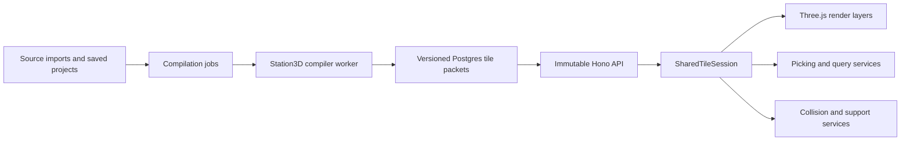

# Station3D precomputed world geometry plan

Status: deferred. The measured publication/readiness work in the
[22 September performance audit](performance-audit-2026-09-22.md) takes
priority; precomputation is not the next response to the current defects.

This document is the implementation plan for moving stable Station3D geometry out of
the browser's hot path. It is intentionally not an implementation specification for
the current road grade-separation work. Resume this plan only after the entry criteria
at the end of this document are met.

## Why this work exists

Station3D currently behaves partly like a geometry compiler that every browser reruns.
Terrain meshes, corrected road surfaces, structures, rail geometry, buildings, and
decor are repeatedly derived from source data even though most of their inputs rarely
change.

The target is to compile stable world geometry once, publish it as immutable spatial
tiles, and leave the browser responsible for:

- loading and placing compiled packets;
- time-dependent presentation and simulation;
- live editing and previewing unpublished projects;
- moving actors, interaction, picking, and collision queries;
- streamed photorealistic content that Station3D does not own.

The design must preserve geometry, entity identity, picking, support placement,
collision behavior, and visual output while materially reducing main-thread work and
production concurrency pressure.

## Target architecture

Compilation is versioned and atomic. Clients pin a manifest revision for a session,
then request immutable packets by layer, revision, level of detail, and global tile
coordinate. Publishing changes only the active revision pointer; rollback changes it
back.

## Spatial and binary contracts

### Global tile matrix

Tile identity must be independent of the browser session's floating origin. Use the
standard EPSG:3857 slippy tile matrix for IDs, but do not encode rendered geometry as
Mercator metres.

Initial layer matrix:

| Layer | Tile zoom | Halo | Notes |
| --- | ---: | ---: | --- |
| Corrected roads, curbs, and markings | 17 | 50 m | Enough context for approaches, structures, lamps, and seams |
| Detailed buildings | 18 | 5 m | Near-view facade, wall, and picking geometry |
| Far buildings | 15 | layer-specific | Simplified distant geometry |
| Static rails and saved projects | 15 | 50 m | Track continuity and structures across boundaries |
| Decor and water | 16 | 20 m | Scatter stability and coastline continuity |
| Terrain, native | 13 | raster-dependent | Native compiled terrain packet |
| Terrain, coarse | 11 | raster-dependent | Distant terrain level of detail |

Each packet carries a WGS84 tile origin. Vertices are encoded in physical,
tile-local metres relative to that origin. Elevations use EVRF2000 and declare their
vertical datum and quantization in the header.

### Shared packet envelope

All compiled layers use a common binary envelope with layer-specific typed sections:

- magic value and schema version;
- layer, level of detail, compiler version, and source revision;
- tile origin, coordinate contract, vertical datum, and quantization;
- typed vertex, index, and attribute sections;
- stable material keys rather than browser material objects;
- stable entity IDs and entity-to-index ranges;
- bounds, collider/query data, and optional support-placement data;
- content checksum.

Decoders must reject unknown mandatory sections, malformed ranges, and unsupported
versions. They must not silently reinterpret packets.

## Persistence and API

### Postgres tables

- `station3d_compilation`: immutable compilation records, inputs, compiler version,
  timestamps, state, and validation summary.
- `station3d_tile`: immutable `bytea` packets keyed by compilation, layer, LOD, and
  `z/x/y`, with checksum and byte size.
- `station3d_active_compilation`: one atomic active revision pointer per location and
  layer group.
- `station3d_compile_job`: queued, claimed, retryable worker jobs with lease and
  failure metadata.

Keep at least the active revision and its predecessor so rollback is immediate. The
first implementation rebuilds a complete immutable layer revision. Dirty-tile
incremental compilation is deliberately deferred until the full-rebuild design is
proven.

### HTTP contract

- `GET /api/station3d/manifest?location=:location`
- `GET /api/station3d/tiles/:layer/:revision/:lod/:z/:x/:y.bin`
- saved-project responses expose a `station3d_compile` state and revision;
- `GET /api/transit/projects/:id/station3d-packet/:projectHash.bin`

The manifest is cheaply revalidated. Tile packets are immutable and return strong
ETags plus long-lived immutable cache headers. A valid but empty tile returns `204`.
Invalid revisions and malformed coordinates fail explicitly.

## Compiler ownership

Geometry compilers must be browser-independent pure modules. The same core compiler
is used by:

- a Node worker for published immutable packets;
- the browser for unpublished live edits and preview;
- deterministic parity tests.

The worker runs separately from request-serving API processes. It claims jobs with
`FOR UPDATE SKIP LOCKED`, uses leases for stale-job recovery, applies bounded retry
backoff, and publishes only after every required packet and validation result exists.
Partial compilations never become active.

## Implementation sequence

### 1. Establish clean baselines

Finish and integrate the road overpass/underpass work first. Separate unrelated dirty
changes in both repositories, synchronize the simulator and API branches with their
respective `main` branches, and capture:

- representative clean-host Station3D scenes;
- current API timings and payload sizes;
- CPU, long-task, draw-call, triangle, and resource baselines;
- existing full headless test results.

No optimization work starts from an ambiguous or dirty baseline.

### 2. Implement the tile and packet contract

Add the global tile matrix utilities, layer definitions, packet encoder/decoder, and
schema-version rules without changing runtime behavior.

Tests:

- stable tile IDs across different session anchors;
- adjacent-tile ownership and halo clipping;
- deterministic byte-for-byte encoding;
- encode/decode round trips for every section type;
- malformed packet and unsupported-version rejection;
- localization within 1 cm after converting tile-local vertices into a session world.

### 3. Add persistence, publication, and immutable delivery

Add idempotent DDL, revision creation, packet storage, validation state, atomic
publication, rollback, manifest delivery, and immutable tile routes.

Tests:

- repeated migrations are safe;
- duplicate jobs and uploads are idempotent;
- incomplete revisions cannot publish;
- concurrent publication has one winner;
- rollback restores the previous manifest;
- ETags, cache headers, `204`, and validation errors match the HTTP contract;
- active and previous revisions survive cleanup.

### 4. Add the compiler worker

Extract browser-independent compiler interfaces and add the separately supervised
worker. The first version performs full immutable layer builds.

Tests:

- deterministic output for identical inputs;
- concurrent workers do not duplicate a job;
- expired leases are recoverable;
- retries back off and retain useful failure diagnostics;
- a source or compiler version change produces a new revision;
- publication waits for the required validation set.

### 5. Add client shadow loading

Implement `SharedTileSession`, manifest pinning, request deduplication, cancellation,
cache ownership, packet decoding, and disposal. Initially load compiled packets in
shadow mode while the existing browser compiler remains authoritative.

Tests:

- out-of-order arrival cannot mix revisions;
- retry and cancellation do not leak resources;
- two consumers share one request and one decoded packet;
- session closure disposes GPU and query resources;
- shadow comparison reports bounds, entity, vertex, and topology divergence.

### 6. Precompute corrected roads first

Materialize the global corrected road surface and vertical-alignment snapshot. Compile
z17 packets with a 50 m halo. The same snapshot must drive:

- cab and road surfaces;
- bridges, tunnels, retaining geometry, and supports;
- sidewalks and bike paths;
- lane markings, curbs, and lamps;
- support, picking, and collision/query data.

Existing GeoJSON road endpoints remain available to non-Station3D consumers. Do not
make each tile independently rediscover or reconstruct a crossing.

Tests:

- compiled and live-reference vertices agree within 1 cm;
- Donja Lomnica and the representative underpass/overpass corpus match;
- seam continuity holds across every affected tile edge;
- entity ownership survives clipping and packet merging;
- structures and companion surfaces use the same solved profile;
- support and collision data match the visible result;
- warm navigation reduces Station3D road query and geometry-build time by at least
  80%;
- compiled packet upload does not create a recurring task longer than 16 ms.

### 7. Cut over roads with a reversible release

Enable compiled roads behind a temporary development flag, validate Zagreb, then the
other Croatian locations. After a verified release, remove the old Station3D road
compiler path. Production rollback switches the active revision pointer; it does not
run the expensive compiler as a fallback.

Tests:

- targeted browser movement through representative grade separations;
- picking, walking, vehicle motion, supports, shadows, and labels;
- rapid movement, cancellation, location switching, and repeated open/close cycles;
- three interleaved clean-host A/B runs with no material visual or behavioral
  regression.

### 8. Precompute terrain

Compile native z13 and coarse z11 terrain packets with explicit EVRF2000, NoData, and
quantization rules. Remove runtime raster union and mesh construction from ordinary
Station3D navigation. Keep the terrain profile API for arbitrary live editor paths,
where the request is genuinely dynamic.

Tests:

- decoded elevations agree with the authoritative raster result within 0.1 m;
- overlapping source bands and NoData resolution remain deterministic;
- normals and seams agree at tile boundaries;
- LOD replacement does not leave cracks or resource leaks;
- ordinary navigation performs no runtime raster union.

### 9. Precompute static rails and saved projects

Compile stable rail cells and published saved-project packets. A saved-project packet
is keyed by project hash, terrain revision, and compiler version. Keep live browser
compilation only for unsaved edits and pending server compilation.

Tests:

- compiled rail and project geometry matches the live compiler;
- junction, structure, profile, entity, and collision contracts survive;
- changing project, terrain, or compiler version invalidates the correct packet;
- ready projects remove the measured 175–290 ms browser rebuild;
- packet upload remains below 16 ms per recurring task.

### 10. Precompute buildings

Compile GDI and Overture near/far packets, including facade and shared-wall results,
footprints, material keys, and picking ranges. Preserve dynamic time filters,
proposal state, user-selected material overrides, and shader effects as lightweight
runtime cuts.

Tests:

- footprint, height, facade, party-wall, picking, and filtering parity;
- deterministic batching across tile edges;
- at least 80% less browser tile-construction CPU;
- at least 30% fewer draw calls in the agreed representative scenes;
- at least 20% better median render time with no accepted correctness loss.

### 11. Precompute decor, water, and stable relationships

Compile greenery/scatter, parking, paths, hedges, and coast/water geometry. Then
materialize stable relationships that are currently repeatedly inferred, including
passages, crossings, static traffic-graph fragments, blockers, and similar
source-revision-derived facts.

Use composite source hashes wherever one result depends on multiple source datasets.

Tests:

- deterministic scatter and seam ownership;
- coastline and water continuity;
- relationship parity against the current runtime derivation;
- correct invalidation when any contributing source changes;
- at least 70% less browser CPU for each migrated layer.

### 12. Operationalize and remove obsolete paths

Add documented compile, inspect, retry, publish, rollback, and status commands. Expose
revision and tile diagnostics in development tooling. Add production smoke checks,
retention, alerting, and deployment documentation. Remove obsolete runtime compilers
only after each layer's verified cutover.

Tests:

- no-op recompilation and explicit rollback drills;
- worker restart and stale-job recovery;
- corrupted and missing packet behavior;
- deployment smoke tests against the manifest and representative tiles;
- full simulator and API suites after each removal.

## Program-wide acceptance gates

Each coherent step must pass the full relevant headless suite. Every compiler test
must first be demonstrated capable of failing for an intentional mismatch.

Each layer cutover requires:

- shadow comparison before authority switches;
- a temporary development flag and explicit rollback revision;
- targeted browser movement through representative scenes;
- three interleaved clean-host A/B measurements;
- no correctness, picking, support, or collision divergence;
- no median or p95 regression above 10%;
- no new recurring task above 50 ms;
- stutter count no worse than `max(baseline * 1.10, baseline + 1)`;
- no stuck queues, retries, partial revisions, or resource leaks;
- triangles, shader programs, and resources within 5% unless a reviewed improvement
  intentionally changes them;
- five open/close cycles returning resource counts to baseline.

## Scope boundaries and assumptions

- Postgres `bytea` is the canonical packet store; Cloudflare caches immutable HTTP
  responses.
- Slippy/EPSG:3857 is used only for global tile identity. Rendered geometry remains
  WGS-origin-relative physical metres with EVRF2000 elevations.
- The first release rebuilds whole immutable layer revisions.
- Base terrain, roads, rails, saved projects, buildings, water, and decor are
  precomputed.
- Proposals, unpublished edits, moving actors, time/material presentation cuts,
  collision broadphase, and external photorealistic streaming remain dynamic.
- There is no permanent expensive browser fallback after a layer cutover. Rollback
  activates a previous known-good revision.
- Production deployment is a separate, explicit action after implementation and
  validation.

## Entry criteria for resuming this plan

Resume only when:

1. the simulator road overpass/underpass branch has passed its manual visual and
   clean-host performance acceptance and is merged or has an explicitly approved
   base;
2. the API road branch's unrelated tower/building edits have been separated, current
   `main` has been integrated, and the full API suite and representative SQL timings
   pass;
3. remaining road-grade-separation scope is explicitly resolved, especially joint
   upper/lower profile solving and support clearance against rail, sidewalk, bike,
   and swept-vehicle envelopes;
4. both repositories have clean, attributable baselines from which A/B measurements
   can be repeated.
