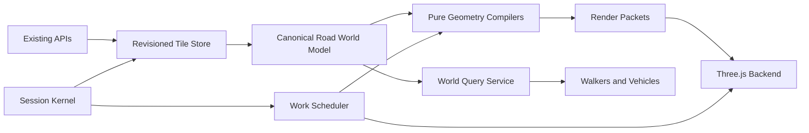

<!-- Incremental architecture and testing plan for migrating Station3D toward session-scoped runtime services without a wholesale engine rewrite. -->

# Station3D Incremental Runtime and Road Architecture Migration

## Summary

Retain Three.js, the existing Station3D public API, shared tile streaming, cooperative queues, formation logic, and performance instrumentation. Introduce a migration-friendly runtime around them, then prove it by migrating the complete road vertical slice: road surfaces, structures, sidewalks, bike paths, lane markings, curbs, street furniture, collision, and walking support.



Completion requires behavioral parity, the removal of migrated legacy paths, full browser QA, and clean-host main-versus-branch performance evidence.

## Architecture and Interfaces

- Preserve native browser ES modules with no bundler or TypeScript build. Define internal contracts through JSDoc and executable Node tests.
- Keep `window.Station3D` unchanged. No planner, URL, API, or external integration should know the runtime changed.
- Introduce a session kernel that owns session-scoped services:
  - `tiles`: shared fetching plus immutable revisioned tile snapshots.
  - `scheduler`: adapter over `FrameChunkQueue` with one session budget.
  - `roads`: canonical road formation and vertical-alignment model.
  - `queries`: visible ownership, placement, support, collision, and entity lookup.
  - `renderer`: Three.js scene/resource/render-packet adapter.
  - `metrics`: existing queue, layer, background, GPU, and stutter telemetry.
- Replace implicit layer-array ordering with manifests:
  ```js
  {
      id,
      worlds,
      requires,
      priority,
      create(session)
  }
  ```
  A layer instance exposes `start()`, `update(frame)`, and `stop()`. Missing dependencies and cycles fail before the session starts.
- Wrap existing layer singletons with a temporary `legacyLayerAdapter`. This allows the kernel to land without rewriting geometry.
- Promote `RoadFormationModel` and `RoadVerticalAlignmentModel` into a session-owned `RoadWorldModel`. Compose the proven implementations rather than initially rewriting them.
- Define canonical road snapshots containing:
  - Entity and OSM identity with cross-tile reference ownership.
  - Surface and centerline geometry.
  - Continuous horizontal and vertical alignment.
  - At-grade, overpass, underpass, tunnel, and approach ownership.
  - Carriageway, lane, sidewalk, bike-path, and curb bands.
  - Structure ranges, exclusions, dirty IDs, and dirty bounds.
- Define an engine-neutral render packet:
  ```js
  {
      positions,
      normals,
      uvs,
      indices,
      materialKey,
      renderOrder,
      bounds,
      entityRanges,
      colliderData
  }
  ```
  Domain and geometry modules cannot import Three.js, the DOM, scene modules, UI, or other world layers.
- Preserve entity inspection after batching by mapping batch geometry IDs to `entityRanges`. Selection highlighting uses a temporary overlay compiled from the canonical entity rather than requiring one permanent mesh per road.
- Expose road-related world queries through one service:
  ```js
  supportAt(position, actor)
  structureAt(position)
  canPlace(kind, position)
  sweep(actor, from, to)
  entityAt(ray)
  ```
  GPU visibility, walking support, vehicle support, curbs, lamps, and decoration exclusions must consume the same ownership result.

## Implementation Steps

1. **Merge the completed feature first**
   - Merge the matching cadastre-data DDL/API work in its documented order, then merge `road-vertical-alignments` into `main`.
   - Run its full unit suite and targeted visual/performance checks before beginning architectural changes.
   - Create the architecture branch/worktree from freshly fetched `origin/main`, after this merge—not from the current local commit or the feature branch.

2. **Record the post-feature baseline**
   - Serve updated `main` through the existing no-cache server and verify `Cache-Control`.
   - Record unit results, scene/resource counts, road debug counts, screenshots, and three clean-host performance runs for every acceptance scene.
   - Store raw performance JSON under the existing gitignored performance-results directory.

3. **Land the behavior-neutral runtime scaffold**
   - Add the session kernel, service contracts, layer manifests, dependency resolver, and legacy adapter.
   - Move the canonical layer registry and startup/teardown orchestration out of `cab.js`.
   - Keep every current layer running through the adapter with identical ordering, world selection, retry behavior, and deferred-start policy.
   - Add an import-boundary ratchet: existing unrelated violations are allowlisted, new violations fail, and migrated road modules must have zero violations.

4. **Make scheduling session-owned**
   - Wrap existing `FrameChunkQueue` behavior behind `WorkScheduler`; do not rewrite its adaptive policy.
   - Represent road work as `fetch → normalize → compile → upload → commit`.
   - Every job carries owner, tile, generation, work class, bounds, cancellation, and metrics.
   - Keep pure compilation and Three.js upload as separate stages. Upload and scene replacement remain main-thread operations.
   - Preserve old-generation-until-success behavior and dispose stale/cancelled staged resources exactly once.

5. **Introduce the canonical road tile store**
   - Continue using `SharedTileSession` for network requests and retry policy.
   - Normalize road surfaces, centerlines, curb inputs, and vertical alignments once into revisioned datasets.
   - Deduplicate identical and overlapping tile responses before advancing revisions.
   - Maintain cross-tile OSM reference counts so evicting one tile cannot remove an entity still owned by another.
   - Publish immutable snapshots and bounded change sets; consumers must not mutate source features.
   - Initially run the store in shadow mode and compare it with current layer-owned maps without changing rendering.

6. **Promote the road world model**
   - Create `RoadWorldModel` before road layers start; remove `roadsLayer`’s mutation of `ctx.roadFormation`.
   - Feed it normalized tile snapshots and terrain/vertical-alignment evidence.
   - Make arrival order irrelevant: surface-first, centerline-first, repeated, and overlapping deliveries produce the same model.
   - Ensure one structure-owned alignment supplies roadbed, sidewalks, bike paths, curbs, markings, lamps, collision, and vehicle height.
   - Treat crossings as intersections only when their structure level and reachability agree.

7. **Extract pure geometry compilers**
   - Extract road-surface, structure, sidewalk, bike-path, marking, and curb calculations from world modules.
   - Compilers consume canonical snapshots and emit render packets plus collider/query data.
   - Preserve current material keys, UV scale, render order, entity metadata, vertical profiles, and visual ownership.
   - Split every potentially large feature into resumable stages; no queue callback may contain an uninterruptible city, tile, large polygon, or complete structure build.

8. **Add the Three.js render backend and batching**
   - Convert packets into spatially bounded batches by origin tile, material identity, and render order.
   - Preserve feature reference ownership across overlapping tiles. Final-reference eviction removes its batch geometry; batch disposal occurs only when empty.
   - Build successors off-scene, verify generation and ownership, publish atomically, then retire the previous generation.
   - Keep structures and special materials in separate compatible batches.
   - Preserve picking through geometry-ID metadata and temporary selection overlays.
   - Expose active batches, batched geometries, unbatched geometries, collider counts, and staged-resource counts in diagnostics.

9. **Migrate the road consumers incrementally**
   - Migrate in this order: road structures and formation → road surfaces → sidewalks and bike paths → lane markings → curbs → streetlamps/furniture → walk support and vehicle height.
   - Use a development-only `roadRuntime=v2` switch while comparing paths on the branch.
   - After each consumer passes its tests, make it use only the canonical model and delete its redundant tile maps, source subscriptions, query helpers, and rebuild path.
   - Before merging, make the new path unconditional and remove the switch and complete legacy road path.

10. **Finalize boundaries and documentation**
    - Update the Station3D architecture documentation with the session lifecycle, tile-build state machine, ownership rules, and instructions for adding a layer.
    - Record the architecture decision in `MEMORY.md`.
    - Explicitly document that authored geometry owns engineered alignment, bare earth supplies classification, and the reality mesh owns only unreplaced visible/supporting surface.
    - Leave buildings, decor, vehicles, and photoreal rendering behavior unchanged except where they consume the new road-query service.

## Testing and Acceptance Requirements

### Fast tests required after every step

Run `npm test` after each coherent change. Add behavioral tests for:

- Layer dependency ordering, missing dependencies, cycles, world filtering, retries, reverse teardown, and late async completion after disposal.
- Two sequential sessions and an interrupted session with no state, listeners, queues, groups, or resources leaking between them.
- Tile deduplication, no-op identical updates, cross-tile refcounts, final-reference eviction, arrival-order independence, stale-generation rejection, and bounded dirty regions.
- Scheduler class priority, movement budgets, far-work liveness, cancellation, retry attribution, transactional publication, and exactly-once disposal.
- Road-world continuity across OSM way splits and tile boundaries.
- Crossings at the same level becoming intersections while overpasses and underpasses remain topologically separate.
- Missing elevation remaining unknown except where the existing tested road-structure default explicitly applies.
- Smooth structure approaches, two-lane underpass continuity, complete overpass sidewalks and bike paths, and no curb endings inside an owned structure.
- Render packets containing finite indexed geometry, correct bounds, material keys, entity ranges, collider data, and deterministic output.
- Render ownership and physical support agreeing at the same sampled positions.
- Lower-road lamps and furniture being excluded beneath a bridge while bridge-owned objects remain.
- Batched picking returning the same entity keys as the existing unbatched implementation.
- Cancellation, failed successors, and proposal-mask changes leaving the previous complete generation visible.

Use deterministic fixtures representing:

- An ordinary flat road and intersection.
- The Donja Lomnica road-over-highway-and-rail overpass.
- The known synthesized underpass with both ramps and the central box.
- Cross-tile duplicates and split OSM ways.
- Missing DTM samples, missing alignment elevation, malformed payloads, and API failure/retry.

Replace source-text assertions from the vertical-alignment branch with behavioral tests as their logic is extracted. Static text scanning remains appropriate only for dependency/import-boundary enforcement. Every new test must fail if its implementation or observable effect is removed.

### Browser regression testing

Browser execution is part of completion and has been explicitly selected.

- Update Playwright’s server command to use the existing no-cache server rather than plain `python -m http.server`; verify the response header in the test setup.
- Run targeted specs after each migrated consumer, then the complete `npm run test:e2e` suite before cutover.
- All tests use the shared fixture that fails on uncaught page errors. New road tests also fail on unexpected console errors, critical request failures, retries that never recover, and build failures.
- Add a road-runtime browser spec covering:
  - Initial load and movement across multiple tile boundaries.
  - Tile eviction and return without disappearance, duplication, z-fighting, or partial publication.
  - Session close during active construction, followed by a clean reopen.
  - Entity hover/selection on batched road geometry.
  - Terrain/elevation mode and an ordinary non-elevation model session.
  - One photoreal smoke session to prove the unrelated source world remains unaffected.

Visual QA must inspect both travel directions and close/grazing views for:

- Donja Lomnica overpass deck, approaches, fences, sidewalks, bike paths, curbs, lamps, and firm walking support.
- The underpass ramps, constant carriageway width, central box, roof slab, retaining-wall crowns, terrain collars, shadows, and snug joins.
- No curb circles or semicircles, endpoint caps, grey strips, holes, transparent roadbed, roadbed penetration, scalloping, or lower-road furniture penetrating structures.
- No bike path falling beneath a bridge, sidewalk diving toward the lower road, or vehicle/walker snapping to an unreachable crossing surface.
- Ordinary intersections, parking entrances, tram crossings, proposal cutouts, and tile seams remaining visually unchanged.

Capture fixed before/after screenshots for the acceptance scenes. Screenshots supplement geometry and collision assertions; they are not the sole proof.

### Performance A/B

Use two no-cache servers for updated `main` and the candidate branch, with the same API, Chrome version, viewport, DPR, seed, simulation hour, URL, camera path, and duration.

Required scenes:

1. Dense central Zagreb moving tram cab.
2. Donja Lomnica walker movement across and beneath the overpass.
3. The known underpass, moving through both ramps and the central box.
4. An ordinary flat-road walk session.
5. A settled dense-road view for renderer/draw-call measurement.

Run three interleaved main/candidate pairs. Discard and repeat any run whose host verdict is not `clean`. Record:

- FPS, average and p95 frame interval, peak frame, and stutters per minute.
- Hooks, render, sky, and stall time.
- Named layer and scheduler work-class time.
- Longest queue item and counts over 16 ms and 50 ms.
- Pending jobs/items, catch-up time, retries, and build failures.
- GPU calls, triangles, programs, geometries, textures, scene-object count, road batches, and batched geometries.
- Resource counts before opening, after settling, after closing, and after five open/close cycles.

Acceptance gates:

- No sustained FPS/frame-time or p95 regression greater than 10% in any comparable movement run.
- No new recurring main-thread work item above 50 ms, full-world rebuild fan-out, unbounded backlog, retry loop, or build failure.
- Equal-duration stutter count may not exceed `max(baseline × 1.10, baseline + 1)`.
- All queues must reach zero pending work after the stationary settlement window.
- No increase above 5% in triangles, shader programs, or retained GPU resources unless separately explained and accepted.
- Road batching must reduce total renderer calls by at least 30% and median render time by at least 20% in the settled dense-road scene, matching the existing road-batching target.
- Five open/close cycles must return scene and GPU resource counts to the original post-initialization baseline.
- Performance failure blocks cutover; do not raise budgets, suppress telemetry, or retain both production implementations as a workaround.

## Assumptions and Later Migration

- The road-vertical-alignments API/data and simulator branches are merged first; the architecture branch starts from the resulting fresh `origin/main`.
- Native ES modules and the no-build setup remain.
- No new database schema or external API shape is introduced by this architecture milestone.
- The first milestone ends with one production road implementation, not a permanent compatibility layer.
- No deployment is included unless requested separately.
- After the road milestone, migrate in measured order: buildings, decor/placement, vehicle simulation/render separation, then photoreal backend ownership. An alternative 3D engine should be evaluated only after render packets and query contracts make a backend comparison inexpensive.
