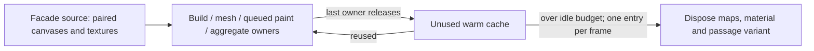
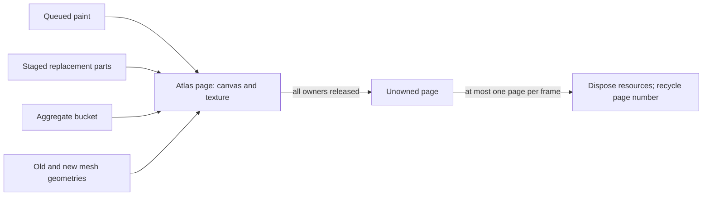
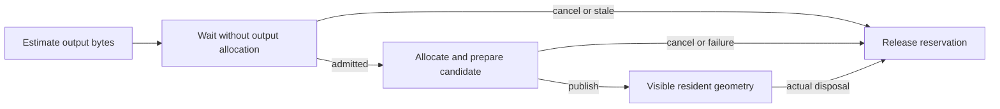
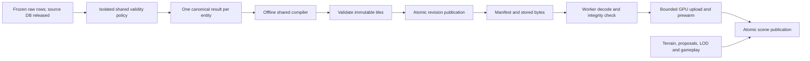

<!-- Approved incremental rollout and evidence ledger for base-world server baking. -->
# Station3D server baking

The aim is smooth travel without sacrificing scenery, elevation or gameplay. Baking moves
repeatable geometry work out of the browser; it does not remove the need to bound decoding,
GPU upload and publication. A green synthetic test is not a city-performance verdict.

Latest checkpoint (September 7 local): **visible local authority is implemented and playable**.
The user-approved release reassessment puts this corridor before additional general tuning;
it supersedes the historical runtime-first gate below. Two fully-built baked on/off pairs
show no consistent speedup, so baking stays experimental/off by default. Medium/low now
have smaller ordinary-façade budgets; repeated memory measurements and built day/night
navigation/close-reopen checks pass. Production comparison and real-phone acceptance remain open.
See the September 7 section at the end for the current evidence and playable link.

Approved scope (2026-09-05): far buildings first, then corrected roads; local/staging only.
Continue after green gates. Stop on a failed gate, changed scope or a production cutover.
Every production cutover requires separate approval.

Priority revision approved September 6: **bounded runtime first, one playable baked corridor
second, geographic/layer expansion last**. The implementation order below supersedes automatic
progression from the earlier geometry/storage stages to wider baking. Preserve the shared engine,
elevation, gameplay footprints and surface authority; no campaign-only performance workaround.

Historical status (September 6, 22:36 UTC): **refreshed headed baking stages 2–4 pass. Runtime work
now includes interactive admission, a shared two-tile replacement overlap limit, and explicit
ordinary-facade and atlas-page ownership with incremental unused-resource eviction, plus the
first byte-admission slice for near aggregate outputs and far upload backing buffers. Far-source
JSON now uses the existing cooperative decoder too; the September 2 fix covered near only.
A September 5 shared-HUD forced-layout regression is now removed, with a real navigable
Frankopanska day/night control and vehicle/mobile HUD checks. An older height-atlas readback
context defect is also fixed; actual day/night contexts and a scoped night navigation/cleanup
check were verified before the latest slice. Shared lazy facade materialization now looks up
live atlas pixels before creating ordinary source textures; actual GDI/Overture and repair
ownership tests pass, and the new path is exercised in headed startup/loading. All 3,401 frontend
tests and the production build pass. After the user freed host memory, the **unchanged latest
build passes both day/night travel, turns and close/reopen**, and all three strict same-cell
returns: 1,371 buildings, 208 atlas pages and identical tracked source/geometry residency at
every settled return. All normal closes release the tracked resources. These supersede the
latest-slice functional verification blocker, not the preserved earlier failed runs. Native
paging and large hitch bursts still occur, so neither a controlled speedup nor smoothness is
accepted. Two fresh dense GTA and two tram runs completed without application errors, but
an overlay-off, fully built neighbourhood still produced a 1.53 s movement pause during paging.
Production is verified
at `8aa4630` (203 commits behind HEAD); its pre-GTA frontend requires the common `walk` mode,
not the new GTA mode, for a walking comparison. The earlier
lifecycle slices have scoped daytime/nighttime travel and
cleanup passes, but an earlier post-wake reopen missed its readiness deadline; it
remains failed evidence, not an established fixed bug. Performance, visual/navigation and release
acceptance remain pending**. Large pauses and native swapping remain. The new street-axis return
is navigable, but the older occluded route is not retroactively a visual pass, and road/ground
artifacts remain. These scoped checks are not a whole-world smoothness or scenery pass. Whole-world
byte admission and visible baked authority are not complete. The fresh candidate matrix is
complete, but the legacy-production comparison is not: GTA is unsupported there, the newer
readiness adapter is incompatible, and a separate actual legacy ready callback released on its
failsafe rather than normal readiness. None is a comparable production performance run. The user approved
pragmatic simplification, including bounded cleanup of numerically collapsed internal rings in
derived render geometry. The shared API/baker policy is `valid-render-footprint-v2`, bake 2.2.0.
All 7,382 freshly frozen entities pass same-engine projected and delivered-GeoJSON validity and repeated
output checks. Thirteen retain exact originals; 373 remove only 571 proven numerical rings,
preserving every polygon part and exterior coordinate. **No whole-database backup or shared DB
upgrade:** the source database and production remain unchanged. New storage/delivery checks run
entirely in the existing network-isolated pilot. Baked authority remains gated on the runtime and
headed checks below; no authority or road expansion has happened.

## Runtime-first implementation order (September 6)

1. **Interactive work admission.** Stops and turns are gameplay. Only the real opaque
   world-ready hold may use the larger loading allowance. Charge actual elapsed construction
   time, including indivisible overruns; let unserved queues take a fresh frame instead of
   appending their old reservations to an overrun. Far liveness/borrowing must obey the same
   aggregate remaining allowance. Verify startup settlement and sustained near/far progress.
2. **Resource ownership and admission.** Bound the complete working set, not only resident
   tile counts: source/decoded rows, compiler requests/results, candidate uploads and the old
   visible generation, texture caches and GPU buffers. First bound simultaneous replacement
   generations; then establish explicit facade ownership (live, pending, repaint/atlas and
   retiring owners) before evicting cache entries. Shared
   texture registration alone is not a reference count. Release/evict unused resources and
   admit replacements against estimated bytes; retain valid visible content under pressure.
   Expose the estimates and actual admission decisions, not an unconsumed accounting module.
3. **Split the remaining measured indivisible work.** A scheduler can stop the next item,
   not interrupt JavaScript already running. Use fresh headed traces after steps 1–2 to pick
   specific construction/upload stages for cooperative or Worker/offline execution. Do not
   rework already-regional surface invalidation merely because an old trace named it.
4. **One representative dense Zagreb corridor plus surrounding coverage.** Reuse the validated
   immutable baking pipeline, with bounded delivery/publication under the shared runtime
   contract. Far prisms are already Worker-compiled today: baking saves repeated source/geometry
   work, but does not by itself remove terrain seating, proposal/detail selection, packet copies,
   GPU uploads or residency. Prove the entire playable path before adding geography or layers.

After each implementation slice: fast regression/lifecycle tests, production build, then headed
travel, sharp turns and stops; add genuine return-to-the-same-area visits and close/reopen checks
for residency changes. Pausing at the end of a route is **not** a warm revisit. Timing acceptance
needs at least two dense walk and two tram runs with matching settings and native host evidence;
functional correctness can be assessed independently on a busy host, but smoothness cannot be
certified from it. A quiet host is an experimental control, not a requirement that players close
their other apps. No missing scenery, recurring large freezes, starvation or growing revisit
working set is acceptable just because mean FPS improved.

Step 1 implementation, September 6: `frame-work-policy.js` now distinguishes the actual loading
hold from interactive motion; `frame-chunk-queue.js` charges full elapsed time, rotates first
admission among unserved queues and bounds far borrowing/liveness by remaining frame allowance.
The new deterministic tests failed on the old implementation, then passed with the fix. All
3,318 unit tests and the production build pass. The two-walk/two-tram headed gate finished at
11:09 UTC in `performance/station3d/results/server-baking-pilot/runtime-budget-v1-sep6`:
all four runs reached verified readiness without application errors, but **performance is not
accepted**. Native movement samples show 603–1,318 MiB swapped in and 1,046–1,818 MiB swapped out
over 40–50 measured seconds per run. The CPU-only harness passed all four; its isolated result is
not the release verdict. Movement had 76/83/92/81 ≥50 ms hitches, with worst frames
1058/454/297/259 ms and queue peaks 5660/3963/7612/7710. No causal improvement over earlier runs is
claimed under that paging. The per-run native host, exact code hashes and screenshots are retained.

Step 2a follows a concrete structural finding from that gate: final diagnostics retained
8/8/10/11 simultaneous old/new **building tile pairs**. Previously one replacement could start
each stopped frame while all earlier replacements were still building or awaiting GPU publication.
The shared terrain/regional rebuild path now admits **at most two live replacement tiles**;
both kinds share the same actual `tileVisualReplacements` map. Completion of feature construction
does not free a slot: publication/retirement or eviction does. Deferred invalidations retain their
payload references and old visible scenery, coalesce through the existing queue, and recheck the
observer's current position on admission. New near-tile loads are not subject to this replay cap.
Two slots allow construction while a sibling awaits aggregate upload; this is a conservative
overlap limit, **not an aggregate CPU/GPU byte budget or a texture-cache bound**. Seven deterministic
admission tests and all 3,325 unit tests pass; the production build contains 38 JS files /
6,050,785 bytes. Evidence is in
`performance/station3d/results/server-baking-pilot/runtime-budget-v2-sep6`:

- The timing matrix **stopped after its first walk**, not after a completed two-walk/two-tram
  gate. Readiness and application-error checks passed, but only 50/56 CPU windows were clean.
  It retained 92 hitches, worst 458 ms, and a 4,695-item backlog peak. Conservative native
  intervals inside travel recorded 1,529,446,400 bytes swapped in / 1,799,553,024 out in
  50.064 seconds. The paused settled phase also hitched (worst 1,813 ms) and paged. No timing
  benefit, quiet-host comparison or release approval is established.
- The separate **functional** walk/return/turn/stop and close/reopen repeat passed at 11:28 UTC.
  Across 243 observations, replacements never exceeded two; the limit was actually exercised
  in 19 samples, and queued replacements drained before close. Both real return visits came
  back within five metres of their start. Actual charged CPU equalled spent CPU, and all
  sampled interactive stationary allowances stayed at or below 10 ms. Both closes released
  the observed build jobs, reservations, replacements and pending queue work; reopening reached
  verified readiness. This does not prove a stable total CPU/GPU working set or every failure path.
- An initial lifecycle harness run is retained as **failed**: it treated generic resource-404
  console lines as application exceptions. The fresh repeat records URLs and applies the
  existing timing harness's optional-facade-photo contract: twelve optional photo 404s, two
  explicitly cancelled terrain requests, no application or unexpected resource errors.
  This classification does not discard a failed terrain request or excuse missing world data.
- A separate headed line-6 tram functional check reached verified readiness and completed
  a 60-second ride plus 15-second paused settlement without application errors. It retained
  five contended windows and was explicitly run as busy-host functional evidence, not as a
  replacement for the three missing timing runs. Its final replacement count was two, with
  thirteen terrain rebuilds still queued and visible work waiting up to 5.15 seconds.

The final return/reopen/tram screenshots were inspected. They establish only the scoped checks,
not complete visual parity: the reopened view includes a close facade plane that needs a matched
visual comparison, and remaining late scenery needs review. Normal lifecycle progress passed;
failed-build/upload rollback and broader feature acceptance remain separate gates. All 43 served
files still match the timing-run hashes after the functional checks. Both versioned timing
directories retain a separate `release-verdict.json` with performance/release approval **false**.

At the end of the 11:40 UTC slice, texture ownership/eviction, shared byte admission and steps 3–4
remained pending. The pre-change
and scheduler-only served bundles are retained separately for matched controls if host conditions
allow a timing comparison. All owned test browsers and runners are closed. No commit, push,
production service, shared API/database, database backup or baking authority change occurred in
these runtime slices; the isolated pilot DB remains stopped with its existing volume retained.

### Facade ownership slice — September 6, 12:51 UTC

The preceding work was committed and pushed on request: frontend `b1c13b2`, API `bd5b398`.
This is **not a deployment**; production and the shared API/database remain unchanged.
The following continuation is a separate, not-yet-committed runtime change.

Ordinary procedural facade resources previously survived until session teardown, including
source canvases whose pixels had already been copied into an atlas. The shared building layer
now explicitly retains those resources for unfinished construction, individual/retiring meshes,
pending atlas paints and staged/published non-atlas aggregate parts. Only the final release
makes an entry evictable. Shader passage variants are disposed together with their unused base.



The **32 MiB allowance covers unused ordinary-facade entries only**, using estimated RGBA
canvas storage plus mipmapped texture storage. It is neither a whole-world memory ceiling nor
a measured GPU allocation. Live owners remain protected above that allowance. Eviction handles
at most one entry per frame; temporary excess appears as `evictionPendingBytes` until drained.
Read the accounting through `__s3dBuildingBuildState().facadeResources`; there is no scene-wide
per-frame traversal. This does **not** complete shared byte-based admission for source data,
compiler work, atlas pages, GPU buffers or old/new generations.

Atlas allocation uses the immutable facade-content key, not the evictable texture UUID, so
recreating a source reuses already-painted pixels rather than filling another atlas slot.
Queued paint success, cancellation and failure release their source leases; failed pages
cannot publish incomplete pixels. A later page's cancellation/failure does not poison pages
that have already uploaded successfully. Merge capture transfers ownership before disposing the
retired individual geometry and leaves registered shared geometry with its original mesh.
Session teardown reports remaining borrowers instead of force-disposing a live resource.

The new pure/cache and real-orchestration characterization tests cover these handoffs, including
daytime's temporarily unbound emissive map. Disabling eviction caused 17 tests to fail; restoring
UUID-based atlas allocation failed the warm-slot reuse test. Both controls were restored.
All **3,347 tests pass**, and the final production build has 38 JavaScript files / 6,054,792 bytes.
The final suite ran serially with a finite timeout: the concurrent attempt left the unchanged
`frame-chunk-queue.test.mjs` child waiting indefinitely. Its manually driven frame tests await
promises after a fixed number of callbacks while using real elapsed-time budgets, so host delay
can leave work for an un-driven callback. The failed attempt is retained, not silently relabelled
green. No assertion or production scheduler was weakened. An overlapping headed attempt was
stopped, marked invalid, and repeated only after tests and build had exited successfully.

Final headed evidence is in the ignored
`performance/station3d/results/server-baking-pilot/facade-ownership-sep6/` directory:

- `lifecycle-repeat3`: final daytime bundle, 254 observations, two genuine returns within
  19.6 m / 7.1 m of the start, turns/stops, verified reopening. The pre-teardown checkpoint
  recorded **1,713 runtime evictions** with 154 entries still cached and live borrowers protected.
- `lifecycle-repeat4`: final nighttime bundle, 279 observations, returns within 1.2 m / 18.8 m,
  lights off/on, turns/stops and reopening. The corresponding checkpoint had **1,136 runtime
  evictions**, 144 cached entries and live borrowers protected.
- Both runs: **zero facade entries, owner references and estimated bytes after each close**;
  no application errors, failed compiler jobs or unexpected resource failures. The day/night
  runs recorded 12/6 optional facade-photo 404s and two cancelled terrain requests each.
  All served hashes stayed unchanged through each final run. Screenshots were inspected.
- `control/lifecycle`: 87-observation check using only the preserved pre-cache bundle in its
  owned browser. At the same reopened position, heading and daytime setting, the oversized
  close-detail facade is present on **both** builds. It predates this slice, not necessarily
  the main-versus-production delta; the visual defect remains an open release item.
- The initial daytime/nighttime passes are retained in `lifecycle` / `lifecycle-repeat1`.
  `lifecycle-repeat2` is explicitly invalid/interrupted, with the reason alongside its raw result.

This is an **ownership/lifecycle pass only**. Native counters across the final full sessions
(startup, travel, stops and reopen included) recorded 3.72 / 1.80 GiB swapped in and
5.01 / 2.24 GiB swapped out over 149.6 / 153.0 seconds, day/night respectively. These are not
isolated movement intervals or an A/B speedup claim. The overlay's CPU-only clean reading does
not negate paging. Repeated large pauses and pending scenery remain visible. A fresh matched
two-walk/two-tram comparison, broader visual/feature checks and practical smoothness acceptance
are still outstanding; production remains **HOLD**.

Next: shared byte-based admission, including atlas pages and old/new/upload representations;
check warm-revisit churn as well as retained memory. Then split freshly attributed indivisible
work and exercise one dense baked corridor. Source-cache eviction alone does not bound the
whole world, and it is not a reason to expand baking geographically. All owned test browsers
and runners are closed; the existing no-cache local test server remains on 8196. No deployment,
API restart, database mutation, database backup or baking-authority change occurred.

### Atlas page ownership slice — September 6

The next lifetime gap was at the **page**, not the ordinary source cache. Atlas canvases,
textures and layout keys were previously retained until an entire two-by-two-tile region
lost its last bucket. A page with no remaining geometry could therefore survive beside a
still-live neighbour. Region bookkeeping also did not express staged or retiring users.

Atlas materials now use the same explicit-owner cache primitive as ordinary facades, with
separate accounting through `__s3dBuildingBuildState().facadeAtlasResources`. Pending paint,
staged replacement parts, bucket descriptors and actual mesh geometries independently pin
a page. Publication transfers ownership before releasing the staged part. Removing a bucket
does not unpin its still-visible old mesh; actual geometry disposal does. Paint success,
cancellation and failure release the paint lease. Session cleanup refuses remaining borrowers.



Only **completely unowned pages** are recycled. Every live allocation/UV stays fixed, and
only keys on the retired page are forgotten. Reusing vacant page numbers prevents historical
array growth in a region that remains loaded. Each 512-square page estimates 1 MiB of RGBA
canvas pixels plus approximately 1.33 MiB of mipmapped texture storage; these are estimates,
not driver allocation measurements. Pages have no idle warm allowance, but live pages are
never evicted to satisfy an arbitrary cap. Cleanup is incremental and reports pending bytes.
This is ownership/unused-page reclamation, **not pre-allocation admission or a whole-world cap**.

The shared-budget mapping confirmed why admission remains a separate step:
`render-compiler-client.js` limits in-flight job count; `render-packet-three.js` limits upload
primitive count; `geometry-batch.js` time-slices copies but still allocates complete output
arrays while source parts and old meshes survive. None reserves those bytes jointly. The next
admission implementation must account for these representations and preserve progress of a
replacement under pressure, not simply postpone a replacement behind the old generation's
own allocation. Terrain, roads, rails, decor and other resources remain outside these facade
ledgers.

Six additional tests cover page recycling/churn and real capture/publication/cancellation
handoffs. Disconnecting atlas-material retention made all four new orchestration tests fail;
restoring it made them pass. All **3,353 unit tests** and the production build pass (38 JS
files / 6,055,538 bytes). The managed check job reached `done(0)` before headed testing began.
The served runtime was not changed again during headed testing.

Evidence is retained under the ignored
`performance/station3d/results/server-baking-pilot/atlas-ownership-sep6/` directory:

- `lifecycle-repeat1`: daytime, **447 observations**; two actual 350 m outbound trips, returns
  within 17.7 / 19.3 m, turns, stops and verified close/reopen. Five atlas pages were reclaimed
  before the first close, with 39 pages and all live borrowers retained at that checkpoint.
- `lifecycle-repeat4`: final full nighttime repeat, **376 observations**; matching outbound
  distance, returns within 17.0 / 25.0 m, turns/stops, lights off/on and verified reopening.
  Twelve atlas pages were reclaimed before close; 106 live pages remained at the checkpoint.
  Reopening reached genuine `ready` in approximately 9.3 seconds from world-build start, not
  a timeout or forced reveal. No runtime patch or deadline increase preceded this repeat.
- Both final runs exercised the two-replacement limit without exceeding it. **Every observed
  close left zero ordinary-facade and atlas entries, references and estimated bytes**, as well
  as no build jobs, reservations, replacements or queued work. No application/unexpected-resource
  errors; two cancelled terrain requests each and six optional facade-photo 404s in the night
  run. Compiler failure/crash/restart counts were zero at the pre-close checkpoints. All 43
  served files match across the final day/night runs and remained unchanged during each run.
- `lifecycle`: failed test-observer assertion compared atlas counts across a screenshot await,
  during which streaming changed them. The assertion now compares one atomic draw snapshot.
  The raw failed result is retained; no production code changed for this correction.
- `lifecycle-repeat2`: **incomplete due to laptop sleep**, including a 597.976-second native
  sampling gap. Travel, lights and first cleanup passed before interruption, but the run does
  not count as a full lifecycle pass. Its interruption annotation references the user's report.
- `lifecycle-repeat3`: **failed after waking**, at the unchanged 120-second reopen deadline.
  Travel, lights and first cleanup passed; reopening was still progressing but not ready.
  Native counters recorded 8.34 GiB swapped in / 10.26 GiB out over 284.5 seconds without a
  sleep-sized gap. This establishes neither an atlas regression nor that paging caused all
  the delay. Its precise unfinished readiness component was not captured in that attempt.
- `focused-readiness/lifecycle`: a separate 98-observation night diagnostic captured actual
  readiness components and DOM visibility. Initial/reopen loads passed; curbs were the last
  observed pending component, not atlas resources. This **does not identify the earlier
  timeout's cause** and is not a substitute for the full travel run. The same instrumentation
  was then used in the successful full night repeat. The 120-second contract stayed intact.

Acceptance is intentionally narrow. The final day/night full sessions still swapped **3.13 /
2.80 GiB in and 4.21 / 4.18 GiB out** over 238.0 / 164.6 seconds, respectively. These whole-session
totals are not isolated movement measurements or an A/B improvement claim. Screenshots were
inspected: late scenery and the previously observed large close-detail facade remain, and the
night return position is occluded by a close surface. This route therefore does not establish
successful visual/navigation acceptance. Confirm the occlusion and traverse a navigable dense
corridor before treating a movement trace as a playable-world verdict.

Neither final visit reached a fully settled, comparable working set: the daytime pre-close
snapshot had 205 loaded buildings and about 91 MiB of live atlas estimates, while nighttime had
560 loaded buildings and about 247 MiB. That is different streaming coverage, **not evidence of
a day/night memory regression or proof of stable revisit residency**. During night reopening,
ordinary-source idle bytes briefly exceeded the 32 MiB allowance while bounded cleanup drained;
the allowance remains an eviction target, not a hard pre-allocation ceiling.

`release-verdict.json` records the scoped ownership checks separately from the unresolved
readiness reliability, visual, residency and timing checks. Production stays **HOLD**. Next:
shared byte-based admission for source/compiled/upload/old-new representations, settled warm
revisits and reliable readiness, then fresh long-task attribution and one playable baked corridor.
No broader geography or visible baked authority is justified by texture cleanup alone. All
owned browsers/runners are closed; the no-cache local test server remains on 8196. These
continuation changes remain uncommitted. No deployment, shared API restart, database mutation,
database backup or baking-authority change occurred.

### Building geometry admission slice — September 6

The first geometry admission slice covers **near aggregate output arrays and far packet
upload backing storage**, shared by ordinary Station3D sessions. The existing two-tile replay
limit counts jobs, not their sizes: source parts, merged arrays, detached upload buffers and
the previous visible mesh can coexist. The new owner is `core/geometry-memory-budget.js`,
reported through `__s3dBuildingBuildState().geometryMemory`.

Each candidate reserves estimated CPU plus GPU bytes **before** the near batcher allocates
its first merged array or the far uploader constructs its first `BatchedMesh`. A denied
request yields a fresh turn even if its caller has an infinite CPU budget. Publication
changes the reservation to resident ownership; only actual geometry/root retirement releases
those bytes. Thus the old visible generation stays accounted and visible while its replacement
waits, but does not permanently block that replacement from being admitted.



The initial **32 MiB candidate allowance per lane** is a conservative overlap target, not a
measured optimum or a total browser-memory ceiling. Near detail and far scenery have separate
headroom: far GPU prewarm may wait until movement stops, and must not consume near progress.
Requests are FIFO within each lane. An indivisible legacy item larger than its allowance may
run **alone in that lane**; `oversizedAdmissions` reports this exception explicitly. This
keeps it from waiting forever, but does not solve that item's allocation/upload hitch. Split
the measured oversized item rather than pretending that this soft limit is a hard cap.

Near estimates count the actual Float32 output attributes and Uint32 output indices twice
(CPU and expected GPU backing). Far estimates follow the installed Three.js backing layout:
attributes, the selected index width, matrix/color/indirect textures and CPU multidraw arrays.
Transferred packet buffers are counted separately as source bytes and released after copying.
The far queue now retains indices, not primitive-array references, and drops the resolved
compiler handle at handoff so its Promise cannot retain a completed packet through GPU prewarm.
Allocation/preparation failure, stale work and session cleanup release their owned reservations.

**Remaining scope is substantial:** near source parts, Worker input/result allocation admission,
other world layers, facade texture admission, JS metadata and GPU-driver overhead are not covered
by this geometry allowance. Published geometry is counted but not subject to a resident ceiling.
Do not add the geometry and facade ledgers together and call the result total process memory.
This is the first allocation gate, not completion of runtime step 2 or a demonstrated speedup.

Verification evidence is retained in
`performance/station3d/results/server-baking-pilot/geometry-admission-sep6/`. Both intentional
red controls failed at the allocation boundary: bypassing near admission completed an assembly
that should wait; bypassing far admission allocated a forbidden `BatchedMesh`. Restoring the
checks passed all 53 focused tests, including real near drain/build/commit/disposal, byte-identical
output, stale/cancelled work, old-mesh retention, empty packets and preparation failure. The first
full suite stopped at 3,368/3,369: an existing text-level prewarm test ended its inspected source
at the newly added handle release. Its boundary now names the actual compile call, and its
ordering assertion additionally requires both operations to exist; the original failure is
preserved in `full-v1.log`. No build or headed run followed that failed full gate.

The corrected full serial suite passed **3,369/3,369**, followed by the production build
(38 JS files / 6,059,735 bytes), managed job `st3d-geometry-gate-sep6-v2` at `done(0)` before
any headed run. All 43 served-file hashes stayed unchanged and match across these checks:

- `lifecycle`: daytime, **366 observations**, two actual 350 m trips and returns within
  19.4 / 23.7 m, turns/stops and two clean closes. Near/far admissions: 626 / 21. The tracked
  geometry estimate peaked at 53.7 MiB; the sampled candidate peak was only 2.01 MiB.
- `lifecycle-repeat1`: nighttime, **370 observations**, returns within 20.1 / 20.8 m,
  lights off/on, turns/stops and two clean closes. Near/far admissions: 449 / 21. The tracked
  geometry estimate peaked at 42.8 MiB; the sampled candidate peak was only 2.36 MiB.
- All four full-travel closes left **zero source/waiting/candidate/resident geometry owners
  and bytes**, and zero facade/atlas entries, references and estimated bytes. Actual two-tile
  overlap was exercised without exceeding two. Atlas eviction before close was 12 / 13 pages.
  No app or unexpected resource errors or compiler failures/crashes. Day recorded six optional
  photo 404s and one cancelled request; night recorded three cancelled requests.
- **No geometry byte wait or oversized admission occurred.** Pressure behavior is proven by
  allocation-boundary tests, not exercised by this headed route. These runs establish wiring
  and lifetime correctness, not a memory reduction or a speedup from the allowance.
- `matched-reopen/lifecycle`: **71-observation focused day diagnostic**, not another travel
  gate. Review found a test-control error: the harness used `headingDeg` where the public API
  expects `initialHeadingDeg`, so earlier reopens faced north (0 degrees) instead of east (90).
  The corrected diagnostic and full night check explicitly restore the intended heading/time
  and assert the actual pose. The original day cleanup result stands, but its reopened image
  is not a matched visual comparison. Earlier facade-scale concerns cannot be attributed to
  an engine regression from those mismatched views. The matched images restore the expected
  east-facing framing; road/ground artifacts and the occluded return route remain unaccepted.

Native sample intervals still record **3.72 / 2.08 GiB swapped in and 5.43 / 2.75 GiB out**
over 166.2 / 159.4 seconds for the full day/night runs. The largest sampling gaps were about
10.45 / 10.09 seconds, not laptop-sleep gaps. Revisit coverage was still growing and differed
(569 versus 371 loaded buildings before close); no steady-state residency or causal timing
comparison is established. The prior post-wake readiness failure remains unresolved.

`release-verdict.json` keeps allocation/lifecycle acceptance separate from **HOLD** for
smoothness, visual navigation, readiness reliability and stable revisit residency. Do not
tighten the candidate allowance merely to make it fire: this route's candidates are far below
it. The immediate next step is a navigable, pose-matched route and fresh hitch attribution.
One concrete remaining path is already confirmed: far `buildings-render` requests omit the
cooperative decoder and therefore call whole-body `JSON.parse` in `tile-delivery`; the near
source's cooperative decoder does not cover that consumer. Reusing it for far sources is a
narrow next slice before expanding baking or introducing a new parser Worker.

No API/DB restart, mutation, backup, deployment or baking-authority/geography change occurred.


### Far-source JSON delivery slice — September 6

The geometry gate exposed a separate, concrete omission before Worker compilation. The near
source opted into `createFeatureCollectionJsonParseTask` in commit `75afae7` (September 2),
but `world/buildings-far.js` registered its source without that option. The shared session
therefore reached `JSON.parse(body.serialized)` for the whole far response in a single
`tile-delivery` item. Worker-compiled far geometry did not protect this earlier text decode.
This identifies incomplete coverage of the near fix, not evidence that the near decoder
regressed. The fresh 105 ms far-parse label motivated inspection; native paging still prevents
attributing every millisecond of that observation to JavaScript parsing alone.

Far sources now use the **same existing cooperative FeatureCollection decoder**. There is no
new Worker, geometry simplification, feature cap, endpoint change or server write. Both dynamic
far endpoints (`buildings-render` and `buildings-lod1`) return top-level FeatureCollections
in the API routes. Two tests execute the actual far-source registration and its configured
decoder: both failed before the option was connected, then passed. A multi-step fixture
preserves all entity geometry, properties, Unicode strings, bounds and envelope metadata
exactly against ordinary JSON parsing. Existing parser and shared-session lifecycle tests
also pass (28 focused tests); full serial verification passed **3,371/3,371** and the production
build (38 JS / 6,059,777 bytes) before headed checks began.

Limits remain explicit: `response.text()` still materializes a whole response; source strings
are not byte-admitted. Scanning is chunked, but an individual feature and the final envelope
are still parsed atomically. A large-feature hitch needs direct per-step evidence, not a claim
that cooperative parsing can interrupt `JSON.parse` midway. Server-baked binary packets still
make sense for one bounded corridor once the playable-world gates pass: they can avoid repeated
source decoding/compilation, but still need bounded upload, ownership and publication.

Evidence: `performance/station3d/results/server-baking-pilot/far-json-decode-sep6/`.

The final headed checks pass **352 daytime / 378 nighttime observations**, including two
350 m trips per run, real returns within 19.8/21.9 m and 18.9/23.8 m, turns/stops, night
lights and verified reopening at the intended 90-degree heading. All four closes returned
tracked geometry/facade/atlas owners and bytes to zero, including a night close while two
far candidate uploads still held packet source bytes. The two-tile overlap limit was exercised
without exceeding two; runtime atlas eviction was exercised too. No app/unexpected-resource
errors, compiler failures or crashes; two/three explicitly cancelled requests and no optional
photo 404s. All 43 served-file hashes match and stayed fixed across these final runs.

The pre-close queue counters give a useful but **non-causal** diagnostic:

| First-session queue | Day maximum item | Night maximum item |
|---|---:|---:|
| Tile delivery | 34.0 ms, streetlamp road graph | 129.2 ms, road delivery |
| Cooperative JSON decode | 26.4 ms, near buildings-mesh | 74.5 ms, near buildings-mesh |
| Far packet upload | 29.2 ms, GPU prewarm | 72.1 ms, GPU prewarm |

All three queues were empty at those checkpoints. Day recorded no item above 50 ms in these
queues; night still did. These are whole-first-session counters, not an isolated travel window
or a matched production comparison. Native intervals recorded **4.62 / 5.29 GiB swapped in,
6.00 / 6.80 GiB out** over 162.5 / 176.9 seconds; no sleep-sized gap. The screenshots still show
large hitches, an occluded return route, and road/ground artifacts in the correctly matched
reopen view. Coverage was still changing (483/412 loaded buildings before close). Neither
smoothness nor stable total-world residency is accepted, and the older readiness timeout has
not been causally explained by these successful reopens.

The next useful gate is a **verified navigable, pose-matched corridor**, followed by targeted
traces of road delivery, individual-feature/batch JSON work and GPU prewarm. Distinguish those
from paging and instrumentation cost before deciding which stage to split or bake. Do not
lower an unexercised geometry allowance or introduce another Worker as a substitute for that
attribution. Then complete settled revisits and the baseline comparison before one bounded
baked-authority pilot. No broader geography, production cutover or claim that all stutters
are fixed follows from these lifecycle passes. `release-verdict.json` remains **HOLD** for
visual navigation, stable residency, readiness reliability and performance. Owned runners and
browsers are closed; the no-cache local server on 8196 remains. All continuation changes are
uncommitted; API, database, production and baked authority were not changed.

### Navigable control and shared-HUD layout regression — September 6, 19:07 UTC

The earlier eastbound origin was not a reliable navigation control: numeric travel could pass
while the return camera faced a close building. Read-only local road-centerline data now defines
a real **Frankopanska** control: `45.8105,15.96916`, heading **7.78°**, `elevation=1`, high quality,
1600×1000, DPR 1. Ordinary W/S movement goes roughly 275 m along the street and returns at the
same heading, without teleporting. Midpoint/outbound/return screenshots and center-ray hits are
retained. The two-visit reconnaissance returned within 0.15/0.57 m; final day/night HUD checks
returned within 0.28/1.39 m. Those inspected return views show an open street. This is a usable
control, **not** acceptance of all scenery: the right-side green/ground artifact is still visible.

The detailed Chrome trace located recurring work under `renderStatusOverlay →
syncRouteOverlayTop`. Source history identifies a **new September 5 regression**, commit
`a2b04b72`: every frame read the HUD row's `offsetTop` and the status pill's `offsetHeight`,
even with the pill hidden; visible pills additionally read `offsetParent`. These reads followed
HUD DOM writes and could force synchronous layout. The commit's campaign-oriented title does
not limit the impact: this code is in the shared HUD used by ordinary world sessions.

The fix observes the actual status pill's border box through one page-lifetime `ResizeObserver`,
reuses the shared desktop/compact top-position rule, and only writes the route position when it
changes. There are no per-frame synchronous layout getters in that path. Vehicle prompts,
health, speed, altitude, locale refresh and phone-orientation behavior are retained. Five tests
execute the actual HUD module with throwing layout-getter tripwires: all five failed before the
fix and pass after it. The full serial gate finished **3,376/3,376 tests**, production build
**38 JS / 6,059,957 bytes**, and `git diff --check`, all **done(0)** before headed rechecks began.

Evidence root: `performance/station3d/results/server-baking-pilot/frankopanska-trace-sep6/`.
Each route run has source hashes, native `vm_stat` samples, per-phase diagnostics, screenshots
and a streamed Chrome timeline. `day1` is the two-visit reconnaissance with CPU samples;
the three targeted checks use the same smaller timeline categories and the same getter probe.
The probe resets after readiness/initial settlement and before travel:

| Scoped run | Targeted HUD layout reads | CPU-busy / known route observations | Native swap in / out, conservative route interval |
|---|---:|---:|---|
| `hud-before`, day | 3,968 (1,984 per getter) | 11 / 199 | 599 / 846 MiB in 30.023 s |
| `hud-after-day` | **0** | 10 / 195 | 546 / 776 MiB in 30.031 s |
| `hud-after-night` | **0** | 40 / 194 | 838 / 1,065 MiB in 35.016 s |

These native intervals are wholly inside the actual travel/stop sequence; they exclude startup
and trace finalization. All three runs passed their functional assertions without application or
unexpected-resource errors. Optional facade-photo 404s were recorded (17/12/12); the two final
runs each recorded one explicitly cancelled request. All 43 served-file hashes stayed fixed
within each run. This proves removal of the targeted reads, **not a controlled FPS improvement**.

The remaining pauses are serious. The isolated route logs still contain **96 day / 81 night
frames ≥50 ms**, with worst frames **784 / 1,648 ms**, under the native/CPU conditions above.
The night timeline's longest main task spans 1,617 ms wall time but 124 ms thread CPU; another
462 ms task is mostly GC with only 18 ms thread CPU. Day's longest task spans 777 ms wall but
60 ms thread CPU. Off-CPU time is not automatically JavaScript construction time or proof of
one particular paging cause: scheduling, GPU waits, memory pressure and tracing all matter.
There is still real CPU work too. Neither a CPU-only "clean" overlay nor this HUD fix clears
the release gate, and these numbers must not be promoted into a before/after speedup claim.

The final **real vehicle HUD** check (`vehicle-hud-repeat`, done(0), 19:05:36 UTC) boarded the
parked `osm:148759670:parked:1:-1` vehicle at `45.812233,15.994846` with E, verified controlling
state and 100% health, resized through desktop / 375×812 portrait / 812×375 landscape / desktop,
then exited and re-entered with E. The observed prompt and readouts remained separated in every
layout; screenshots were inspected. No app/unexpected-resource error; one cancelled terrain
request recorded. The first `vehicle-hud` run is retained as **failed test evidence**: it waited
for a HUD-enriched field absent from the public controller snapshot, despite the actual enter
prompt being visible. The corrected helper waits on that real enterable prompt, then asserts
the public occupant state. No production code or readiness deadline changed for the repeat.

**Why earlier fixes did not mean all stutter was gone:** the HUD read is newly introduced;
the far JSON issue was incomplete coverage of the September 2 near-only fix; and older runs
were not a matched, settled, whole-world comparison. These are distinct explanations, not a
claim that all current hitches came from one new change. The latest captures still finish with
growing coverage: 334→529 day / 355→504 night buildings between outbound and return checkpoints.
Corresponding atlas pages grow 53→70 / 53→66. That is **not yet a settled residency test** and
does not, by itself, prove a leak. At return, pinned atlas estimates are 163/154 MiB, ordinary
facade resources 56/37 MiB, and tracked geometry 26/19 MiB; these estimates omit other world,
browser and driver allocations. Geometry admission again recorded no waits or oversize items.

Next steps remain runtime-first:

1. Reach stable coverage on this navigable control, then make genuine repeated visits with
   browser-process/native memory evidence. Separate new coverage, eviction/recreation churn,
   old/new overlap and retained source/compiler inputs. Complete working-set admission where
   measured ownership demands it; lowering the unexercised geometry allowance is not a fix.
2. Isolate the remaining indivisible stages in matching traces. Current lifetime queue labels
   include facade/normal-map readback, road delivery and GPU prewarm, but those maxima include
   startup. Establish recurrence during interactive travel before splitting or moving a stage.
   Preserve the trace's wall/thread-CPU distinction; do not explain an unclaimed stall from
   whichever two-millisecond layer happens to be printed beside it.
3. Re-run the dense walk/tram matrix and the exact production-baseline comparison with native
   host controls, readiness, scenery and feature checks. The current slice is not that matrix.
4. Then enable **one bounded baked corridor** under the shared runtime contract. Baking remains
   useful for repeatable source/geometry work, not a remedy for HUD layout, all terrain seating,
   GPU uploads or total residency. No whole-Croatia bake, new surface authority or road expansion
   follows from this fix.

The new evidence's verdict is **HOLD** for smoothness, stable residency, readiness reliability
and broad visual/feature parity. No commit, push, deployment, API restart, database mutation,
database backup or baked-authority change occurred in this slice. Existing foreign campaign/
voice work and the cancelled backup helper remain untouched.

### Settled-return diagnosis and cold normal-map readback — September 6

Evidence: `performance/station3d/results/server-baking-pilot/settled-revisit-sep6/`.
This diagnostic uses a dedicated headed, foreground Chrome, high quality, elevation 1,
1600×1000/DPR 1, the same Frankopanska street axis and ordinary W/S input. It does **not**
enable a Chrome timeline or force garbage collection. Existing world diagnostics, four large
canvas-readback observations, process RSS/heap/backing storage and native paging remain enabled;
it is not an instrumentation-free or quiet-host benchmark.

The initial `day1` attempt is retained as failed harness evidence: resetting the performance
window legitimately returns null until the next window, and the helper dereferenced it.
`day2` then completed three visits and cleanup, but its second return stopped 2.32 m behind the
spawn. The spawn is a source-grid corner; `tileIndex()` uses `Math.floor`, so crossing zero
requests an additional strip of near and far coverage. The growth from 1,249 initial buildings
to 1,513 on return therefore cannot establish a same-coverage leak. Do not "fix" tile demand
or call that run a warm same-cell comparison from this evidence.

The stricter `same-cell-before` control first walks inside the starting cell, travels to about
295 m along the street, and returns to the positive 23 m target. Its observed returns are
19.75/19.74/21.39 m along the original axis. It requires zero build/replacement/compiler work,
zero pending/retrying/failed source and scheduler work, zero aggregate buckets/publications,
and eight seconds of unchanged resource counters. World-ready and whole-background settlement
are deliberately separate: playable readiness is not a claim that all surrounding hidden tiles
are complete.

The three fully settled returns at 19:42–19:44 UTC have:

| Measurement | Return 1 | Return 2 | Return 3 |
|---|---:|---:|---:|
| Loaded buildings / near tiles / far tiles | 1,371 / 56 / 12 | 1,371 / 56 / 12 | 1,371 / 56 / 12 |
| Live atlas pages | 208 | 208 | 208 |
| Estimated atlas canvas + texture MiB | 485.33 | 485.33 | 485.33 |
| Tracked geometry MiB | 75.30 | 75.30 | 75.30 |
| JS used heap MiB; no forced GC | 311.82 | 404.56 | 308.84 |
| Backing storage MiB | 210.07 | 233.93 | 210.51 |
| Ordinary facade creations, cumulative | 3,140 | 3,387 | 3,635 |
| Atlas creations / evictions, cumulative | 246 / 38 | 269 / 61 | 292 / 84 |

These observations support **bounded residency on this route**, not a general leak-free claim.
Do not add the overlapping estimates to process RSS or treat RSS as all allocated memory:
compressed/swapped and driver allocations differ. Normal close released tracked ordinary/atlas
entries and references, geometry bytes and build jobs to zero. All seven settlement checkpoints
passed, all 43 served files stayed fixed, and there were no app/unexpected-resource errors.

Churn still exists: each later round trip created another 23 atlas pages and about 248 ordinary
facade resources while evictions kept live counts flat. A late semantic-slot lookup in
`facadeAtlasPart()` avoids repainting existing atlas pixels, but `getFacadeOverlayMaterial()`
has already painted the ordinary source textures. Region identity currently arrives at
`captureBuildingMeshesForBatching()`, after GDI/Overture construction. Avoiding that wasted work
needs an explicit facade descriptor plus lazy texture materialization shared by both builders,
the unbatched path and late passage re-mask. It must preserve real source maps for standalone,
night and passage behavior and retain the existing page/source leases. An early return of an
atlas material is **not** a safe substitute. This redesign is identified, not implemented here.

Timing remains unaccepted. In the three complete visits (travel plus settlement), CPU-busy
observations were 6/77, 2/49 and 5/50; each visit also had one unavailable post-reset CPU window.
Conservative native intervals wholly within those visits recorded swap-in/out of 520/519 MiB
over 61.33 s, 220/378 MiB over 44.02 s and 323/314 MiB over 40.05 s. The corresponding visit
logs retain 82/49/58 frames ≥50 ms, worst 341/295/303 ms. These are not movement-only rates or
speedup evidence. Removing timeline capture did not eliminate host paging. The ordinary
return screenshots show a navigable street but retain the previously noted right-side ground
artifact; broad scenery acceptance is still open.

One separate cold-path defect is now fixed. `buildWallAtlasCooperative()` first created the
512×512 height atlas without `willReadFrequently`; the later normal-conversion request could
not alter that existing context. The browser observed false on all four actual normal-map
readbacks. Source history dates the atlas creation to May 3 (`e6811a85`) and the later hint to
May 1 (`a2418fb0`): this is **old incomplete coverage**, not another newly introduced September
regression. All four readbacks happened during startup and none recurred during the three
visits. This therefore does not explain every movement pause.

The shared builder now selects the readback-friendly context at height-atlas creation only;
color atlases keep their previous mode. Six behavioral tests execute the production generators:
four initial-context assertions fail before/pass after, while tile placement, seed routing,
cooperative phases, wrapped normal pixels, texture repeat/color-space and color-atlas behavior
remain green. All **3,382** serial unit tests, production build (**38 JS / 6,059,985 bytes**)
and `git diff --check` passed before headed after-checks.

The first `same-cell-after-day` attempt reached playable readiness and verified all four
actual readback contexts true, but is retained as a **failed settlement check**: the background
queues emptied near the 180-second limit without completing eight seconds of stability. No
movement/revisit pass is inferred. CPU overload was recorded at startup; the retry uses the
same deadline and settings.

The unchanged `same-cell-after-day-repeat` also missed full-background settlement: all 1,345
buildings were present, but 40 curb work items / seven jobs remained at the cutoff. Both failures
are retained, not averaged away or converted into passes. They recorded 30/210 and 18/221 CPU-busy
observations, and host-wide swap-in/out of 6,087/7,740 MiB over 216.06 s and 4,124/5,735 MiB over
201.09 s respectively, including startup/background loading. Neither establishes a timing
regression caused by the small canvas change, nor an accepted after-change revisit. Readback
context was true on all four variants in both attempts; there were no application or unexpected
resource errors, and all served hashes stayed fixed. Optional facade-photo 404s were recorded
(12/17), with one explicit cancellation in the repeat. Failed runs closed their browser but did
not reach the helper's normal in-world cleanup assertion.

The separate `normal-night-navigation` check finished **done(0), 20:01:18 UTC**. Its deliberately
narrower protocol asserts all four actual 512×512 readback contexts true, navigates to 140.46 m
and returns to 22.11 m along the street, and closes while scenery is still streaming. Ordinary
facade/atlas entries and references, geometry bytes and build jobs all reach zero. It records
twelve optional photo 404s and one cancelled terrain request, with no app/unexpected-resource
errors and fixed served hashes. The day post-load and night-return screenshots were inspected:
normal-textured facades and the navigable street remain visible in both lighting modes. The
night view contains only 193 loaded buildings, explicitly **not** a settled whole-world scenery,
residency, performance or main-versus-prod comparison.

**Release decision: HOLD.** The three-minute whole-background diagnostic cutoff is not a product
smoothness target; its failure means the controlled after-comparison is incomplete. Recurring
pauses, visible world correctness, the large live texture footprint and creation churn remain
the material concerns. Next work is the shared lazy-facade/texture path described above, followed
by a completed settled revisit and matched dense walk/tram/production comparison with native
host evidence. Do not keep collecting contaminated runs merely to obtain a green artifact.
Baking still makes sense for repeatable source/geometry construction **after these runtime
checks**: one bounded corridor, no whole-Croatia bake. It cannot remove HUD layout, live texture
ownership, all terrain seating or GPU upload costs. No authority/layer/geographic expansion,
commit, push, production change, API restart, database mutation or backup occurred here.
Foreign work is preserved. At handoff there are no automation browsers; frontend 8196 serves
no-cache bytes and both frontend/API health respond 200.

### Lazy facade materialization — September 6, 21:31 UTC

The shared lazy-facade redesign identified above is now implemented in `world/buildings.js`.
GDI geometry preparation carries a pixel-free semantic descriptor, not a painted material.
Both GDI and Overture look up the descriptor in the destination region's live atlas **before**
requesting ordinary source textures. A healthy hit binds the real page material and remapped UVs;
the detached mesh pins that page immediately. Capture transfers ownership to the staged part
without remapping a second time. This is not an atlas pretending to be an ordinary source.

Original 0–1 UVs and the captured architectural/style identity remain available for standalone
meshes, close detail and late passage re-masking. Those paths materialize an ordinary source
when needed and acquire it before releasing the page. New construction still uses the current
city's style; delayed recreation uses the original descriptor's city. Failed/retired slots are
not warm hits. A page that fails between binding and capture sends that new capture through
the ordinary source; already-staged failed-page publication retains its existing fail-closed
behavior. This does not claim general recovery from a failed GPU upload.

No texture resolution, world radius, geometry, night-light formula or surface authority changed.
`facadeAtlas.sourceReuses` counts atlas-first lookups; it is **not** a count of paints saved,
because some of the previous ordinary-source requests would have hit their own cache.

Twenty-two behavioral tests execute the actual descriptor, builders and capture/repair paths
with real Three geometry and owned caches. They cover punched/glass warm hits, missing/failed/
retired slots, region changes, original UVs, passage re-masking, captured architecture, and GDI
publication/cancellation/failure ownership. The complete serial gate is **3,401/3,401**, production
build **38 JS / 6,061,465 bytes**, and `git diff --check` passed before headed after-checks:
`st3d-lazy-facade-gate-sep6-v3` is `done(0)`. The first gate was stopped on a pre-existing test
driver hang: real elapsed time exhausted a fake-frame slice and the test awaited work without
driving its next frame. Deterministic clock/callback tests now exercise that exact boundary.
The second gate's two stale textual guards were corrected, with live-city versus captured-city
behavior tested directly. No production scheduling budget or readiness deadline was relaxed.

Evidence is retained under the ignored
`performance/station3d/results/server-baking-pilot/lazy-facade-sep6/` directory:

- `before-day` (20:49–20:54 UTC): normal-readback-fixed build before lazy materialization.
  True readiness passed, but initial full-background settlement **failed at 300.327 s**:
  four building jobs and 32 curb items / 16 jobs remained. There were no return visits.
  Final coverage was 1,274 buildings / 197 atlas pages; this is unfinished coverage.
- `after-day` (21:12–21:18 UTC): final lazy-facade build, same route/settings/deadline.
  True readiness passed; full-background settlement **failed at 301.281 s**, with visible
  building work, roads and curbs still pending. It recorded **812 atlas-first reuses**, but
  only 922 buildings / 139 pages. Lower allocation/heap/page totals are **not a like-for-like
  improvement**: this run completed less world content. Again, no return visits occurred.
- `night-lifecycle` (21:19–21:22 UTC): separate scoped navigation/material/turn/reopen check,
  **failed true readiness at the unchanged 120-second limit**. All planned post-ready actions
  were unreached. The failure checkpoint has 105 buildings / 16 pages, 232 atlas-first reuses
  and an active curb queue. The visible night street in the inspected failure screenshot is
  not a readiness or lifecycle pass. Unused inherited `visits`/settlement fields in this raw
  helper report do not describe completed work; its checkpoints and error are authoritative.

The day runs respectively have 73/292 and 83/274 CPU-contended observations. Conservative
whole-run native intervals record **11,323 / 14,405 MiB** swapped in/out over 331.635 s before,
and **15,911 / 17,560 MiB** over 363.082 s after. Night has only a failure-checkpoint CPU reading
(overloaded ×5.71), with **11,790 / 12,174 MiB** swapped in/out over 159.006 s. These include
startup and background loading, not isolated movement; they cannot establish intrinsic CPU
cost or a speedup/regression attributable to this change. No further same-condition retry or
deadline increase is justified merely to obtain a pass.

This is not solely inferred from the world run. With **no automation browser or owned
test/build job running**, the host still swapped 248 MiB in / 346 MiB out between
21:31:31 and 21:34:09 UTC (158.306 s). The read-only 21:27 host snapshot reported 15 GiB
physical memory used, about 5 GiB compressed and 14.7 GiB swap used. These are whole-machine
observations, not memory attributed to this viewer. Other applications and the shared API/DB
were not stopped. A nonblocking request for the user to free unneeded host workload is pending.

All three runs observed the four actual 512px normal readbacks with `willReadFrequently=true`
and fixed 43-file bundle hashes. No app/unexpected-resource errors appeared beyond each
explicit gate failure; 12/12/4 optional facade-photo 404s and one explicit terrain cancellation
per run were retained. Their browsers closed in `finally`, but **none reached the normal
in-world cleanup assertion**. Earlier close/reopen passes do not certify the latest code.

**Release/manual-candidate decision: HOLD.** Complete the latest day/night lifecycle and a
same-coverage settled revisit on a host where native paging is controlled, then the matched
dense walk/tram/production comparison and visible road/ground review. A quiet host is a test
control, not a product requirement to close other apps. Do not weaken scenery or readiness to
green a diagnostic. Continue read-only ownership/admission review while the environment is
blocked, but do not pile an unverified atlas-layout or baking-authority change onto this gate.
Server baking remains useful for repeatable source/geometry construction; it does not solve
live texture residency or upload cost. Its next rollout remains **one bounded corridor after
the runtime gate**, not all Croatia. No commit, push, deployment, API/DB change, backup or
baking-authority expansion occurred; unrelated campaign/voice work remains untouched.

The final read-only audit confirms two separate next-step candidates, not measured fixes:

- Atlas layouts are keyed by **two-by-two tile region plus punched/glass family**. Identical
  semantic source keys in different regions occupy separate slots/pages. Each 512px page is
  estimated at 1,048,576 canvas bytes plus 1,398,102 mipmapped GPU bytes, and live bucket/mesh
  leases legitimately pin it. A global immutable content-slot pool with regional geometry
  ownership could reduce duplication without reducing resolution, but its benefit and lifetime
  behavior require a real experiment; the settled footprint is not simply an idle-cache leak.
- `shared-tile-session.js` retains the whole response string during cooperative decoding and
  decoded features through subscription/build ownership. Far compiler request metadata and
  source features precede packet/output admission. The newer near/far geometry reservations
  do **not** reserve those source representations before allocation. Source/compile admission
  addresses transient peaks, while atlas content sharing addresses persistent duplication.

Neither option was implemented over the failed current gate. Exact served-bundle verification
at 21:33 UTC matched all 43 files with `no-store` headers; the API's actual `/health` route
returned 200 at 21:35 UTC. No automation browsers remain. Full failure records, source helpers,
native host control and the scoped decisions are preserved beside `release-verdict.json`.

### Post-cleanup verification — September 6, 22:00 UTC

The user freed host workload. The **same 43 build files** were reverified through HTTP with
no-cache headers; no runtime, quality, radius, API or readiness-deadline change intervened.
The previously failed captures remain in the record. All new evidence below is under
`performance/station3d/results/server-baking-pilot/lazy-facade-sep6/`.

| Check | Functional outcome | CPU-busy / known samples | Native swap in / out |
|---|---|---|---|
| `night-post-cleanup` | True readiness, real 140 m outbound/22 m return, left/right turns, actual night atlas materials, matching reopen and both normal closes pass | 0/29 | 1,495.9 / 1,436.2 MiB over 39.119 s |
| `day-lifecycle-post-cleanup` | Same lifecycle and actual daytime material checks pass; both normal closes release tracked resources | 5/29 | 232.4 / 171.3 MiB over 37.597 s |
| `settled-post-cleanup` | Initial construction and all three outbound/return settlements pass, then normal close passes | 15/325 | 1,765.7 / 2,681.6 MiB over 305.226 s |

Native intervals are conservative whole-run observations, not viewer-attributed memory or
isolated movement measurements. CPU-only clean readings do not remove the native-paging caveat.
Initial full-background settlement took 122.513 s including the required eight-second stable
interval, within the original 300 s diagnostic cutoff. Each of the three settled returns has
1,371 buildings, 208 live atlas pages (~485.33 MiB estimated canvas plus mipmapped textures),
133 ordinary source resources (~85.78 MiB including pinned and idle), and ~75.29 MiB tracked
geometry. Heap is non-monotonic (~308.71 → 426.50 → 304.50 MiB), without forced GC. Source and
page creation still occur on warm trips, but evictions keep up; this is bounded residency on
this route, **not** global leak freedom or a measured memory reduction versus the older build.
Atlas-first lookup counts reach 1,752; they are not a count of paints avoided.

The inspected returned daytime view is an open, continuous street with facade details retained.
Day/night reopen views still show the small right-side ground wedge, so broader surface parity
remains open. All actual wall-normal readbacks retain `willReadFrequently=true`. No application
or unexpected resource failures occur in these three checks. Cleanup leaves zero tracked source
and atlas entries/references, zero geometry bytes and zero active building jobs.

**Smoothness remains HOLD:** the three visit-plus-settlement captures retain 26/38/78 hitches
of at least 50 ms, including large bursts amid native paging. Changing layer names across the
bursts is not proof of new independent regressions. The next matrix uses lighter instrumentation,
two dense GTA controls and two tram runs, plus applicable production controls. The production
checkout is clean at `8aa463021fdd062d108808e503319816c3f95939`; served HTML carries `?v=8aa4630`
and the served entry module SHA-256 matches its checkout. It predates bundled delivery and GTA
mode: two attempted `st3d=gta` baseline runs cannot measure production. Compare the shared `walk`
entry point separately, retain missing legacy runtime-contract fields, and do not invent an
apples-to-apples percentage. A temporary 37.9 MiB static archive on local port 8198 uses the same
current API as the candidate on 8196; production itself was not changed.

### Completed dense matrix and ordinary play — September 6, 22:18 UTC

The unchanged final lazy-facade build completed two GTA runs and two tram runs in
`dense-post-cleanup/`. High quality, elevation 1, headed 1600×1000/DPR 1, one visible test
browser at a time; no Chrome timeline, CPU profile or forced GC. These are streaming runs,
not fully built steady-state worlds. All four reached verified readiness and had no application
errors. HTTP hashes before/after matched for all 43 candidate artifacts and the legacy source
modules. The harness accepts the CPU readings, **not native-memory conditions or release readiness**.

| Candidate measurement | Median moving window frame ms | ≥50 ms frames in measurement phase, including stops/turns | Worst frame ms | Peak pending items | CPU-busy / known | Native in / out MiB (interval s) |
|---|---:|---:|---:|---:|---:|---|
| GTA 1 | 16.983 | 48 | 1336.6 | 723 | 3/42 | 185.125 / 864.750 (40.052) |
| GTA 2 | 14.364 | 12 | 293.0 | 983 | 2/44 | 27.859 / 146.000 (35.025) |
| Tram 1 | 17.352 | 62 | 429.5 | 5395 | 3/58 | 558.203 / 1243.188 (55.030) |
| Tram 2 | 15.976 | 24 | 161.9 | 5753 | 1/59 | 234.516 / 0 (55.045) |

Native intervals use only samples inside each measurement phase, so they conservatively omit
its unsampled edges; they are whole-host counters, not memory attributed to the viewer. Large
same-code variation is not a controlled improvement. The largest burst spreads across unrelated
hooks (including rail junctions, cars and pedestrians); do not infer separate new code regressions
from wall-clock labels under paging. No average or CPU-only valid flag overrides those pauses.

`player-view-gta-1` then tested ordinary play with **stats=0**, using raw rAF intervals and the
same pure CPU probe once per second. All surrounding construction drained plus eight stable
seconds before movement (1,249 buildings at the exact spawn). Movement recorded 53 ≥50 ms
frames / 1,793 frames, worst 1530.1 ms; CPU-busy 2/45; native in/out 639.328/745.938 MiB over
40.017 s. The following 30-second observation recorded 34 hitches, worst 383.5 ms; CPU-busy
0/30; native 93.844/164.875 MiB over 25.021 s. This is a real ordinary-play failure, not merely
the overlay. Timed W/S legs ended about 58 m south of spawn and loaded another strip (1,481
buildings), so this is **not** another same-cell warm-residency test. Normal close releases all
tracked resources. Raw rAF and one-second moving-window medians are different measurements.

The baseline failures are explicitly separated:

- Two legacy GTA controls never opened a supported world. These are our invalid test inputs.
- Two legacy tram controls rendered, but the modern readiness adapter could not observe that
  older frontend. These are incompatible harness controls, not demonstrated app regressions.
- `player-view-production-walk-1` used the actual unchanged native-ESM `onWorldReady` callback.
  It observed a real `timeout` release, rejected it, and never measured movement. This used the
  current local API and a paging host, not a test of the deployed end-to-end production stack.
  Its screenshot shows the same right-side green ground wedge at Frankopanska; that particular
  artifact predates the current facade changes. Broader surface/feature parity remains unverified.

The matrix wrapper retained failed-run logs, native records and code receipts. The existing
trace harness does not write its final run JSON when startup throws; those four controls have
no invented summary or replacement passing artifact. There is no valid main-versus-production
percentage and no production or manual-candidate sign-off.

### Atlas storage reality check — September 6, 22:30 UTC

`atlas-inventory-1` reads the real layout allocations through CDP lexical scopes, without
editing source, materials, shaders or world state. This native-ESM, high/elevation-1 headed
inspection is a residency diagnostic, **not a performance comparison with bundled delivery**.
After full background settlement it has the same 1,249 spawn buildings, 201 live pages,
20 regional/family groups, 2,365 entries and only 1,112 distinct semantic images: 1,253 entries
are duplicated between regions. All pages are genuinely pinned; this is not an idle-cache leak.
Tracked atlas canvas/texture residency is ~469 MiB. Normal close releases all tracked pages
and ordinary sources; no application errors or automation browsers remain.

Replaying those exact allocations offline gives 201 regional pages versus 95 hypothetical
global pages. However, the global layout touches **688 region/page pairs**, against the actual
204 regional page-material buckets. That is a draw-batch pressure estimate, not a measured draw
count or speedup. A naive shared global atlas is therefore **not the next runtime change**:
it also risks pinning unrelated old pixels through widely shared pages. A tighter-shelf-only
packing replay saves just one page (201→200), so it is not a meaningful solution either.

Continue the existing source/decoded/compiler-input byte-admission work and evaluate a bounded
regional texture-storage design, preserving resolution, day/night appearance, regional geometry,
explicit page leases and upload bounds. Baking is still useful for immutable regional assets;
far-geometry baking alone does not remove the near-facade canvas/texture working set. Do not
expand geography or switch visible baked authority over the failed runtime gate. A native-quiet
control remains necessary to separate code cost from host pressure; it is not a demand that
eventual players close all their other apps. Live process checks found no leaked automation
browser, and the old baking-only API is only ~27 MiB; shared API/DB and user apps were untouched.
At 22:40 UTC the 57 focused facade/layout/ownership tests passed again; no runtime code changed.
Final HTTP checks matched all 43 served artifacts, with no-cache headers and API `/health` 200.
The temporary comparison server on 8198 was stopped after inspection; its static archive and
all evidence remain on disk. Main on 8196 and the shared API on 3001 remain available. No commit,
push, deployment, data backup or database change was performed in this continuation.

## Data flow and ownership

The API repository freezes whole render-row entities once across the pilot coverage, preserving
landmark material parts and their parent identity. Pinned offline GEOS simplifies each entity
once; neighboring tiles reference the same canonical result. The frontend repository owns the
pure compiler shared with browser Workers. Compilation happens offline, never inside an HTTP request.



Manifests pin compatible revisions. Tile addressing is global EPSG:3857 slippy z/x/y (far LOD
starts at z15), but vertices are physical tile-local metres using `core/math.js`, not Mercator
render coordinates. The tile origin is its northwest geographic corner. Conversion to a session
requires X scaling by `cos(session latitude) / cos(tile latitude)` plus translation. The existing
scene root exclusively owns floating-origin rebasing; tile placement must not apply it again.

`S3B1` wraps the existing render-packet contract using shared typed-array envelope machinery.
Existing `S3L1` campaign bytes and public codec functions remain compatible. Geometry carries
compiler/source versions, global identity, coordinate/vertical frame, stable entity identities,
material profiles, bounds and integrity checks. Immutable packets use generation zero; live
publication tickets have their own generation. Explicit empty coverage differs from failure.

For the first far slice, bake **foundation-relative prisms and stable source metadata only**.
Keep terrain evidence/seating, proposal demolition and passage cuts, tint, detail ownership, and
the current selection/caps live. Retain all authoritative footprints, not just rendered ones.
Never persist a session `nearKey`, proposal-filtered list, or sampled scene foundation as truth.

Planned delivery routes:

- `GET /api/station3d/manifest?location=:location`
- `GET /api/station3d/tiles/:layer/:revision/:lod/:z/:x/:y.bin`

Persistence is additive in `cadastre-data`: compilation/revision records, immutable byte payloads,
active revisions and job status. Build, validate and publish are separate operations. Store
precompressed representations offline; requests only serve bytes. Start with one compiler
process and one tile in flight. Keep prior valid revisions for rollback and pinned sessions.
Failures retain valid visible data or report incomplete readiness with bounded retries; they
must not silently invoke expensive legacy compilation after authority migration.

## Incremental gates

| Stage | Work | Headed gate before expanding |
|---|---|---|
| 0 | Freeze code, source snapshot, prewarm fix and requested dense-route footprint | Two Zagreb walk and tram cold/moving/warm runs, elevation=1, quiet host, real readiness |
| 1 | Shared packet codec and global placement, synthetic only | Direct/decoded render and picking; two anchors, 2×2 neighbors, rebase, malformed data |
| 2 | One canonical far tile exported and baked offline | Live/baked same-input skyline, height, tint, landmarks, terrain seating and detail handoff |
| 3 | Local/staging immutable storage, delivery, publish and rollback | Cold/warm HTTP, cache, explicit empty, missing/corrupt tiles, rollback; city default unchanged |
| 4 | Shadow loading, no additional visible geometry | IDs, geometry and ownership match; 2×2 seams, movement, rebase, cancellation and reopen |
| 5 | Far authority for frozen pilot routes plus surrounding coverage | Two cold/warm walk/tram runs; proposals, passages, detail switching, rapid turns, five open/close cycles; no covered live LOD1 fetch/compile |
| 6 | Far expansion: Zagreb, then locations individually | Resume/retry/revision invalidation, interruption, pinned sessions and rollback; remove legacy static path only after coverage passes |
| 7 | Corrected-road corridor after road-grade acceptance | Same solved snapshot for asphalt, curbs, markings, structures, support/query/collision; no asphalt-only cutover |
| 8 | Terrain → static rails/saved projects → detailed buildings → decor/water | Each layer follows the five increments below |
| 9 | Integrated staging release acceptance | Walk/tram/cab/planner/night/coast/grades, rebase, switching, rollback, browser and API memory |

Each layer in stages 7–8 is five separately gated changes: extract pure logic under current
authority; one tile plus neighbors; immutable serving and shadow comparison; pilot authority;
expansion and legacy static-path removal. No broad switch spanning unverified layers.

Every gate records exact code/input/release refs, URL, screenshots/movement capture, errors,
requests and readiness/queues. Performance gates additionally record worst frames and recurring
hitches, upload cost, transferred bytes, resources, HOST and native CPU/paging. No missing scenery,
new recurring hitch, growing backlog, retry/build loop or lifecycle leak is acceptable. Judge
practical smoothness, not a chosen FPS number. A busy-host run leaves performance acceptance
pending; independently verifiable non-timing work may continue, but not authority expansion.

## Implementation ledger

Base: frontend `945287946a869cbd5ae50f77e2750453b0bfd9d4` plus the pending GPU-prewarm fix;
API `d9801b53ee7315628747a5e771f256d468e61419`. Unrelated campaign playtest files preserved.
Production remains unchanged. Previous audit: [post-API release audit](../performance/station3d/post-api-release-audit-2026-09-05.md).

- Stage 0: pending a fresh frozen-source dense-route baseline. Earlier busy-host captures are
  not reused as acceptance. At 18:03 UTC, load averages were 4.51/4.14/5.58; native paging still
  needs an interval sample alongside any timing run. The September 6 repeat now records native
  paging and confirms continued contention; see the four-run diagnostic below, not an accepted baseline.
- Stage 1: implementation and first correctness gate passed at approximately 18:17 UTC.
  46 focused campaign/packet tests passed. S3L1 golden bytes remain SHA-256
  `3d1291be98210d9d54b7008c7c9eff3ec7f0ae8b3a09739f4f79ff8f8bda499b` (464 bytes).
  Headed Chrome used ANGLE Metal / Apple M1 Pro: original anchor, changed anchor and scene rebase
  all passed; four expected entity IDs and roof heights survived Worker decoding and picking.
  Three views per case differed at only 1 / 5 / 5 edge pixels; visually inspected side by side.
  No console errors and GL error 0. Corrupt magic rejected before upload.
  Fixture: [baked tile placement gate](http://localhost:8195/station-3d/__tests__/fixtures/baked-world.html).
  This verifies geometry/placement, not city smoothness.
- Stage 2: correctness gate passed at approximately 19:02 UTC, after retaining the failed
  comparisons and fixing source-frame determinism, source-space roof topology, and pre-Float32
  tile localization in the shared live compiler. Frontend unit suite: 3,272 passed; build passed.
  The local canonical export contains 2,057 whole entities, including six merged landmarks;
  2,009 are drawable prisms and 48 non-building footprints remain in metadata. One z15 tile,
  `17837/11682`, is frozen at source SHA-256
  `f6867b16842b37350b02b642394cc873c6e0ba26d46837618ed2e40e25d42dee`.
  Artifact: `performance/station3d/results/server-baking-pilot/far-15-17837-11682-v3.bin`,
  revision `zagreb-pilot-20260905-v3`, compiler `1.2.0`; 4,667,280 raw / 773,287 gzip bytes.
  Headed ANGLE Metal / Apple M1 Pro: a fresh browser compile and the decoded offline bake have
  **exactly equal arrays, metadata and GPU pixels** in the same frame. All live/baked entity IDs,
  topology and tint metadata agree. Two anchors plus scene rebase differ by at most 0.061 mm
  per world vertex; detail hide/restore and missing-terrain gating pass; console/GL errors zero.
  The complete live-vs-baked scene is **not pixel-exact**: 191 pixels across two 600×460 views
  differ in each anchor case (54 / 46 non-edge samples). Diagnostics found overlapping source
  faces with different identity tints. Raw pixel quotas and a live-anchor-relative pixel quota
  proved invalid as geometry gates: fixing live precision made the control zero without making
  the two coordinate representations identical. Acceptance instead requires exact same-frame
  GPU/array equality, unchanged topology/materials/IDs, sub-0.1-mm world geometry, and headed
  visual inspection. The residual raster differences are retained in the evidence, not hidden
  or called pixel parity. This is correctness approval only, not city smoothness or lighting QA.
  Fixture: [single-tile far bake gate](http://localhost:8195/station-3d/__tests__/fixtures/baked-far.html).
  Evidence: `performance/station3d/results/server-baking-pilot/stage2-headed-v3.json` and
  `/tmp/st3d-baking-stage2-v3.png` (visually inspected). Terrain seating uses a controlled sloped
  grid with the real TerrainReference sampler; actual DGU terrain and seam coverage remain
  later gates. No ordinary session has switched to baked authority.
- Stage 3: local storage/delivery/rollback gate passed at approximately 19:26 UTC.
  Additive `002_world_tile_release.sql` created four owner-role tables on local `geodata:5432`
  only. Database hash/length checks and immutable-row guards reject in-place tile mutation.
  `tools/publish-station3d-world.mjs` separates prepare/stage/validate/publish/rollback, is dry-run
  first, rejects remote/tunnel/connection-override targets, and reads back one tile at a time.
  Real staging resume passed; activation before validation was rejected. Local release B was
  activated then rolled back to A; both pinned releases remain readable. No production or
  ordinary city-session pointer was changed. Active test locations are `zagreb-bake-pilot`
  (`zagreb-bake-local-a`) and the separate **synthetic** `bake-empty-fixture` (not world coverage).
  Headed HTTP/Worker/GPU gate: stored gzip 773,287 bytes became canonical 4,667,280 bytes;
  raw SHA-256 `fbe1ed3052abe63e3c4d97634977af84ac978077303a5f17379b9e0b940d282c`.
  Cold/warm fetches, 304, missing 404/no-store, corrupt-byte rejection, explicit empty decode,
  rollback and pinned-B-after-rollback all passed. Rendered 2,009 identities with GL error 0;
  no console errors or remaining decode Workers. Upload was chunked across 86 fixture frames;
  this is not a frame-time or city-smoothness benchmark.
  Fixture: [local delivery gate](http://localhost:8195/station-3d/__tests__/fixtures/baked-delivery.html).
  Isolated API: `http://localhost:8197`; shared API port 3001 was not restarted.
  Evidence: `performance/station3d/results/server-baking-pilot/stage3-headed.json` and
  `/tmp/st3d-baking-stage3.png` (visually inspected).
  Repeated stage-1 headed gate after the shared fixes: all three views/anchors passed with no
  pixels differing by more than one channel level; IDs/heights 19/32/12/24 and malformed rejection
  passed. Frontend: **3,278 passed**. API: **339 passed, 0 failed, 1 skipped, 1 existing TODO**.
  The full API run exposed an old street-facing scratch-schema omission of `street.current`
  (the real predicate was added in `a4c06d3`, August 20). Only the test fixture was repaired,
  with a retired-street regression assertion and local JIT disabled for tiny geometry tests;
  the production function was not changed. Build and both worktree whitespace checks pass.
- Stage 4, historical first attempt: **headed compatibility gate FAILED. Expansion stopped.**
  The corrected source and complete September 6 gate below supersede this failed attempt.
  At approximately 19:57–19:59 UTC the actual Zagreb GTA session loaded all four pinned tiles,
  reached ordinary world readiness, and retained its live far-building layer. The shadow used
  one Worker and the shared network scheduler's background lane; it neither constructs Three
  objects nor publishes surfaces. Evidence is copied in batches of 16 entities on separate
  frames. Missing/corrupt/incompatible tiles cannot become empty success or start frame-driven
  retry/fallback loops. Worker teardown, stale results, cancellation, changed anchors, bounded
  evidence and reopen have unit coverage; the remaining headed lifecycle/movement gates are
  **not passed**. Production and ordinary city authority remain unchanged.
  Local-only release `zagreb-shadow-local-a`, location `zagreb-bake-shadow`, covers
  z15 `17837–17838 / 11682–11683`. Manifest SHA-256:
  `36fc5b2090aff7b4071d7911d554c3337158f89a567e80cfcf88e17d01f50a56`.
  It contains 7,284 entity copies / 7,127 primitives; 7,129 unique identities, with 152 identities
  shared between tiles (155 extra copies). These duplicates are evidence, not extra scene draws.
  Two blockers:
  1. **Actual live source contract differs from the pilot export.** The city selected
     `/buildings-render?limit=600&simplify=1`, with `footprint_source`, `footprint_id`, separate
     landmark material parts, tier and height-source metadata. The pilot export models merged
     `/buildings-lod1` entities with `source`/`object_id`. Thus stage 2 established same-input
     codec/compiler correctness, **not parity with the actual city's source adapter**. The first
     comparator mistakenly called these `undefined:ID` missing buildings; it now explicitly
     rejects the unsupported source contract instead. The read-back replay reports 600 unsupported
     source rows, not 600 genuinely missing buildings. Do not switch the live endpoint just to
     turn this comparison green: cap selection, height policy, landmark identities and detail
     ownership must be preserved and checked explicitly.
  2. **One unchanged entity has differing neighboring outlines: `gdi:65313`.** Both snapshots
     name render row `7577737`, mesh `65313`, identical properties/provenance and update time
     `2026-08-08T16:45:37.158936+00:00`. The two outputs contain 260 polygon parts but 1,323 vs
     1,326 coordinate entries. A fresh local repeatable-read transaction reproduced different
     simplified outlines on repeated calls against the same valid source geometry (2,247 points,
     source EWKB MD5 `695f7e56b18ec53e4da85966f0d34e0f`). The current export expression varied;
     adding `ST_Normalize` around union did not make all repeats equal. The **existing live**
     `ST_SimplifyPreserveTopology` → transform → GeoJSON expression also varied (1,329 / 1,333 /
     1,333 / 1,330 entries). This identifies unstable source processing, not a new browser
     placement regression or a proven recent database edit. Its lower-level cause is not yet
     established. A first-wins owner would hide this inconsistency and is not a fix.
  Reproducible compatibility artifact:
  `performance/station3d/results/server-baking-pilot/stage4-compatibility-blocked.json`,
  recorded 20:09 UTC by `tools/audit-station3d-shadow.mjs`, with expected nonzero exit 2.
  Initial city screenshot `/tmp/st3d-baking-stage4-city-initial.png` was visually inspected but
  still shows loading; subsequent runtime evidence reached `worldBuildState=ready`. This is
  not a completed visual/smoothness verdict. HOST reported overloaded (×21.1 in that capture);
  native swap usage was 14,276.69 MiB with large increasing swap-in/out counters. No timing from
  this run is accepted. The owned browser was reaped at 21:59 local for age (34 minutes), as
  recorded in `browser-reap.log`; it was not classified as an API memory crash. Stale task browser
  sessions were closed; the other campaign browser was left untouched.
  Stage 0 still requires two fresh dense walk/tram baselines on a quiet host. Stages 5–9 have
  **not begun**; there is no baked authority cutover, production deploy, commit or push.
  Final verification: **3,291 frontend unit tests passed**, including 13 shadow/lifecycle/audit
  cases; the API full suite remains 339 passed / 1 skipped / 1 existing TODO, with the ten
  baking/source/delivery cases rerun green. Production bundle builds 38 JavaScript files
  (6,048,181 bytes), including a separately emitted shadow Worker with a stable configured URL.
  This extra opt-in Worker has no implicit native-module URL in a production split chunk.
  Both worktree whitespace checks pass. At 20:15 UTC the local city page and bundled Worker
  returned HTTP 200/no-store, both local API health checks passed, and no task-owned browser
  session remained. These code/storage checks do not override the failed compatibility gate.

### Render-row correction and repeated gates — September 5 UTC

The two earlier failures were investigated, not waived:

- `building-render-rows-v2` now exports the actual `/buildings-render` property contract through
  the same pure row adapter as the route. Raw `object_id` values remain unchanged for picking,
  tint and detailed ownership; namespaced `entityId` is separate. Each landmark material part
  remains an entity with its whole `landmark:<slug>` parent. Nullable heights, tier, ground,
  provenance and the live 600-row selection metadata are preserved. The route's SQL selection
  and simplification have **not** been replaced with the older merged LOD1 endpoint. Pilot
  entities have no raw-object-ID collisions, but expansion must check this again. The existing
  SQL has no tie-breaker for equal selection priorities; a future authority implementation must
  explicitly address selection/cutoff ties, not claim arbitrary ordering reproduces the cap.
- The local database reports PostGIS 3.5.2 with **GEOS 3.9.0**. That GEOS implementation iterates
  topology-preserving simplification inputs through pointer-keyed unordered storage. The upstream
  [deterministic-simplifier fix](https://github.com/libgeos/geos/commit/e1b10c750e23) replaced it
  with stable traversal (present from GEOS 3.12). This explains repeated different outlines from
  unchanged valid source geometry; it is not evidence of a recent browser placement regression.
  The installed isolated `geosop` **3.14.1** produced identical WKB in five independent runs on
  `gdi:65313`: 260 parts / 1,279 points, sampled densified Hausdorff distance 0.9071 m
  from the original at the live 1 m simplification tolerance. **Correction:** its earlier
  "valid" result came from the old GEOS 3.9 database validator; the same-engine gate below
  proves this whole simplified MultiPolygon is invalid. Simplifying polygon parts
  independently was rejected: its repeatable output formed an invalid whole MultiPolygon.
- The exporter reads one bounded repeatable-read snapshot, selects each identity once across
  up to nine z15 tiles, simplifies in bounded 128-entity batches in two independent GEOS processes,
  and rejects version mismatch, nondeterminism, invalid geometry or changed part/ring counts.
  Every neighbor gets that same result. It does not alter the shared PostgreSQL/PostGIS service.
  `rawGeometrySha256` is a content digest of the JSON-serialized raw WKB hex string; the source
  revision hashes the complete canonical payload. It is not described as a raw-EWKB byte hash.
- Publication now checks identities across the **whole release**, including source revision,
  properties, parent and geometry. Conflicts and mixed source snapshots fail before staging and
  during stored-byte validation; an old per-tile-only validation report cannot authorize
  activation. No first-wins deduplication hides a conflict. This remains a bounded pilot export,
  not the full-city revision/catalog implementation planned for stage 6.

Two independent full exports produced identical canonical payload bytes for all **7,366** entities:
`source-render-2x2-geos314-v1.json` and `source-render-2x2-geos314-repeat.json`, source revision
`abf124013254f4391c6d1b08dacde000d63dcb723c222256fe787eb2b39a7444`.
New tile revision `zagreb-render-geos314-v1` uses bake format `2.0.0` / packet compiler `1.2.0`.

| z15 tile | Entity copies / prisms | Raw / gzip bytes |
|---|---:|---:|
| 17837/11682 | 2,103 / 2,055 | 5,757,712 / 1,065,116 |
| 17838/11682 | 2,334 / 2,250 | 6,626,672 / 1,272,636 |
| 17837/11683 | 1,761 / 1,748 | 4,646,104 / 822,024 |
| 17838/11683 | 1,331 / 1,319 | 3,629,232 / 654,958 |

The 7,529 copies contain 160 shared identities / 163 extra copies and **zero conflicts**.
Tile files are `far-15-X-Y-render-v1.bin` plus gzip and descriptors under the ignored pilot folder.
Local location `zagreb-bake-shadow` still points to the historically validated release
**`zagreb-shadow-render-a`**, now rejected by the current bake compatibility contract;
manifest SHA-256 `d0e82ff2d96a61c5468a0a97284b36eea102c5b188e255e21296a0f7c9029688`.
Release B (`zagreb-shadow-render-b`) is retained and pinned-readable after rollback to A.
The older failed artifacts and releases are also retained, not overwritten.

Historical repeated verification (the 2.0.0 source acceptance is withdrawn below):

- **Stage 2 same-input headed GPU: passed.** ANGLE Metal / Apple M1 Pro, actual Lambert material,
  2,103 metadata entities / 2,055 prisms. Fresh same-frame compilation versus decoded offline bake:
  exactly equal arrays, identity/material metadata and GPU pixels. Two anchors and scene rebasing
  agree within **0.061 mm** in world coordinates, with no changed indices. All five HNK material
  parts hide/restore correctly; missing terrain remains a publication gate. Live/baked different
  coordinate representations are still **not pixel-exact**: 531 / 822 changed pixels across the
  two views per anchor (319 / 471 non-edge samples), with overlapping differently tinted source
  faces retained in diagnostics. No raster quota substitutes for source parity. Evidence:
  `stage2-headed-render-v1.json`, `/tmp/st3d-baking-render-stage2.png`; repeated after the ownership
  fix as `stage2-headed-render-lod-fix.json`, `/tmp/st3d-baking-render-lod-fix.png` (both inspected).
- **Stage 3 headed delivery/rollback: passed.** Stored gzip → canonical checksummed bytes,
  cold/warm fetch, 304, missing 404/no-store, corruption refusal, retained explicit synthetic
  empty, A → B → A rollback and pinned B all pass with the new format. 2,055 rendered identities,
  GL error 0, no console errors or remaining decode Workers. Upload spanned 88 fixture frames;
  this is not a timing acceptance result. Evidence: `stage3-headed-render-v1.json` and
  `/tmp/st3d-baking-render-stage3.png` (inspected).
- **Stage 4 actual source replay: still FAILED.** `stage4-render-compatibility.json`, recorded
  21:41 UTC with expected CLI exit 2, found all 600 actual-live identities and no unsupported
  source rows or neighbor conflicts. 391 outlines matched; **209 differed** between old GEOS
  live simplification and the new baker. A separate fresh read confirmed **600/600 properties
  identical**. Newer GEOS legitimately changes additional simplification results, so fixing the
  nondeterministic one alone does not establish exact live parity. The comparator stays strict.
- **Stage 4 headed actual city:** all four tiles loaded, one shadow Worker, no shadow failures,
  DGU terrain active/required, `worldBuildState=ready`; the visible layer still uses
  `/buildings-render`. At 21:56 UTC all 18 source/selection reports drained in 684 bounded chunks;
  source `0_0` found 393 exact / 207 changed (an independent live request, not the CLI's 391/209).
  No covered identities were missing; matching selected geometry had unchanged topology and
  world-coordinate error at most 0.064 mm. Evidence: `stage4-headed-render-city.json` and
  `/tmp/st3d-baking-stage4-render-city.png` (inspected). These do **not** approve the mismatching
  geometry. Readiness also does not mean every background queue is empty.
- **Shared live ownership bug discovered by the shadow:** eight far/detail visibility mismatches
  appeared after readiness. Seven persisted at the final capture and were duplicate border
  instances: one copy hid while the other remained visible. The one-ref `instanceByObjectId`
  handler dates to July 15–16 (`fe5cfc02` / `1d0abef6`), predating baking. The shared engine now
  indexes **every** published ref per object ID, retaining surviving copies when a neighbor or
  predecessor retires. Six new tests cover duplicates, publication refresh, both ownership
  dimensions, retirement and cleanup. The repeated headed GPU gate uses the production index
  across both copies, including five-part HNK hide/restore and one-copy retirement; it passes.
  This changes live LOD handoff, not baked authority or world content.
- **Actual city after the ownership fix:** the rebuilt bundle reached readiness with zero
  mismatches among 4,780 published refs. A 20-second DOM W-key hold drove the actual GTA controller
  **446.94 m** east, crossing global tile x17837 → x17838. All four shadow tiles stayed pinned
  (four requests total), with zero shadow errors or ownership mismatches before/after movement.
  This is an input/ownership smoke, not the prescribed walking-speed/performance route: the
  current GTA controller reached 25.56 m/s, no speed settings were changed, and it climbed onto
  existing building/roof support along that path. Evidence:
  `stage4-headed-render-lod-fix-movement.json`, `/tmp/st3d-baking-render-city-lod-fix-moving.png`
  (inspected). The screenshot still shows substantial live streaming work and poor frame times;
  it is **not** a smoothness pass or proof that baking has improved visible performance.
- **Actual city close:** the saved pre-close debug handle reports `closed`, zero Workers,
  retained live sources, tiles, pending operations and far refs; the public debug hook is removed.
  Evidence: `stage4-headed-render-city-close.json`. After the ownership fix, a same-page reopen
  loaded the same four pinned tiles using one Worker. Closing and then cancelling a further open
  during its manifest phase each returned to zero Workers, sources, tiles and pending operations,
  with no errors. Verified evidence: `stage4-headed-render-lod-fix-lifecycle-verified.json`.
  The earlier `stage4-headed-render-lod-fix-reopen.json` is **not** a passed reopen: that first
  harness sampled the new debug hook before the asynchronous public open had installed it.
  Full 2×2 route coverage, actual-city rebase, cancellation during tile transfer and the complete
  repeated reopen sequence remain unapproved until the failed source gate is resolved.

Pre-upgrade-investigation unit/build verification: **3,299 frontend tests passed**, **341 API tests passed**
(1 skipped / 1 existing TODO). Production bundle: 38 JS files / 6,048,862 bytes plus six
self-hosted vendor artifacts. The shadow Worker remains explicit and opt-in. No production,
ordinary city data pointer, commit or push was performed. The screenshot's busy-host rendering
and later clean overlay samples are not a quiet-host interval baseline; stage 0 is still pending.

Handoff checks: the local city HTML and production bundle return HTTP 200/no-store, both local
API health checks pass, and the active pilot manifest reads back `zagreb-shadow-render-a`.
The task-owned browser sessions were closed; the surviving headed Chrome job was then stopped
and its PID/debug listener verified gone. The separate campaign browser and the local test
servers were left untouched. Generated evidence remains available in the ignored pilot folder.

### Isolated GEOS upgrade gate — September 6 local

The approved operation was conditional: validate an isolated copy, obtain a complete verified
backup, then consider a shared **local-only** image swap. Neither a deterministic result nor
an incomplete dump authorizes that swap. The gates stopped the operation; no shared image,
compose configuration, source geometry or production service was changed.

- **Image and integration:** the new image retains PG 17.5, PostGIS 3.5.2, PROJ 7.2.1 and
  GDAL 3.2.2, changing only the dynamically loaded GEOS to 3.14.1. All **508 upstream tests**
  pass. CTest must run from its build directory: bullseye's CMake 3.18 silently ignores the
  newer `--test-dir` argument; a separate non-empty-test-discovery gate corrected this before
  validation. Tested image ID:
  `sha256:8efeb70e0f8a601921151be34159b5cf307179f848a93df65482262c3734d1d5`.
- **Exact source parity and determinism:** all **7,366** entities match the frozen 3.14.1
  snapshot, including properties, part/ring counts and raw-source digests. Five fresh
  Postgres backends produce the same complete output digest:
  `4ddc2d85bfc4a1b8127ba08e85a74fe5df13eb91951f2fd0ed58065024d5e026`.
  The strict geometry comparator was not loosened. Synthetic spatial/raster checks pass;
  128 detailed real road/parcel buffer-and-clip cases preserve validity and emptiness,
  with zero symmetric-difference area and only floating-point boundary roundoff.
  The old contained-axis-line intersection returned length 0; the new engine returns the
  correct length 6. This also shows why the bounded pilot is not an audit of every GIS query.
- **Validity FAILED:** both original geometries are valid, but the 1 m simplification of
  **`gdi:65021` and `gdi:65313`** produces invalid nested-shell MultiPolygons. Independent
  host GEOS 3.14.1 and isolated PostGIS agree. On those exact serialized output bytes,
  GEOS 3.9 reports valid. Thus earlier confidence came from an incomplete validator, not
  proof of a newly edited or corrupt input. GEOS's
  [release notes](https://raw.githubusercontent.com/libgeos/geos/3.14.1/NEWS.md) record the
  later nested-MultiPolygon validity correction. This geometry defect is not established
  as the cause of the original frame stutters.
- **Source gate hardened:** the offline exporter validates both input and output with its
  pinned simplifying engine and requires complete validation results. Bake version **2.0.1**
  requires that receipt before compilation **or resume**. The shadow and delivery fixture
  require the current version, rejecting historical 2.0.0 bytes before a tile transfer.
  No shape is repaired, dropped, snapped or silently substituted to pass this gate. Trying
  **0.5 m** produced valid outputs for both failing examples; that is a diagnosis, not an
  applied source policy. A shared versioned API/baker rule is still required.
- **Backup FAILED safely:** the complete-database logical dump reached its approximately
  14.7 GiB byte cap before completing `geodata`. Only its uniquely marked backend was
  terminated; zero owned sessions remained. The unusable partial dump was then removed,
  recovering that space. Private globals plus failure/cleanup records remain in the ignored,
  non-served `.local-db-backups/` directory. **There is no complete verified recovery backup.**
  Locally unique raster/DMP data was not excluded to make a smaller apparent success.
- **Headed rejection gate passed:** the rebuilt split bundle contains bake version 2.0.1.
  Dedicated visible ANGLE Metal / Apple M1 Pro Chrome reports `Unsupported tile bakeVersion`,
  zero baked-tile requests and zero loaded baked tiles for the old release. The unchanged
  live world reaches `worldBuildState=ready`, required terrain is present, and 5,379 live
  far refs are published with no pending far builds. No uncaught page errors; GL error 0.
  Closing the city removes the public hook and releases all Workers, pending operations,
  live source references and far refs. This stationary functional check is **not** a
  movement/performance comparison or a new stage-2/3 source acceptance.

Evidence under `performance/station3d/results/server-baking-pilot/`:
`geos314-isolated-sep6a.json`, `geos314-isolated-sep6a.json.inputs.json`,
`geos314-host-validity-check.json`, `geos314-validity-diagnosis.json`,
`geos314-headed-obsolete-bake-gate.json`, and `geos314-headed-obsolete-bake-close.json`.
The screenshot `/tmp/st3d-geos314-obsolete-bake-gate.png` was visually inspected. The isolated
container `st3d-geos314-pilot-sep6a` is stopped, with its volume retained for diagnosis.
Latest verification: **3,300 frontend tests**, **342 API tests** (1 skipped, 1 existing TODO),
and **9 isolated-pilot contract tests** pass; the production bundle builds and worktree
whitespace checks pass. Both existing local API health routes remain healthy. The owned Chrome
was closed and its actual PID, launchd registration and debug listener verified gone; `run-job`
can still print stale `running` after an explicit stop because it only checks for an exit-code
file. The existing local app servers remain available.

### Remaining corrections before resuming expansion

1. **Completed:** the single versioned API/baker validity rule, immutable re-export/rebake,
   all-source validity, exact candidate API parity and repeated headed stages 2–3. See the
   refreshed gate receipts below. The ordinary shared API remains unchanged; isolated candidate
   parity must not be described as parity with its legacy geometry output.
2. **No whole-database backup or shared image swap.** The earlier conditional upgrade proposal is
   superseded by the user's cancellation. Baking concerns selected shared-world areas, not a
   database-wide copy or a whole-Croatia bake. Before authority expansion, explicitly resolve how
   the ordinary API/world will consume the same approved canonical geometry policy; a new shared
   infrastructure change is not implied by permission to finish this pilot.
3. **Completed September 6, 03:21 UTC:** actual-source and headed stage-4 gates, including
   2×2 movement/seams, actual-city rebase out/back, tile-transfer cancellation and reopen.
   The heavy QA observer's successful gate is not timing acceptance.
4. Repeat the dense walk/tram baselines on a quiet-memory host with elevation=1 and native
   CPU/paging intervals; the completed two-per-route attempt was contended and is retained as
   diagnostics only. Only then begin stage 5's bounded far-authority migration.
   Keep terrain, proposals, passages and current selection live; roads remain outside this iteration.

### Approved numerical cleanup and refreshed gates — September 6, 02:17 UTC

The first delivered-geometry audit found 385 failures after coordinate conversion, despite valid
projected inputs. This was not hidden by dropping buildings. Correcting the fallback to consider
**delivered** validity retained 11 additional exact originals; the two original nested-shell
examples also retain their exact originals. The remaining 374 failures contained 572 internal
rings whose combined area is **2.0037e-9 m² (0.002004 mm²)**. Some are long, near-zero-width slivers,
not necessarily tiny in both dimensions; the longest bounding-box extent was 7.202 m.

The user then approved simplification as needed. The shared policy now tries, in order:

1. Valid topology-preserving 1 m simplification, including its final serialized geometry.
2. The valid original, without changing any coordinates or topology.
3. Only if both fail delivery: the original with **invalid-delivered interior rings** removed
   when each has area ≤1e-9 m² and `2 × area / perimeter` ≤1e-8 m. This is not general courtyard
   removal, snapping, buffering or `MakeValid`. Exterior rings and polygon parts cannot be removed.
4. Reject the entire result if validity, expected part/ring counts or cleanup bounds still fail.

Every branch tries six GeoJSON decimals, then fifteen if necessary. All final geometry is parsed
and revalidated by the same pinned GEOS 3.14.1 engine. Each source entity records its raw and
selected geometry digests, choice, precision, removed-ring count and area. The ordinary API is
**not** silently opted into this policy on its old GEOS engine.

Fresh source: `source-render-clean-policy-v2.json`, revision
`0b1a4a76ed42697cbbddbf6b67845e4a7a975a521759c739de341fce263dad1c`.
It is a verified replay of the existing frozen raw inputs, not a new source-DB snapshot. The
exporter verifies all input/properties/identity/selection digests against the old snapshot and
runs every batch twice in independent Postgres backends. A source transaction is released before
offline computation; the frozen-replay path never connects to the shared DB.

- **All-source gate:** 7,366/7,366 valid and repeatable; 13 exact originals, 374 cleaned originals,
  752 entities requiring fifteen decimals. Nothing is omitted.
- **Actual handler / candidate SQL gate:** eight uncapped/600-row cases, each repeated, cover all
  four tiles and all 7,366 identities. Geometry and every HTTP property match the canonical source
  exactly. Independent SQL checks confirm all 387 fallback entities retain every polygon part and
  exact exterior coordinates, with exactly the declared 572 removed rings. A real courtyard stays
  intact, a 2 mm outline survives serialization, single-part MultiPolygon unwrapping is accepted,
  and an invalid original is rejected. This is **isolated candidate parity**, not a claim that the
  unchanged old shared API now returns the new canonical outlines.
- **New four-tile bake:** revision `zagreb-clean-policy-v2`, bake 2.2.0, packet compiler 1.2.0.
  7,529 copies / 7,366 unique entities; 163 neighbor copies, zero conflicts. Total raw bytes:
  **23,699,296 (22.60 MiB)**; stored gzip: **4,726,646 (4.51 MiB)**. Both representations occupy
  the tile schema; these totals exclude DB overhead, other layers and retained historical copies.
  They are a measured four-tile pilot, not a whole-Croatia estimate or a country-wide bake.
- **Repeated headed stage 2:** real ANGLE Metal / Apple M1 Pro; 2,103 metadata entities / 2,055
  prisms. Fresh same-frame compilation and decoded bake have identical arrays, metadata and GPU
  pixels. Changed anchor/rebase error remains ≤0.061 mm with unchanged indices. HNK material parts,
  detail hide/restore, duplicate retirement and missing-terrain gating pass; console/GL errors zero.
  Different coordinate representations still have 516 / 824 differing pixels (318 / 474 interior
  samples), retained as diagnostics; those full scenes are not called pixel-exact. The side-by-side
  screenshots were visually inspected. Evidence: `clean-stage2-headed-v2-sep6.json` and
  `/tmp/st3d-clean-policy-stage2-v2.png`. The earlier `clean-stage2-headed-sep6.json` is an invalid
  wrong-tab capture (`result: null`), not a passing report.
- **Repeated headed stage 3:** the real publisher and HTTP routes now use the owned pilot's
  private Unix socket over Docker exec, with native Postgres transactions/bytea and no exposed DB
  port. Additive bake tables are owned by `geo_user` there. The source row/property fingerprint
  stays `032acc21c1c3a98bd5f0df066dbada2f` across every stage/validate/publish/rollback operation.
  Cold/warm stored gzip, 304, uncached missing 404, corrupt-byte refusal, retained explicit synthetic
  empty, A→B→A rollback and pinned B after rollback all pass. GPU renders all 2,055 identities,
  no console/GL errors and zero decode Workers. Its 86 upload frames are a functional chunking
  observation, **not performance acceptance**. Final evidence: `clean-stage3-headed-v2-sep6.json`
  and `/tmp/st3d-clean-policy-stage3-v2.png` (visually inspected). A previous run was interrupted by
  the laptop browser reaper before rollback verification; it is not counted as passed.
- **Then-current local test store:** location `zagreb-clean-bake-pilot`, active `zagreb-clean-release-a`,
  retained `zagreb-clean-release-b`; both use the new four tiles. API on loopback **8198**, connected
  only to `st3d-geos314-pilot-sep6a`. The old shared-local pointers and API 3001 were not changed.
- **Tests/build:** 3,312 frontend unit tests and 21 focused API/source/delivery tests pass;
  production bundle builds (38 JS files / 6,048,862 bytes plus six vendor artifacts). No deployment,
  commit or push. City movement, practical smoothness and baked authority are still separate gates.

Primary source/geometry evidence in the ignored pilot folder: `valid-policy-diagnosis-sep6.json`
(pre-cleanup failure), `valid-policy-rings-sep6.json` (read-only experiment), and
`clean-render-api-parity-sep6.json` (passed new policy). Historical failed artifacts remain retained.

### Fresh source and actual-city comparison — September 6, 03:18 UTC

The live comparison correctly caught a source change after the earlier frozen export: 17 new
landmark material parts (`landmark:2178` through `landmark:2194`) and removal of `gdi:66329`.
Every remaining common identity retained its geometry and HTTP properties. This was source
drift, not permission to tolerate missing baked buildings. A fresh bounded read-only export
at 02:55 UTC includes those changes within the **same four tiles**, without copying a database
or changing the source rows. Internal render-row ID churn is tracked separately from real
geometry/property/parent changes.

Current source: `source-render-clean-live-v3.json`, with frozen raw receipt
`source-render-clean-live-v3.inputs.json`, SHA-256
`d86edef3c11d6496b5b9303eeb9064c78a3d67759d0d7de5334dd693449e14d3`.
All 7,382 entities pass the pinned validity/repeatability policy; 13 exact originals, 373 cleaned
originals, 571 removed numerical rings, 751 high-precision serializations. Total removed area
is 2.0037036314814096e-9 m². The actual candidate HTTP handler/shared SQL matches all four tiles,
capped and uncapped, twice; synthetic courtyard, thin-outline and invalid-source checks pass.
The candidate reads the verified raw fixture as a read-only JSON relation; the isolated store's
original 7,366-row input table remains unchanged with fingerprint
`032acc21c1c3a98bd5f0df066dbada2f`. Receipt: `clean-live-v3-api-parity-sep6.json`.

Four new immutable tiles, revision `zagreb-clean-live-v3`, contain 7,545 entity copies / 7,382
unique identities / 163 extra neighbor copies, with zero conflicts. **23,734,488 raw bytes plus
4,728,225 gzip bytes** (22.635 + 4.509 MiB) are stored, excluding table/index overhead and retained
history. This remains a four-tile pilot, not a country-wide storage projection.
Location `zagreb-clean-bake-pilot` now pins **`zagreb-clean-live-v3-a`** after the tested rollback;
`zagreb-clean-live-v3-b` remains readable. Both are in the owned isolated store on port 8198.

Repeated headed stages 2–3 completed at 03:04 UTC using ANGLE Metal / Apple M1 Pro. Same-frame
fresh compilation and bake have equal GPU arrays/metadata/pixels; changed anchors/rebase stay
within 0.061 mm, with detail hide/restore, duplicate retirement and missing-terrain gating intact.
The previously described nonzero cross-frame raster differences remain diagnostics, not exact
pixel parity. Cold/warm HTTP, 304, missing/corrupt/explicit-empty handling, A→B→A rollback and
pinned B all pass; 2,055 rendered identities, GL/console errors zero and no retained decode Workers.
Evidence (screenshots inspected): `clean-live-v3-stage2-headed-repeat3.json`,
`clean-live-v3-stage3-before-rollback-repeat3.json`, `clean-live-v3-stage3-headed-repeat3.json`,
and their PNGs. A failed unpublished-A attempt and browser-interrupted repeat remain retained,
not counted as passes.

The first fresh actual-city run crossed east, south, west and north seams using real keyboard
movement. All four shadow tiles remained loaded, 5,590 source/selected comparison observations
matched (not unique entities), no covered shapes/IDs differed, and all 5,375 live ownership refs
agreed with detail visibility. Screenshots show actual city scenery and were inspected; the
initial point is inside a building, so it is not a street-view visual acceptance. An explicit
stress jump triggered a real 2.43 km floating-origin change and evicted all four shadow tiles
outside coverage. **The browser was externally killed before rebase-return and lifecycle checks
completed.** Receipt: `clean-stage4-headed-city-v3-sep6.json` and its phase JSON/PNG files.
Those functional checks and the heavy shadow/debug inspection are not performance acceptance.

The browser reaper log confirms the kill at 03:07 UTC, browser age one minute. Read-only diagnosis
found a stale `browser-activity/pid-1` timestamp being applied to fresh LaunchServices children.
The test launcher now keeps Chrome parented to its bounded test process; the reaper's dry-run
recognizes normal age accounting and spares it. No global reaper file, activity marker, TTL,
launchd definition or shared service was changed. The complete city gate passed on repeat,
preserving the interrupted attempt as failed evidence.

**Stage 4 complete at 03:21 UTC:** `clean-stage4-headed-city-owned-v3-sep6.json` passes actual
four-seam keyboard travel, the real floating-origin shift out and back, eviction/reload,
close during an intercepted tile transfer, and same-page reopen. Rebase return matches 5,488
source/selection observations with 6,579 correct live ownership refs; reopening returns to
5,590 matched observations / 5,375 refs. All covered comparisons have zero missing/changed/
unsupported entities or topology errors; zero uncaught page exceptions or pilot HTTP failures.
Each close removes the public hook and releases all Workers, pending operations, loaded tiles,
live source references and far ownership refs. Rebase-return and reopen PNGs were inspected.
The test process and browser are closed and the debug listener is gone. This is a **correctness
pass only**: diagnostic comparison and frequent full ownership snapshots add considerable work,
and native paging occurred during the run. No smoothness claim follows from it.

Before ordinary-authority performance measurement, the owned pilot APIs on 8198/8200 and isolated
container were stopped; their volume/evidence are retained. Shared API 3001, the source DB and
the city/static test servers remain unchanged.

### Ordinary-authority timing gate — September 6, 03:24–03:32 UTC

**Not accepted as a quiet baseline or release sign-off.** Two Zagreb GTA walk/turn runs and two
line-6 tram runs completed, each with a separate 30-second settled phase. They used the unchanged
production bundle, elevation=1, fixed high quality, DPR 1, 1600×1000 viewport, TCP transport and
the timing observer (no timeline/object/CPU profiler, shadow comparison or canonical QA adapter).
All four reached verified `ready`, with no application/HTTP errors. The ordinary local API on
3001 remained unchanged. These are current-candidate diagnostics, **not a production A/B**.

| Run | Median sampled frame | ≥50 ms hitches | Worst frame | CPU-clean windows | Native swap in / out during interior movement intervals |
|---|---:|---:|---:|---:|---|
| GTA 1 | 17.1 ms | 65 | 411 ms | 55/58, ×1.00–3.35 | 928 / 1,418 MiB in 40 s |
| GTA 2 | 18.5 ms | 76 | 445 ms | 53/57, ×1.00–2.23 | 560 / 638 MiB in 50 s |
| Tram 1 | 20.6 ms | 115 | 647 ms | 51/56, ×1.00–3.47 | 1,194 / 1,841 MiB in 50 s |
| Tram 2 | 20.7 ms | 139 | 456 ms | 49/56, ×1.00–4.81 | 1,281 / 1,830 MiB in 40 s |

Counts include turns/stops inside the route and retain all contended frames; they are not only
forward-moving samples. The native figures are conservative cumulative-counter differences
from 10-second intervals wholly inside the measurement windows, excluding startup/boundaries.
They demonstrate sustained memory pressure even when individual overlay samples read `clean`;
they do **not** prove every long frame was caused by swapping. The separately paused settled
phases also kept hitching and swapping, so neither average FPS nor world readiness is a smoothness
pass. Backlog peaks were 5,658 / 5,661 / 6,261 / 6,232 items; those cannot establish a client
regression under these conditions, but must be revisited on the same clean-host routes.

The existing CPU-only harness marks three traces valid and rejects tram 2 for too many busy
windows. **This audit overrides those first three apparent passes:** native paging makes all
four unsuitable for quiet-host acceptance. Raw results and failed verdicts are retained; no
threshold, speed, scenery, terrain or quality setting was relaxed to manufacture a pass.
No additional retry was launched on the same demonstrably contended host.

Evidence directory: `performance/station3d/results/server-baking-pilot/dense-baseline-sep6-attempt1/`.
It contains all four traces, `native-host.jsonl`, conservative `native-host-audit.json`
(`releaseAccepted: false`), the CPU-only `summary.json`, and before/after served-code hashes.
`run-receipt.json` verifies the served bundle did not change during the run. The recorded
canonical source reference identifies the baking snapshot, not a claim that the ordinary API
was serving that newer geometry or that all world inputs are now immutable.

**Next gate:** free memory without changing the requested game settings, then repeat the same
walk/tram runs plus warm revisits and the applicable baseline on that host. Only after trustworthy
baseline evidence should stage 5 consume immutable far packets as visible authority, retaining
live terrain/proposals/passages/detail selection and removing covered live fetch/compile work.
Server baking remains a sound next step for repeatable geometry work; it is not a demonstrated
fix for GPU uploads, texture residency, driver stalls or host memory pressure. Roads and other
layers remain later separately gated work. No production cutover is authorized by this result.

Final checks: 3,312 frontend unit tests, 25 focused API tests, existing production build and both
worktree whitespace checks pass. All audit browsers/agent-browser sessions are closed and the
debug listener is absent. The isolated pilot services/container remain stopped with their
volume retained; ordinary localhost test servers remain available.

### Requested timing retry — September 6, 10:00–10:08 UTC

**Still held; no clean baseline or release acceptance.** The user requested another attempt
after freeing memory. An idle ten-second preflight at 09:59 UTC read only 1.875 MiB from swap
and wrote none. This did not survive the actual workload: all 18 conservative native intervals
wholly inside the four travel windows recorded active swapping. The check must therefore cover
the loaded world and streaming, not just an idle laptop before Chrome starts.

The same two walk/turn and two tram scenarios ran serially with unchanged high quality,
elevation=1, DPR 1, TCP and the production bundle. Before/after hashes verify that served code
was unchanged within the attempt and byte-identical to attempt 1. The ordinary API remained
the source; no shadow/QA adapter, CPU profiler or timeline recorder was enabled. All four
worlds reached verified readiness with no application errors or non-cancelled request failures.
Each tram's startup network log includes one explicitly cancelled HTTP-200 terrain request;
it is not an API outage or a successfully completed terrain transfer.

| Run | Median sampled frame | ≥50 ms hitches | Worst frame | CPU-clean windows | Native swap in / out during interior travel intervals |
|---|---:|---:|---:|---:|---|
| GTA 1 | 21.2 ms | 127 | 1,874 ms | 52/55, ×1.00–3.94 | 1,917 / 2,269 MiB in 50 s |
| GTA 2 | 16.5 ms | 82 | 442 ms | 53/57, ×1.00–3.50 | 584 / 1,007 MiB in 40 s |
| Tram 1 | 20.8 ms | 94 | 896 ms | 54/56, ×1.00–2.33 | 741 / 1,270 MiB in 40 s |
| Tram 2 | 20.7 ms | 104 | 423 ms | 55/58, ×1.00–4.58 | 543 / 1,074 MiB in 50 s |

The 30-second paused settled phases also recorded 110 / 130 / 125 / 153 hitches and native
paging. They are **not warm route revisits**. Travel backlog peaks were 4,272 / 5,456 / 6,117 /
5,912 items. All four pass the existing CPU-only validator, but **none passes this audit**.
Repeated hundred-millisecond pauses during play are an experience failure regardless of the
ordinary frame average. These contended runs cannot establish whether a particular client
change regressed, nor prove that every hitch is caused by swapping. No production A/B was run.

A one-off native process snapshot during GTA 1 reported 15 GiB physical memory used on the
16 GiB laptop, including about 6.8 GiB wired and 5.4 GiB compressor storage. The Docker VM,
other Chrome/Brave sessions and the owned test browser all appear among the large consumers.
The test's GPU/helper and renderer alone reported approximately 1,838 and 1,406 MiB in `top`'s
MEM column; do not conflate those values with RSS or add compressed/shared columns as if disjoint.
The VM identity was checked against its open Docker kernel/image paths. After the run, Docker's
separate container reading was 897.4 MiB for the API and 540 MiB for the DB; those measurements
do not explain the entire host footprint or establish a leak in either service. Nothing was killed
or restarted to obtain these readings. Browser memory/residency remains a client audit concern,
not something to dismiss solely because other apps also consume RAM.

Evidence: `performance/station3d/results/server-baking-pilot/dense-baseline-sep6-attempt2/`,
containing four raw traces, native intervals, before/after hashes and `run-receipt.json`.
`native-host-audit.json` preserves the numeric audit with approval left for review;
the separate immutable **`release-verdict.json` records `releaseAccepted: false`** and the
host/service observations. Attempt 1 and all failed geometry/browser evidence are retained.

Next prerequisite: enough working memory **while the game is running**, using the required
API/DB and one test browser without unrelated large browser/app workloads, or a separate
test machine. Do not terminate personal sessions or reconfigure the shared VM without approval.
Then repeat travel plus actual warm revisits and the comparable baseline. Profile the client's
own geometry/texture/Worker residency and eviction as part of that audit; repeatable geometry
baking does not by itself solve resource residency. Stage 5, broader baking and production stay
gated. No runtime code/settings, shared API/DB, deployment or source data changed in this retry.
All owned audit browsers closed normally; no automation sessions remain. The pilot DB remains
stopped with its volume retained. Only test-helper/output bookkeeping and this evidence changed;
the previously passing unit suite was not rerun alongside or after these unchanged-runtime captures.

## Local pilot commands

Generated snapshots, bytes and raw captures stay under ignored
`performance/station3d/results/server-baking-pilot/`. They are not deployment assets by themselves.
Run API scripts from `cadastre-data` and the compiler/prepare tools from this repository.
Use a new immutable revision/output whenever inputs or compiler versions change.

```sh
node api/scripts/export-station3d-source.mjs --run --tiles 15/17837/11682,15/17838/11682,15/17837/11683,15/17838/11683 --geometry-container st3d-geos314-pilot-sep6a --out /absolute/path/source.json --raw-out /absolute/path/source.inputs.json
node tools/bake-station3d-far.mjs --run --source source.json --tile 15/X/Y --revision REVISION --out tile.bin
node tools/publish-station3d-world.mjs prepare --location LOCATION --release RELEASE --out release.json tile.bin --run
node api/scripts/publish-station3d-isolated-pilot.mjs --run --container st3d-geos314-pilot-sep6a --action stage --publication /absolute/path/release.json
node api/scripts/publish-station3d-isolated-pilot.mjs --run --container st3d-geos314-pilot-sep6a --action validate --release zagreb-clean-RELEASE
node api/scripts/publish-station3d-isolated-pilot.mjs --run --container st3d-geos314-pilot-sep6a --action publish --location zagreb-clean-bake-pilot --release zagreb-clean-RELEASE
node api/scripts/publish-station3d-isolated-pilot.mjs --run --container st3d-geos314-pilot-sep6a --action rollback --location zagreb-clean-bake-pilot --release zagreb-clean-OLD-RELEASE
node tools/audit-station3d-shadow.mjs --run --release release.json --live-url 'http://localhost:8200/api/buildings-render?bbox=W,S,E,N&limit=600&simplify=1' --out NEW-audit.json
```

For identical-input policy testing without any shared DB connection, the exporter additionally
accepts `--frozen-source PRIOR-SNAPSHOT.json --frozen-inputs PRIOR-RAW-INPUTS.json` (instead of
`--env`). It verifies every raw digest, property, identity, membership and selection against the
checksummed prior snapshot, and labels the result as frozen replay rather than a fresh DB read.
`api/scripts/validate-station3d-render-policy.mjs` exercises the real HTTP handler and shared SQL
against the isolated copy, including cap selection, repeated results and serialization regressions.

The historical stage-3 A/B pair is quarantined by bake compatibility. The current
`zagreb-clean-live-v3-a` / `zagreb-clean-live-v3-b` pair has passed the complete headed flow on
the isolated store at port 8198. A is active after rollback; the delivery fixture expects B
active at its start. Publishing B for a repeat is an explicit isolated-publisher operation,
never a browser endpoint or a change to an ordinary city pointer.

Stage-4 canonical-source QA uses a separate read-only loopback adapter on port 8200:

```sh
node api/scripts/serve-station3d-render-pilot.mjs --run --port 8200 --upstream-port 3001 --source /absolute/path/source-render-clean-live-v3.json --source-env /absolute/path/cadastre-data/.env
```

It preserves the actual API's cap, order and properties. For each covered identity it verifies
current raw WKB and landmark parent before substituting approved canonical geometry; every
outside-coverage feature remains unchanged. Changed/missing raw rows or properties reject the
response. A regenerated internal `building_render.id` is recorded, not mistaken for world change
when stable identity, parent, geometry and properties are identical (observed for
`landmark:2175`, whose row was rebuilt September 6 at 00:38 UTC). This avoids reintroducing a
shared database upgrade and does not relax geometry comparison. It is **QA only**: the extra
legacy HTTP request/raw verification is not the production delivery path or a perf baseline.
`worldBakeSourcePort=8200` is honored only in explicit loopback shadow mode. All other layers
continue to use the ordinary API. The production far-authority path must consume immutable
canonical metadata/packets directly, keeping runtime terrain, proposals and detail ownership.

The historical stage-4 rejection diagnostic (not a release-ready build) is served from this worktree's `main`:
[Zagreb shadow pilot, elevation enabled](http://localhost:8196/transit.html?st3d=gta&loc=croatia&lat=45.8104&lon=15.9706&heading=90&elevation=1&worldBake=shadow&worldBakeLocation=zagreb-bake-shadow&worldBakeRelease=zagreb-shadow-render-a&worldBakePort=8197).
This old pinned link currently verifies **rejection**, not geometry parity: inspect
`window.__worldBakeShadow()` for phase `failed`, `Unsupported tile bakeVersion` and zero tile
requests while the live city continues to load. Without these `worldBake` parameters the diagnostic does not create a Worker or fetch
anything. The local city server is port 8196; historical bake delivery is 8197; current isolated
bake delivery is 8198 and canonical-source QA is 8200; the shared ordinary
API remains port 3001. The shadow does not accept remote/production origins or authority mode.

### September 7: visible local authority (release reassessment supersedes the old gate order)

The user approved showing the existing frozen corridor before further general runtime tuning.
`worldBake=authority` now works on loopback origins with an explicit pinned location/release/port.
It uses the same 800 m shared source, network slots, terrain evidence, proposal filtering,
near/far registry, bounded uploader and atomic publication as the ordinary far layer.
Only fully covered local source tiles bypass live `/buildings-render` and geometry compilation;
uncovered tiles and failed/incompatible baked data use the ordinary live source. Corrupt baked
keys are not retried on each frame. Worker decode transfers buffers; decoded tiles are shared
by their live local-tile owners and released on eviction/close, with a nine-tile working-set cap.

Selection retains the frozen API priority and 600-row cap *before* gameplay filtering. The
pilot deliberately uses geographic footprint bounds and stable ID ties, not PostGIS's
EPSG:3765 bounding-box edge selection or unspecified tie order. Therefore it is not exact
current-database selection parity. Duplicate global-tile copies are deduplicated per local
source tile. Existing local-border and detailed-building ownership rules remain unchanged.

The first headed view published four baked local roots (2,384 primitive refs), no baked errors
and zero near/far visibility mismatches. 3,410 fast unit tests passed before measurement work.
This proves visible integration, **not** a production or performance sign-off. Initial on/off
captures use `visible-authority-sep7/off-1.json` and `on-1.json`; fully built scene captures
are separate. The harness's new `--settled-start` waits for two drained windows and records
the initial building state; its start policy is part of the comparison contract.

The retained isolated store `st3d-geos314-pilot-sep6a` is running, served by run-job
`st3d-visible-bake-sep7` on port 8198. No shared API/database, bake content, publication pointer
or production service was changed. The scene on port 8196 is this worktree's `main`.

[Playable visible-bake corridor](http://localhost:8196/transit.html?st3d=walk&lat=45.8062&lon=15.9739594&heading=0&elevation=1&time=14&worldBake=authority&worldBakeLocation=zagreb-clean-bake-pilot&worldBakeRelease=zagreb-clean-live-v3-a&worldBakePort=8198)

**23:44 UTC September 6 / September 7 local release decision:** leave baking experimental/off
by default. Two fully-built on/off pairs used identical high quality, DPR 1, elevation, input
route and observer; the comparison contract finds only the four intentional `worldBake*`
parameter differences. All four runs started at 1,111 detailed buildings with drained queues;
every movement host sample was CPU-clean (final ratios 1.06–1.23). This is a local on/off
experiment, not a production A/B or an actual-phone result.

| Fully-built pair | Live median / p95 window (ms) | Baked median / p95 window (ms) | Live / baked pauses ≥50 ms |
|---|---|---|---|
| 1 | 23.03 / 29.09 | 25.27 / 31.18 | 16 / 18 |
| 2 | 23.72 / 29.46 | 23.35 / 29.77 | 18 / 21 |

These are one-second-window summaries, not single-frame percentiles; individual pauses
remain in each artifact. Baking removed four of nine initial live far-source requests but
increased startup transfer from 31.9 to 34.9 MB (92.3 to 114.4 MB decoded). Both ON runs
published four baked roots, reported zero baked errors and reused four decoded global tiles.
No consistent movement improvement is established. Final wall-timed camera/streaming states
can differ, so final-frame FPS and final object counts are not headline comparisons.

The next bounded change connects existing medium/low quality to ordinary atlas size and
optional close owners, with high unchanged. It does not rebake assets or reduce elevation,
road/collision semantics or near/far ownership. Two medium native-ESM runs preserve all 1,111
initial buildings and reduce atlas pages from 195–196 to 97: estimated generated canvas/GPU
storage falls from 455–457 MiB to 226 MiB in both runs. Movement-window median/p95 are
23.47/28.60 and 22.55/26.89 ms, with 19/13 pauses ≥50 ms (18/12 moving), every movement
host sample CPU-clean (final ratios 1.06). Compared with the high controls above, this is
a reproducible memory saving, not a demonstrated broad smoothness fix. High retains its
old budget. The full headless suite and the 6,069,934-byte JS production build pass; visual,
normal-close/reopen and actual-phone checks are separate gates.

**Download constraint (user, September 7):** hundreds of MB required before play are out of
scope. Atlas measurements are generated CPU/GPU residency, not download sizes. Track actual
compressed/wire bytes at the playable-ready boundary, at fully-built startup, and throughout
movement separately. No up-front country pack. The local native-ESM scene totals above are
not a compressed production-bundle cold-start measurement.

A fresh-cache local production-bundle run (`bundle-medium-network-1.json`, September 7,
00:01 UTC) transferred **12.34 MB before playable-ready**, **25.87 MB before fully built**,
and **35.55 MB over the complete startup/movement/settle run**. Decoded payloads are separate
at 16.32/86.41/128.21 MB; none of the 226 MiB generated atlas residency is a downloaded atlas
pack. Playable readiness was observed at page T+7.05 s on localhost—**not** an internet/mobile
load-time promise. This no-cache local static server does not apply production gzip; API mesh
responses are already compressed. This is not production-host or cellular verification.
No hundreds-of-MB up-front pack is required, and future baking must remain demand-streamed.

**Built candidate functional check, 00:07 UTC September 7:** medium daytime travel/return/turns,
medium-to-low live request plus close/reopen, and medium night travel/return/turns/reopen all
pass on the unchanged production bundle. At this Frankopanska pose only one local far tile is
completely covered; it publishes baked geometry in both sessions. All observed near/far
visibility refs agree, low creates zero close owners, and actual night atlas materials use the
atlas for emissive lighting. Normal closes release tracked source/atlas/geometry bytes to zero.
Screenshots were inspected; these are scoped navigation/material/lifecycle checks, not whole-world
scenery, performance or mobile sign-off. The first daytime diagnostic asserted baked selection
before the far tile had finished; its failed artifact is retained. The corrected check waits
for actual baked-root publication (not just near-world playable readiness) and passes without
a runtime change. No test browser remains running. Shared API health and both local listeners
were rechecked; no commit, push, database migration or production deploy was performed.

[Medium built candidate](http://localhost:8196/transit.html?st3d=gta&loc=croatia&lat=45.8105&lon=15.96916&heading=7.78&elevation=1&time=14&quality3d=medium&bundle3d=1) ·
[Same candidate with visible baked pilot](http://localhost:8196/transit.html?st3d=gta&loc=croatia&lat=45.8105&lon=15.96916&heading=7.78&elevation=1&time=14&quality3d=medium&bundle3d=1&worldBake=authority&worldBakeLocation=zagreb-clean-bake-pilot&worldBakeRelease=zagreb-clean-live-v3-a&worldBakePort=8198)
