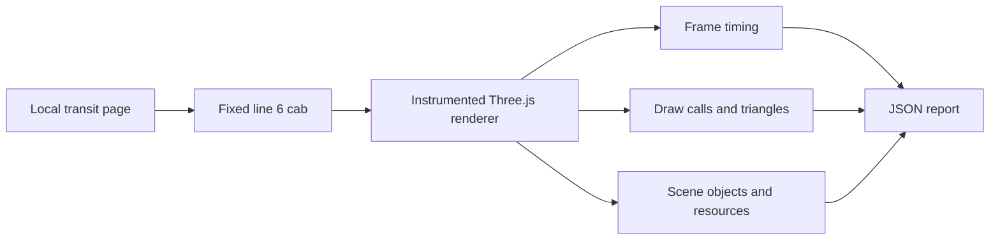

<!-- Repeatable performance-testing guide for the Station3D tram simulator. -->
# Tram simulator performance profiling

This folder contains a browser-level profiler for the real Station3D tram scene. It is intended for before/after comparisons of meaningful changes—not for chasing tiny differences between individual runs.

The architectural findings and ranked recommendations are in [TRAM_SIM_REVIEW.md](TRAM_SIM_REVIEW.md).

The profiler opens a fixed shared-ride cab link for line 6 at central stop `106_1` on shape `6_22`, holds the benchmark cab at that initial position, instruments the Three.js renderer without changing application code, waits for the scene to settle, and writes a JSON report. A fixed location is used because a moving or seeded-random ride samples different city geometry when machines render at different speeds.



## Prerequisites

- Serve `website/` at `http://127.0.0.1:8000`.
- Run the Zagreb API at `http://127.0.0.1:3001`.
- Install the existing browser-test dependencies with `cd tests && npm install`.
- On macOS, use the default headed Chromium run. Headless Chromium may be unable to create a WebGL context.

For example, from the repository root:

```bash
python3 -m http.server 8000 --directory website
```

Then run the profiler in another terminal:

```bash
node performance/tram-sim-profile.cjs --run \
  --output performance/results/tram-sim-local.json
```

Running without arguments or with `--help` prints all options without opening a browser.

## What the report measures

- recent frame-interval and synchronous JavaScript-side `renderer.render()` percentiles;
- the simulator’s own one-second overlay: FPS, hook time, render time, draw calls, triangles, DPR, and the most expensive layer hooks;
- scene mesh, instancing, shadow-caster, material, and geometry counts;
- per-layer passage-relevant mesh and unique patched-material counts, so passage-shader scope can be regression-tested structurally;
- Three.js renderer memory counters and WebGL renderer identity;
- resource counts, known transfer bytes, heap use, and Long Task API totals;
- network-idle and mesh-population readiness diagnostics;
- commit, dirty-worktree flag, browser version, viewport, DPR, and machine metadata.

`status: "completed"` means the requested frame target and performance overlay were reached. `status: "partial"` preserves the available sample when the scene cannot reach that target before the timeout. `status: "initialization_failed"` includes bootstrap diagnostics and browser console errors, such as a missing WebGL context. `status: "incomplete_scene"` means a required local API request failed; those numbers must not be used as a baseline because streamed geometry is missing. Every non-completed status exits with a non-zero code while still writing its diagnostic report.

Before warm-up, the default run waits for browser network idle and then requires the scene mesh count to remain stable for three seconds. This matters because road-graph and building construction are intentionally asynchronous and chunked across frames: a cold run can render hundreds of frames before all building meshes exist. It then discards 180 warm-up frames before collecting its sample. Use `--warmup-frames` to override that final warm-up for targeted experiments.

Runs are deterministic by default: the harness seeds `Math.random` with `1337`, holds the schedule clock at noon, and freezes the benchmark cab pose. This stabilizes traffic placement, active service count, procedural textures, shadow direction, and streamed tile set while other trams and traffic continue their normal frame work. Change the seed/hour with `--seed` and `--sim-hour`; use `--moving-cab` or `--live-sim-clock` only for a deliberately dynamic test. Keep all of these choices identical in before/after comparisons.

## Comparing changes

Use the same machine, viewport, DPR, scene URL, browser mode, and experiment flags for both versions. Run each version at least three times and compare medians; cold caches, background applications, thermal throttling, and moving traffic can move a single result.

The most useful signals are usually:

1. draw calls and visible-flag/shadow-caster mesh counts for GPU/driver overhead;
2. `hooks` and per-layer timing for simulation CPU cost;
3. frame-interval p95/p99 and long tasks for visible stutter;
4. triangles and render time only after the above are understood.

Do not interpret `renderer.render()` duration as direct GPU execution time. It measures synchronous render submission and any associated stalls; a WebGL timer query would be required for isolated GPU time. Also do not compare headed and headless render timings. Headless browsers may use software rendering, and cross-origin resources may report zero transfer bytes unless their server exposes Resource Timing headers.

The diagnostic switches are:

- `--disable-shadows`, which turns off the renderer shadow map;
- `--disable-passage-discard`, which changes `PASSAGE_DISCARD_ENABLED` only in the browser's in-memory response;
- `--enable-log-depth`, which restores the former logarithmic-depth renderer option only in the browser's in-memory response.

The latter two verify that the expected source token was replaced and record that fact under `experiments`. None of these switches edits application files or proposes removing the corresponding visual feature. Use them to isolate a cost, then implement and profile the smallest production-safe version.

Normal depth is the production default. To recheck that decision against the same scene without editing source, compare an ordinary run with:

```bash
node performance/tram-sim-profile.cjs --run \
  --enable-log-depth \
  --output performance/results/log-depth-control.json
```

For the passage shader, inspect `result.scene.topLevel[]` for the `Buildings` entry. `passageRelevantMeshes` counts meshes selected by the conservative bounds broad phase, while `passagePatchedMaterials` counts their unique material variants. A sudden return to thousands of relevant meshes is a structural regression even if a noisy one-off FPS run happens to look acceptable.

## Other scenes

Pass any local Station3D deep link with `--url`, for example:

```bash
node performance/tram-sim-profile.cjs --run \
  --url 'http://127.0.0.1:8000/transit.html?st3d=walk&lat=45.8104&lon=15.9706&stats=1' \
  --frames 180 \
  --output performance/results/walk-local.json
```

Generated JSON and screenshots belong in `performance/results/`, which is intentionally ignored by git.
