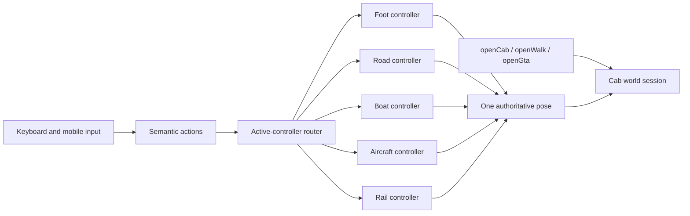
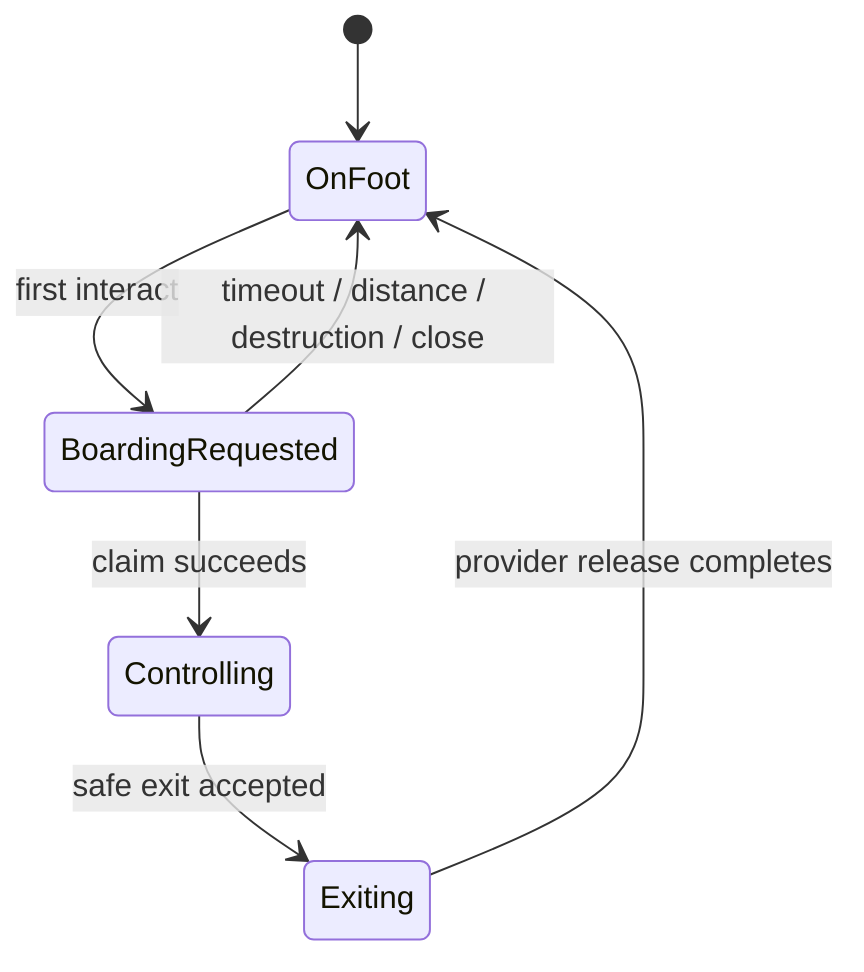
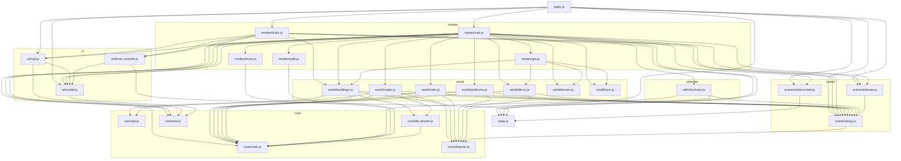

# station-3d

For geometry factories and asset ownership, start at the [model library](models/README.md). Vehicles and street furniture live here; buildings and bridges have one authoring owner in `zagreb-zgrade-datiranje/models/structures`.

First-person tram, walk, station, and Sloboda (`st3d=gta`) local-alpha view for the
transit planner. Loaded as an ES module from `transit.html`:

```html
<script type="module" src="station-3d/index.js"></script>
```

Exposes a single global surface:

```js
window.Station3D = {
    open, openCab, openWalk, openGta, close,
    setInteractionState, getPose,
    setQuality, getPerformanceContext
};
```

The stable browser entry is `station-3d/loader.js`. Native ESM remains the
development and Node-test source; `npm run build:station3d` emits the production
runtime under `station-3d/dist/` with a stable `index.js`, a stable render-Worker
entry, and hashed split chunks. Three.js, Rapier, 3D Tiles, and Draco assets are
self-hosted. Cab, GTA, campaign, photoreal, and weapon code load only when the
selected mode needs them. Add `?bundle3d=1` on localhost to exercise the exact
production entry.

`?quality3d=auto|high|medium|low` selects the renderer profile and persists as
`station3dQuality`; `Station3D.setQuality(mode)` changes it live. High caps DPR
at 1.5 with MSAA and 2048 px shadows, medium caps DPR at 1 with 1024 px shadows
and shorter caster/thin-feature ranges, and low disables MSAA with 512 px
shadows and the shortest detail range. Auto begins from a WebGL capability
probe and changes only DPR, with hysteresis, during settled GPU-bound windows;
compiler, upload, long-task, and event-loop stalls are excluded. The resolved
profile, DPR, drawing buffer, active Worker state, and source policy are exposed
by `Station3D.getPerformanceContext()`.

Building texture budgets are captured on each complete world reset (both streamed and
static modes). High keeps 192 px ordinary façade atlas entries and eight optional
close-detail owners; medium uses 128 px / three owners; low uses 96 px / zero owners.
All retain 512 px atlas pages, source/repair UVs, night lighting, terrain and gameplay.
Live `setQuality()` still changes renderer settings immediately, but close/reopen the
world to apply its new building budget without invalidating already-published atlas UVs.
The active budget is in `__s3dBuildingBuildState().visualQuality`.

`setInteractionState({ hoveredKey, selectedKey })` applies cyan hover and
orange selection overlays without mutating shared production materials.
`getPose()` returns `{ lat, lon, headingDeg }` for the active walk/cab/GTA
session or `null`. The module emits `station3d:entity-hover`,
`station3d:entity-select`, and a `station3d:pose` event throttled to 10 Hz.
Road identity is `osm:way:<id>`; building identity is
`gdi:building:<object_id>` or `overture:building:<id>`.

## Sloboda local alpha

Launch a country-profile session directly through the transit page:

```text
/transit.html?st3d=gta&loc=croatia&lat=45.8150&lon=15.9819&heading=0
```

`lat` and `lon` are required and must lie inside the exact Croatia boundary.
`heading` and `pitch` are optional degrees. Programmatic callers can use
`Station3D.openGta(lat, lon, options)`.

Rail elevation has two directly comparable source modes:

- `railProfile=osm` (default) keeps the proximity-streamed OSM railway. Its
  DGU samples are median-denoised, broadly smoothed, biased modestly toward
  ballast/fill rather than excavation, and constrained to train/tram grades.
  OSM `bridge`, `tunnel`, `covered`, and signed `layer` tags explicitly own
  short structures; bridge/tunnel ways sample their approaches so a missing
  DGU deck cannot pull the track down onto the crossing road. Existing rail
  viaduct geometry uses the shared road/track-aware pillar clearance rule. In
  Zagreb its visible deck is a worn-green box girder with square flanges,
  stiffener plates and dark fasteners. A blocked nominal pier resolves to the
  first clear site on both sides of the road, producing the common pair of
  concrete sidewalk-side supports rather than a column in the roadbed. Deck
  ends overlap the adjoining formation, and explicit structure endpoints own
  the shared rail level of their neighbouring OSM ways so the ballast cannot
  ramp down at a bridge seam. The lower road profile ignores DGU samples owned
  by that upper rail deck. Ordinary street-running tram tracks consume their
  longitudinal road profile and never enter the heavy-rail civil-earthworks
  builder, so terrain discrepancies cannot add tram embankments or retaining
  walls. Explicitly mapped tram bridges, tunnels and embankments remain
  structural. Ambient tram height queries are scoped to their own OSM way at
  plan crossings, while authored independent tram alignments retain the more
  permissive tram grade solver.
- `railProfile=solved` makes one bounded reference-project request around the
  spawn and uses absolute EVRF2000 profiles wherever they cover the corridor.
  Parallel OSM rail is clipped only across those covered metres, so transverse
  crossings and unsolved continuations remain OSM-inferred. Where independently
  versioned solved projects share a trunk, the newest reconstruction owns only
  the overlap and older projects retain their diverging continuation. Split is
  the deliberately bounded exception: OSM station tracks 1–5 and their switch
  leads inherit the solved M604 EVRF2000 profile as non-driveable context, while
  the second main rail continues through the one existing double-track tunnel
  without creating another tunnel shell or importing the wider OSM network. The
  shared civil bore is centred between those two physical centrelines, begins and
  ends at the solved profile's published tunnel chainages, and has exactly one
  deduplicated portal at each end. Its swept masonry is interior-facing; only the
  short bounded portal collar is two-sided, so low/coarse terrain at the harbour
  mouth cannot expose a freestanding tunnel roof above the near-sea-level rail.

Both modes use the same rail renderer, formation model, streamed-source
revision lifecycle, collision publication, and ambient/playable tram graph.
The formation graph is rebuilt on a settled rail-source change or DGU terrain
revision, never per frame. `Station3D.openGta` accepts the equivalent
`railProfileMode: 'osm' | 'solved'` option; solved spans go in `otherTracks`.
Overhead equipment follows the same revision discipline: each 600 m cell has a
signature derived from its actual rail geometry plus its support halo. An
equivalent streamed revision is a no-op; a changed cell is staged while its
published wires remain visible, then atomically replaces the old cell.

The current loop is walk → approach a visibly parked unoccupied vehicle → use
the glowing `E` affordance to enter → drive → stop → exit. Cars, vans, trucks,
buses, mapped-water boats, runway aircraft and ambient trams are claimable. Buses have a flat
front and three outlined passenger doors on the Croatian right-hand kerb side.
Simulated people
are visible by default in GTA mode but have no collision or interaction
behavior; `H` hides or shows them. Up to four ambient groups can include a
low-poly dog walking on a visible leash. Ambient-person and dog spawn, route
planning and movement reject mapped sea and decor water; the player
intentionally retains water traversal.

| Action | Keyboard | Mobile |
| --- | --- | --- |
| Walk | existing walk controls | walk pad and look controls |
| Jetpack (on foot) | `Space` | jetpack button |
| Enter or exit | `E` | enter/exit button |
| Throttle / brake-to-reverse | `W` / `S` | up/down drive pad |
| Steer left / right | `A` / `D` | left/right drive pad |
| Aircraft nose down / up | `W` / `S` | up/down drive pad |
| Aircraft throttle / hold power | `Space` raises, `X` lowers, `Q` holds the current setting | `SPACE` hold button / — |
| Aircraft brake | `B` | `STOP` button |
| Full stop | `E` while moving | `STOP` button |
| Handbrake (road vehicles) | `Space` | `SPACE` hold button |
| Change view | `C` | camera button |
| Hide / show simulated people | `H` | — |
| Terrain diagnostic | `T` cycles isolated textured terrain + wireframe, wireframe only, then restores every world layer | — |
| Scene inspector | `Shift` + click any visible surface | — |
| Reset upright / to nearest road | unmodified `R` | reset button |

The terrain diagnostic does not reload or pause the simulation. Within the DGU
detail window it exposes the actual 4 m render lattice sampled from the 1 m DGU
source; outside it the streamed fallback uses 20 m triangles. This distinguishes
source-elevation/tessellation artifacts from roads, buildings, ballast and
formation earthworks.

`Shift` + click opens the general scene inspector on the right. It reports the
camera-ray hits and a downward surface stack at the selected X/Z, including
object path, producer, layer, feature identity, material/render role, local and
geographic coordinates, shader-painted terrain land use, and the semantic
civil-ground owner/stage trace at that point. Selecting a hit
highlights the owning mesh or merged feature range when one is available;
building hits retain the facade plane-bucket/near-coplanar analysis. Layers are
grouped into collapsible topics; each topic has a tri-state checkbox that can
hide or restore all of its layers at once, while individual checkboxes remain
available for terrain, asphalt, sidewalks, curbs, road/rail earthworks,
trackbed, water, buildings, vegetation and other registered scene producers.
The selected surface's topic opens automatically. Hidden state also applies to
geometry streamed after a layer was hidden. “Copy all” copies a compact JSON
diagnostic for the selected point in a chat-ready schema: it retains the hit
stack, OSM/feature and vertical-alignment evidence, matched surface owners and
publication problems, while omitting unrelated global publication entries and
repeated material/user-data contracts under a strict 60,000-character budget.
“Restore all layers”, closing the panel, and closing the Station3D
session restore the exact original visibility state. Unregistered scene roots
remain inspectable and are named as such so producer metadata gaps are visible
instead of silently omitted.

That rendered piecewise-planar surface is the only bare-earth authority. GTA
terrain collision samples the same globally aligned lattice; passive OSM grass,
forest, paving, flowerbed, sand, playground and fitness polygons are material
classes painted onto those triangles, never separately triangulated relief.
Roads and rails may add firm designed surfaces, walls and collars. Fill keeps
the supplied terrain underneath as a watertight backstop, while only measured
excavations and explicit structure openings may remove it.

All producers consume the canonical policy in `core/surface-hierarchy.js`. It
is the sole source for same-level precedence, civil authority order, physical
surface offsets, stencil bits, ownership-mask channels and technical render
sequencing. Every drawable publishes a compiled `SurfaceClaim`; missing
coverage or elevation evidence defaults to `planned` / `unknown`, never to a
permission. Its three independent decision channels distinguish visible
colour, physical support and terrain-backstop removal: paint and rail steel can
own colour without becoming walkable, and a structural opening can cut terrain
only after explicitly publishing its replacement backstop. Same-level
precedence applies only after the vertical relationship is known: bridges,
overpasses, underpasses and tunnels preserve both surfaces and let explicit
geometry/depth decide visibility. Planned or partially built geometry may never
suppress an existing surface. Replacement begins only after complete geometry
is published; exact stencil and visible geometry land in one new-before-old
atomic swap, while mask-based owners must retain their previous surface until
the successor mask lands. Terrain is the final visual backstop and always wins
over literal void; an intentional opening is valid only when its interior or
structural backstop is already present.

Civil ground composes in the fixed semantic authority order `terrain → rail →
road → sidewalk → path → building`, defined by
`core/surface-hierarchy.js` and executed by
`core/civil-ground-composition.js`; mesh arrival, layer startup and render
order cannot change it. One subsystem owns each stage. It receives the
accumulated ground from every earlier stage and either publishes a real ground
surface or returns `null`, leaving that input untouched. Ordinary rail cut/fill
publishes its complete trackbed, batter/retaining face and terrain collar; road
profiles keep their own solved top but sample that rail-modified result for both
grade evidence and earthwork toes, then publish their own ordinary top and
dressing for later owners. Geometry-token snapshots invalidate only downstream
roads inside materially changed upstream bounds, not on every streamed model
revision.

Viaducts, bridges, underpasses and tunnels do not register as ground: their
decks, bores, portals and supports retain explicit upper/lower structure
ownership. Sidewalks, paths, curbs and markings currently remain carried
surfaces of the resolved road/rail formation; their named stages reserve the
same contract for future earthworks without changing today's geometry. Buildings
likewise extend foundations to ground instead of modifying it. The cumulative
handoff makes a road beside a rail cutting or embankment join the already-built
railway earthwork rather than independently returning to the original DGU and
intersecting it.

An ambient tram advertises `E` within 12 m. The first press reserves it for 30
seconds and applies its service brake; the reservation is cancelled if the
player moves more than 40 m away. Once speed is at most 0.4 m/s, the right-side
doors open. Move within 3.2 m and press `E` again after they are fully open to
enter the existing front cab. `W/S` drive, `A/D` arm the next rail turn, `B`
rings the bell, and `C` cycles front, rear, and exterior views. To exit, stop at
a supported, unobstructed right-side location, open the doors, and press `E`.
The same exterior tram remains in the world throughout; after a two-second
dwell it closes its doors and resumes autonomous motion on the source edge the
player reached. Sloboda heavy-rail trains remain non-enterable.

On foot, `C` alternates first- and third-person view. Third person renders the
same low-poly stick figure used for other people, with a backpack whose exhaust
appears while the jetpack is lifting the player. In a car, `C` cycles the three
chase views. Holding `S` at forward speed applies the service brake; reverse
does not engage until the car is nearly stopped. Pressing `E` above the safe
exit speed now latches the same all-wheel service brake instead of merely
refusing the exit; press `E` again once stationary to get out. The mobile
`STOP` button uses that latch directly. A fresh `W` or `S` press releases it.
The release follows the physical non-repeat keydown rather than the cached held
key set, so a lost key-up cannot leave `W` inert; keyboard auto-repeat cannot
cancel a Stop requested while the pedal remains held. Modified reset shortcuts
are never captured, so browser `Ctrl+R` / `Cmd+R` reload continues to work.

Boats use a mapped-water-constrained arcade controller, a tapered V hull,
speed-dependent bounded wake/spray and managed CC0 recorded engine/water loops.
Aircraft are runway-derived and globally capped at two. `W` pushes the nose
down, `S` pulls it up, holding `Space` increases throttle, `X` reduces it, `Q`
holds the current setting, and `B` cuts thrust to idle while applying the wheel
brakes. An airborne aircraft can reduce to its minimum flying speed but cannot
stop in the air. Reaching the runway end at
takeoff speed transitions into flight instead of pinning the aircraft against
the runway boundary. The aircraft mesh has an animated propeller, a rounded
cabin greenhouse with a static door outline, a low Cessna-like cowling that
leaves the windshield clear, rounded/tapered wing and tail surfaces, three landing-
gear assemblies, a lofted fuselage that slopes upward and narrows toward the
tail, and managed CC0 recorded propeller audio. Source and license details are
pinned in `audio/sfx/special-vehicles/ATTRIBUTION.md`.

Flying replaces the rail chainage/grade readouts — meaningless off the rails —
with three gauges the pilot can act on: `AGL` (height above the ground actually
below, from the same lookup the flight solver lands against), climb/descent rate,
and throttle percentage with the `Q` power-hold marked. The altimeter reads the
aircraft's own height, not the terrain under it, and the vehicle badge names the
vehicle you are in. The 🎮 button in the header re-shows the control list for
whatever you are currently controlling, so the flying keys are not lost with the
five-second toast you got on entry.

OSM `highway=traffic_signals` points are retained by the Croatia import,
but a pole is published only after the streamed road polygons place it outside
every carriageway with 0.4 m clearance. Unverifiable points wait for road data
instead of falling back onto the roadbed. Each head has two exposed road-facing
lamp sets running the deterministic red/amber/green cycle, which aligned ambient
traffic consumes as a braking control. GTA also renders bicycles, cargo bicycles
and playable ambient trams.

Vehicle physics uses pinned `@dimforge/rapier3d-compat@0.19.3`, a fixed 60 Hz
step and at most four catch-up steps per rendered frame. The current collision
bubble includes DGU terrain, a bounded firm-road overlay built from the same
road polygons and vertical profiles as the visible asphalt, building walls,
authoritative civil walls/supports, nearby traffic, trees, fountains, lamps,
and benches.
Buildings/trees/fountains/civil works are immutable; lamps and benches break
above configured contact-force thresholds and stay absent after tile reload for
the current session. Moving ambient cars inside 80 m are promoted without
changing identity into dynamic Rapier bodies; they keep their existing render
mesh and route state, recover toward the traffic path after an impact, and
demote beyond 120 m. Parked and wrecked traffic remain kinematic obstacles, and
the combined traffic-body set has a contact/nearest-prioritized hard cap. The
controlled car has impact damage, bounded pooled debris, a persistent
speed/load-sensitive six-layer CC0 recorded engine bank with a synthesized
fallback, managed audio, camera response, CCD, three chase views, and
reset-to-road recovery. It uses a 1,250 kg low-centre-of-mass
rear-wheel-drive tune, front-biased service braking and a lateral-acceleration
steering limit at road speed. The rendered chassis offset rotates with the
physics body, and emergency recovery raycasts the actual Rapier road and terrain
colliders rather than treating a separately sampled visual height as collision
truth. Road-vehicle shells have rounded edges and extend across nearly the full
visual footprint, including the flat bus nose, so road seams cannot hook a sharp
undersized box. If fewer than three wheels report contact or the body tilts,
recovery additionally checks the four tyre points and four chassis underside
corners; a buried nose or corner is lifted only to exact collider support.
Stable upright driving retains the original centre-only ray. Road triangles are
refined before the formation height is sampled, which
keeps long or curved asphalt polygons continuous on graded streets. The terrain
collider uses the rendered terrain sampler, while civil surface and wall
colliders use their own authored profiles instead of rewriting bare earth;
fixed-collider ingestion is capped at 16 operations and 2 ms per
frame. The recorded source and license are documented in
`audio/sfx/car-engine/ATTRIBUTION.md` and
`audio/sfx/tire-skid/ATTRIBUTION.md`; the tyre loop is the primary squeal source
and synthesis remains its load-failure fallback. A small safe-entry footprint prevents
mapped geometry from applying a
depenetration impulse before the car moves, and ambient traffic collisions no
longer create damage or sparks on the player car. GTA also limits the heavy
detailed-building look-ahead to 450 m while retaining far LOD to the horizon.

Visible road ownership is resolved per fragment: asphalt writes an independent
carriageway stencil bit, so buffered sidewalks and crossing polygons cannot draw
through the road even when their source geometry overlaps it. Asphalt,
sidewalk-level surfaces and mapped parking also claim a shared roadbed bit in
render order. Passive ground and synthetic curb back-ramps mask only that bit,
so neither can protrude as a pale stripe through asphalt or parking. Curb
openings are limited to tagged crossings and pedestrian precincts; parallel
footways, sidewalks and cycleways keep the physical curb between them and the
carriageway. Road-formation collars test their endpoints and mitres against
neighbouring road polygons so driveway collars cannot leave pale corner slivers
in the asphalt. A fully at-grade formation also omits its retaining face,
terrain collar and terrain cutout: otherwise the mandatory 0.8 m batter width
turns a zero-height face into a continuous smooth-grey apron along both road
edges. A profile with genuine relief keeps its civil face and collar, but the
terrain mask is limited to sustained sampled cut runs. Road fill remains
additive over the supplied DGU surface instead of deleting it and relying on a
second, independently tiled shell to close the ground.
Excavation evidence comes from ground occupying the road axis, not the highest
terrain beside it; an adjacent rail embankment therefore cannot authorize a
road-shaped hole through that embankment. Independently tunnel-tagged OSM
footways and cycleways own compact pedestrian concrete boxes (2.6 m clear
height, 0.45 m roof, 16% default ramp limit), while paths merely carried on a
road bridge remain non-structural companions. The upper road keeps its own
smoothed firm profile over such a pedestrian underpass.
Sharp curb corners above the miter limit use a true bevel with bounded segment
offsets instead of a clamped shared point, eliminating diagonal tails around
parking and tree islands. Parking-derived curbs close with a vertical back face
because the mapped parking/green surface already exists behind the stone; only
road-union curbs retain the one-metre synthetic back-ramp. Streamed road-profile replacements remove and
republish the same named aggregate owner in its original regional bucket, and
asphalt stencil-writer buckets upload before dependent concrete buckets even
when the per-frame upload cap spreads a tile over several frames. This prevents
stale surfaces from accumulating and prevents a concrete/default-looking patch
from briefly growing through the carriageway. A per-tile publication barrier
releases curb work only after every road-surface aggregate bucket needed by that
tile has actually swapped into the scene. The startup Curbs segment is an
explicit four-observer-tile gate: each tile counts as ready only after curb
data, road masks, the parking/green index and that asphalt publication have
arrived and its final empty or populated geometry has published. Cooperative
curb stages consume the queue's millisecond budget rather than one stage per
frame, and a completed serialized generation remains visible while a coalesced
successor rebuilds. Horizon curb streaming does not control the startup gate.
The ownership/lifecycle changes add no meshes or draw calls; bevels add only a
few triangles to the existing curb tile meshes, and the at-grade rule removes
unneeded geometry and draw calls.

This is not yet a production all-Croatia release. Rapier rebases locally after
2 km, but the complete Three.js world does not yet share an atomic floating
origin. Moving terrain refreshes its visible surface and physics collider, but
does not yet invalidate every terrain-seated visual layer. The country profile
re-resolves continental/karst ground, natural scatter and building architecture
every 1 km. It rebuilds terrain UVs and cached detailed-building tiles through
bounded near-to-far queues without refetching building payloads. Road decks,
curbs, tunnels, bridges, viaducts and supports do not yet have structure-aware
stacked-surface collision groups.
The server-side bbox limits and national query safeguards are also outside this
repository. See
`docs/gta-croatia-plan.md` for the release gates.

During a GTA session, `window.__gtaCroatiaDebug()` returns bounded physics and
traffic counts, timings, dropped physics time, contact totals and capacity hits.
The same data appears in the performance overlay under `GTA PHYSICS` and is
included in `window.__perfTrace`. Headless verification is the normal unit
suite:

```sh
npm test
```

The complete headless contract count is reported by the command rather than
pinned here, because the suite grows with each Station3D subsystem.

## Render packets and Worker compilers

Terrain and far-building geometry are authoritative Worker slices. One module
Worker per Station3D session accepts immutable, generation-tagged jobs and
returns transferable `station3d-render-packet-v1` packets. Packet coordinates
are physical metres relative to a session-independent tile origin; primitives
carry typed geometry arrays, material keys, bounds, entity ranges, surface
claims, and optional collider data. Worker-reachable compilers are pure core
modules and cannot import Three.js, DOM, UI, scene, or world-layer state.

The main thread validates every packet, creates Three.js resources through a
bounded delivery queue, positions the tile root, and atomically publishes the
complete generation through `SurfacePublicationRegistry`. Cancellation, stale
results, malformed output, and a bounded one-time Worker restart all retain the
previous complete generation. There is deliberately no silent synchronous
production fallback. Terrain keeps one immutable snapshot per active revision;
far buildings preserve proposal filtering, terrain evidence, picking, detailed
LOD swaps, passage cuts, cancellation, and eviction across the Worker boundary.

Tracked scenarios and compact A/B summaries live in `performance/station3d/`;
raw browser traces under its `results/` directory are ignored. The supported
harnesses are `tools/perf-baseline.mjs`, `tools/perf-attribution-baseline.mjs`,
and `tools/perf-lifecycle.mjs`.

## Unified session and controllers

`modes/cab.js` is the only live Station3D world/session engine. It owns scene
setup, streaming layers, rendering, the camera director, HUD/audio routing and
teardown for `openCab`, `openWalk`, and `openGta`; those public functions are
compatibility launchers, not separate runtime engines. One controller router
selects exactly one authoritative pose and camera profile per frame.



Every registered controller implements this contract:

```text
activate(context)
handleAction(action, phase)
step(dt) -> authoritative pose
getCameraProfile()
requestStop()
getExitState()
deactivate(reason)
dispose()
```

Specialized solvers remain independent: walking retains walk collision and
jetpack physics; road vehicles retain Rapier; boats and aircraft retain their
arcade solvers; trams and trains retain graph-snapped rail motion. The router,
not the solvers, decides which one owns the session pose.

Free-roam launchers select immutable capability presets from
`core/session-capabilities.js`; they do not select different engines.
`openWalk` starts the quiet inspection preset, while `openGta` enables named
capabilities for road vehicles, boats, aircraft, ambient-tram claiming,
Croatia rail streaming, parked vehicles, traffic lights, default pedestrians,
continuous movement streaming, render-origin rebasing, the expanded building
horizon and Croatia bounds. Ordinary moving road traffic remains part of the
shared world in both presets. Callers may narrow individual capabilities with
`options.sessionCapabilities` without mutating the shared preset. The legacy
`status.gtaMode` field remains derived from the preset for HUD/event consumers;
world layers never use it as a feature switch.

Enterable world fleets implement one provider shape:

```text
findNearest(local)
requestBoarding(id)
claim(id)
sync(id, pose)
release(id, pose, policy)
cancelReservation(id)
```

The shared occupant lifecycle is deliberately solver-independent:



Ambient tram records survive ordinary streamed reconciliation while reserved or
claimed. A claimed record is not autonomously advanced or recreated, and its
existing exterior mesh is published once as a tram obstacle. Streamed rail
graphs rebuild only when the active source revision changes. A replacement is
accepted only when the controlled pose re-snaps within 60 m; signed speed,
throttle, armed turn, direction, doors, and camera mode otherwise remain on the
previous usable graph.

## Layer protocol

Every world / vehicle module exports a layer object:

```js
export const fooLayer = {
    beginSession(ctx) { /* create groups, register caches */ },
    onFrame(pose, local, dt) { /* per-frame work; optional */ },
    endSession() { /* dispose groups, clear caches */ },
};
```

`ctx` is a shared object the cab orchestrator passes to every layer:

```js
{
    anchorLat, anchorLon,   // scene origin
    fetchController,        // shared AbortController for in-flight fetches
    otherTracks,            // OSM tram geometry
    allStops,               // stops list for platforms
    otherTrainsFn,          // live poses of other trams
    initialPose,            // starting pose (for layers that need to build before the first frame)
    onBuildingCountChanged, // narrow callback the buildings layer uses
}
```

`modes/cab.js` holds a single `layers = [...]` array. Adding a new layer
(traffic cars, weather, player tram, whatever) is a 2-line change: import the
new layer object and push it onto the array.

## Module graph



## State flow

- **`scene/setup.js`** owns the Three.js singletons (`scene`, `camera`,
  `renderer`, `controls`, `groundMesh`, `ringMesh`, `northArrowMesh`,
  `stationMarker`, `buildingMaterial`). They are `let` exports assigned inside
  `initScene()`; consumers get ES-module live bindings — never read them at
  module top level, only inside functions called after initialisation.
- **`state.js`** holds only `mode` (`'static' | 'cab'`) and `cabState`. `cabState`
  contains cross-cutting per-ride fields: the active-controller router,
  generic occupant, pose history, anchor, fetch controller, and handoff callbacks. GTA remains a cab
  orchestration submode rather than a third top-level scene mode. All layer-owned state
  (platform groups, tree groups, tile maps, etc.) lives inside the respective
  layer modules — `state.js` does not know about them.
- **`scene/animate.js`** owns the `requestAnimationFrame` loop plus a
  before-render hook registry. It is mode-agnostic: static mode and cab mode
  both register their own `onBeforeRender(fn)` hooks on enter and unregister
  on exit. The loop itself never reaches into mode logic.
- **`core/dispose.js`** owns a registry of shared resources (geometries /
  materials / textures). Modules that create a shared singleton call
  `registerShared(...)`; `disposeGroup()` skips anything in the registry.
  Layers that manually dispose cached materials at session end pair the
  `.dispose()` with `unregisterShared()` so the set stays accurate.
- **`core/tile-stream.js`** defines the shared tile grid and canonical stream
  options; `core/shared-tile-session.js` owns fetching, delivery and eviction.
  Layers subscribe to one source per endpoint with
  `onFetch(features, tileKey)` / `onEvict(tileKey)`, so sibling consumers share
  the payload without inventing their own request order.

## Photoreal reality-mesh contract

Photo mode keeps three authorities separate:

- the saved `verticalProfile` owns the authored rail elevation and direction;
- Google Photorealistic 3D Tiles own the visible source surface only where no
  civil replacement has claimed it;
- DGU DTM or robust local bare-earth evidence classifies formation, cut,
  viaduct, and tunnel, but never bends the authored alignment.

All authored lon/lat/EVRF2000 points pass through one session tangent frame.
Google receives one vertical root translation near the session anchor; rails,
stations, platforms, civil works, vehicles, and cab-to-walk handoff reuse the
same frame and do not independently register themselves.

`core/photo-corridor-ownership.js` is the pure source-ownership contract used
by `world/photoreal.js` to build the GPU mask and by walk/decor queries to
reject shader-hidden Google triangles. Portal mouths, shallow full-headwall
facade collars, narrow bore hoods, intact tunnel core, generic corridor, and
station envelopes are separate owners with explicit precedence. At the current
one-metre mask resolution, a portal's full-removal collar reaches two texels
onto the approach and two texels into the hill, with a 13 m half-width. Its
opaque facade reaches `2 + sqrt(2)` m to either side of the nominal face and
`13 + sqrt(2)` m laterally, leaving one complete mask-pixel diagonal of masonry
around every plan edge. The ordinary cut uses that same derived contract: its
12 m source-removal edge is buried inside a wall whose outer face and formation
floor reach `12 + sqrt(2)` m; terrain evidence is sampled another 0.75 m out.
There is no independent wall-centre offset that can drift below one texel.
Both portal directions use a right-handed inward frame so front-face culling
cannot remove the outward facade. A central hood starts behind the collar,
extends 10 m into the hill, and tapers from the minimum portal crown to the
running-tunnel roof. The headwall is at
least rail +9.45 m so it remains visible above the bore, then rises to the same
robust retained-ground crest as the adjoining cut walls. Its face is placed at
the first/last sampled section that meets the tunnel-cover criterion—not a
fixed distance farther into the hill—so steep terrain cannot force a needless
terrain-height headwall. The shared 60 m civil safety cap remains only a guard
against bad samples. Facade height is never encoded in the track-floor channel:
the shallow red collar clears its source footprint completely, while the green
hood carries only the bounded bore roof. Raw Google surface height and the route-wide mask range are not
portal dimensions. Retaining walls likewise use the median of neighbouring
robust bare-earth samples, never a DSM roof/tree hit, and viaduct-owned spans do
not emit retaining walls. These rules prevent terrain-height headwalls,
freestanding wall/pillar spikes, and sub-texel portal collars.

A straight, level tunnel station uses the rigid authored hall. A legacy stop
whose curved or graded route cannot carry that hall instead becomes a compact
`station-covered` chamber swept along the sampled rail. One indexed ring set
owns its floor, walls, roof, source mask, and walk colliders, so bends cannot
open box-to-box gaps. Its roof is always 8.25 m above rail, only 0.80 m above
the running tunnel's source roof, and never stretches to Google terrain. Each
owned endpoint is perpendicular to its route segment, while one bounded outer
corner fan joins it to the adjacent running-tunnel face without a duplicate
ring, crossed quad, or longitudinal ownership extension. The same fan topology
owns the mask, roof/floor, exterior wall band, light and walk collision. The
section then widens over 8 m and every solid is capped at its exact boundary.
The CPU ownership test evaluates the same two mask triangles, diagonal, and
barycentric roof payload as the GPU; a centreline projection is not equivalent
on a graded miter. The fallback also owns one 52 m route-swept side platform at
rail +0.90 m, its tactile strip, and a short route-swept nameboard. The legacy
surface canopy, rigid hall, rail flare, and saved-level boarding actors are
suppressed rather than mixed into that chamber. Covered stations are tunnel
continuations for portal ownership, so their boundaries cannot create
fictitious tunnel mouths or masonry headwalls. Google remains visible
above the authored lid and is clipped only inside the covered chamber.

Walk support in an active photo world comes only from locally raycast Google
surface that still owns the point or explicit visible civil/track support.
Scene `y = 0`, a session-wide minimum, and a retired spawn height are not
ground. An abstract fallback world may supply support only when Google is
actually unavailable. New tile/LOD meshes must receive the same material and
walkability hooks as meshes present at startup. Shader-patch authority is the
actual revisioned `onBeforeCompile` and program-cache-key wrapper, never a
`userData` boolean: Three.js copies `userData` but not those callbacks when a
material is cloned. The existing half-second tile traversal reconciles callback
identity so a late clone or replacement cannot resurrect unclipped source.

An enclosed authored tunnel is also a source-visibility boundary. While the
observer is physically below the running-tunnel roof, the Google tile group and
its updates are suspended: the source above the masonry cannot contribute a
visible pixel but otherwise remains expensive to stream and draw. This rule is
observer-height-aware, so a walker or jetpack above the same alignment still
sees and updates the photo world.

Legacy/ambient trains never derive height from whichever rail formation happens
to be nearest. Their canonical route supplies horizontal pose, elevation, and
grade, including DGU/terrain drape and deck offset. This matters at
grade-separated crossings, where a global nearest-rail query can jump a train
onto the crossing structure. Walk support applies the matching principle:
unreachable decks are overhead surfaces, not floors.

## Background scheduling contract

Interactive motion has priority over world completion. Shared tile delivery and
frame-chunk queues defer expensive work during fast walker movement, then
reprioritize pending work from the observer's current cell outward when motion
settles. A task may opt into a very small during-motion slice only after it has
been measured as bounded; orientation roads are the current example. Do not
apply walker gating blindly to cabs, because a cab is continuously moving and
would starve its world.

Near roads, rails, curbs, markings and detailed/far buildings use the same view
tiers: observer-supporting tiles first, then visible, peripheral and hidden
tiles, with distance breaking ties. The narrow look-ahead corridor is
speculative and never gates publication of the immediate support ring. Geometry
that was already published gets a short look-away grace to avoid rebuild churn;
queued, fetching or building tiles that leave both the support ring and current
corridor get no grace and are cancelled immediately. Each tile holds a lease on
its coalesced request: cancellation frees that source's bounded slot at once and
aborts the HTTP/decode when no other visible source still needs the same URL.
Queued delivery callbacks re-check ownership before invoking a layer, so stale
payloads cannot rebuild after eviction. Streamed rail publishes its first
snapshot only after the local 3×3 road-tile ring has delivered (empty tiles
count), with a bounded fail-soft for a degraded tile; the rest of the 1.4 km
road corridor cannot delay nearby track.

`core/background-activity.js` lets loaders/builders publish `{kind, label,
pending}` to the FPS overlay. `pending` is a count of source-specific work units
or tiles, not milliseconds, and every registration must be removed during
session teardown. “background caught up” means no registered work remains.

## Shared civil feasibility contracts

`core/station-contract.js` owns the underground station's vertical form. The
worst terrain sample over each envelope selects exactly one buildable form:
full rigid station, compact 60 m covered station, or open cut. The elevation
strip and both render worlds consume the same result; do not create a fourth
state for a box protruding through insufficient cover.

`core/intelligent-pillar-placement.js` owns viaduct support placement for model
and photo worlds. Callers provide road/rail clearance; the shared policy tries
keep → slide along alignment → skip within maximum span → least-bad forced
placement. OSM roads, tram tracks, and heavy rail are obstacles, while a
recognized divided-road median is valid. When a photo support moves, resample
the ground at the moved footing.

For the general implementation and QA playbook, use the shared
`$google-reality-mesh` skill together with `$croatia-geodata` for DGU and
EVRF2000 specifics.

## Adding a new layer

To add e.g. a weather layer:

1. Create `world/weather.js`, export `weatherLayer = { beginSession, onFrame, endSession }`.
2. In `beginSession`, instantiate a `new TileStream({...})` if you want
   tile-streamed data, and add any meshes to a session-owned group.
3. On `onFrame(pose, local, dt)`, call `stream.ensureAround(local.x, local.z)`
   (no-op if tile didn't change) and animate per-car positions.
4. On `endSession`, `.abort()` the stream, dispose your group, clear caches.
5. Register any shared geometry/materials via `registerShared(...)` so
   disposeGroup skips them.
6. In `modes/cab.js`, import `weatherLayer` and push it onto the `layers` array.

Adding scoring, replay, or live-feed integration follows the same pattern.

## Boundaries to respect

- **`core/*`** stays pure — no THREE, no DOM, no module-level mutable state
  besides caches. Easy to test in isolation.
- **`scene/*`** must not import `ui/*`, `world/*`, or `vehicles/*`.
- **`world/*` + `vehicles/*`** may import `scene/setup.js` (to add to the scene)
  but nothing from `ui/*` or `modes/*`.
- **`ui/*`** must not import `world/*` or `vehicles/*`.
- **`modes/*`** is the only layer allowed to orchestrate across
  world + vehicles + UI. This is where growth goes when features span layers.

## Debugging photo-mode mask artifacts: `__photorealDebug`

When a photo-world artifact (floating crust, sliver, hole) survives a fix, do
not iterate on the ownership model — measure. A read-only console hook is
always installed by `world/photoreal.js`:

- `__photorealDebug.probeAim()` — get the artifact roughly mid-screen and run
  this. Sweeps an 81-ray fan, walks each hit chain PAST shader-discarded ghost
  crust (raycasters hit invisible carved geometry — the first hit is almost
  never what the eye sees) to the first surface that renders, then probes it.
- `__photorealDebug.probe(x, z, y?)` — reads the ACTUAL mask pixel back from
  the GPU at a world position (row orientation self-calibrated against the
  route centerline texel), decodes it exactly like the tile shader, and prints
  the point's along/across in every portal frame and flank strip.
- `audit()`, `ownershipAt(x, z)`, `collars()`, `hoods()`, `flanks()` — scene
  census (per-material patch check by function identity), CPU ownership rules,
  and the raw region lists.

Scene coordinates are session-local (the world re-anchors per boarding) —
never reuse coordinates across reloads; always re-probe via `probeAim()`.

This hook is how the 2026-07-22 "un-killable portal sliver" was solved after
five model-driven fixes missed the real cause (core join discs bulging through
the portal face — see MEMORY.md and the `google-reality-mesh` skill playbook).
