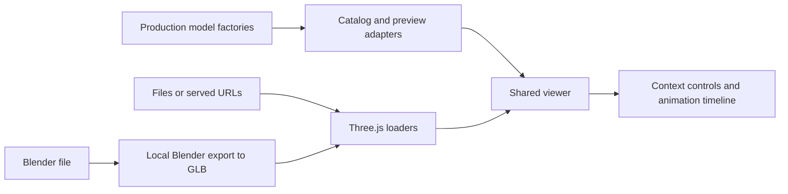

# Shared model viewer

[model-viewer.html](../../model-viewer.html) is the common inspection page for all Station3D vehicles, people, faces, animals and small objects. It uses the production factories and one renderer, so legacy vehicles, new studies and imported meshes share selection, cameras, lighting and comparison. Buildings and landmarks remain in the `zagreb-zgrade-datiranje` viewer.



## Run and inspect

From the repo root, run `npm run models:viewer -- 8105`, then open `http://localhost:8105/model-viewer.html`. This starts the existing development server with caching disabled. It does not need the world API or database. Native Three.js modules come from the installed package; `npm run build:station3d` also copies them and the format decoders into the public vendor directory for a static host.

Choose a model or search the catalog. **Detailed studies** includes the recovered Blender fleet, TMK tram, HŽ train, leut, UTVA airplane and detailed Viktorija bust. **Earlier studies** retains the previous road-fleet builds and boat comparison meshes. **Compare with** opens a second model using its original scale; **Match displayed size** helps compare a bust with a whole person. The Primary/Comparison tabs select which model's controls and camera presets you edit. Camera orbit, pan, zoom, framing, grid, wireframe, day/night lighting, backgrounds and PNG export work for every model. The fleet also has a full line-up entry; boat studies expose a sea toggle at their authored waterline.

Each model displays its name followed by a permanent four-character code, such as `Sedan TSDM`. The codes distinguish variants and stay fixed when names, catalog order or descriptions change. Authoring tools such as Blender appear as small provenance labels, never as part of the model name. Search also matches codes and provenance.

Context controls include the old/new tram comparison, tram/train doors and detail levels where available, train articulation, character expressions/talking/walking/sitting/turning, seeded crowd faces and the instanced waiting view, airplane cabin cameras and the before/after mesh, propellers, breakup, and object-specific moving parts. Controls appear only when supported by that model. Imported clips have a clip selector and the common play/pause, speed, rewind and seek timeline. Rendering sleeps when idle or the page is hidden.

Links can use `?model=airplane-smuggler`, `?model=tmk-2400-new&compare=tmk-2400-old`, or `?model=actor-resistance-leader&cam=front`. The viewer writes model/control state into the URL. `seed` fixes crowd identities and `chrome=0` hides the UI for capture. Imported local files remain available only in the current page session; their temporary IDs are not shareable links.

The former rolling-stock and people pages redirect here, preserving their actor, crowd, camera, seed and animation options. `tools/face-study-shot.mjs` also uses this page and its deterministic seek API.

## Open a file or module

Use **Open a model**, drop files onto the canvas, or choose a folder. Select the model together with external textures, material libraries and buffers. Duplicate texture basenames must retain their folder paths.

| Input | How it opens |
| --- | --- |
| GLB / glTF | Three.js GLTFLoader, including animation clips, Draco, Meshopt and KTX2 support |
| `.blend` | Local Blender subprocess exports a temporary GLB, then the same loader opens it |
| Three.js JSON | Object/Scene/Mesh JSON or BufferGeometry JSON; stored animation clips remain playable |
| Blender mesh-document JSON | The recovered fleet/boat material groups, with their original normals, glass, emission and Z-up coordinates |
| JS / MJS | A served module URL, export name, and optional JSON factory arguments; standalone files can also be selected |
| OBJ + MTL, FBX, STL, PLY, DAE | The corresponding Three.js addon loader |
| An in-memory Three.js object | `window.modelViewer.open(mesh)`; Mesh, Group, Scene and BufferGeometry are accepted |

For example, open `./station-3d/models/vehicles/boat-airplane.js`, export `createAirplaneMesh`, with arguments `[{"interior":"smuggler"}]`. Arguments can be an array of positional arguments or a single options object. Modules with relative dependencies need a served URL so imports resolve normally.

Blender is detected on PATH or at its standard macOS application path; set `BLENDER_BIN` for another installation. Pack external textures into the `.blend` first. Conversion preserves supported glTF animation, including shape keys, and exports visible objects. Arbitrary Blender materials and simulations still follow Blender's GLB exporter capabilities. Conversion uses factory startup, disabled script auto-execution, an isolated temporary directory, a two-minute timeout, a 256 MB input limit and one conversion at a time. The endpoint is available only through the loopback development server. Static hosting supports the other formats; export GLB before opening Blender work there.

Durable study entries live in [`models/viewer-studies.json`](../models/viewer-studies.json). Their source files, exports and reference images live together under [`models/vehicles/studies/`](../models/vehicles/studies/README.md) and [`models/characters/viktorija-study/`](../models/characters/viktorija-study/STUDY.md). The catalog and GLB/JSON previews work on static hosts and require no temporary session files. References and the source download appear in the same inspector. To register another exported study, add its canonical model/source paths and optional camera views, reference images, waterline or orientation to this manifest. Optional `partControls` entries (`id`, `label`, `node`) expose visibility toggles for named model groups; the exported model remains complete without the viewer.

Loader behavior follows the [Three.js GLTFLoader documentation](https://threejs.org/docs/pages/GLTFLoader.html) and the installed Blender glTF exporter.

## Add contextual functionality

Add an entry to `model-catalog.js` with `id`, `label`, `category`, `source`, `description` and an async `create(options)` factory. Keep geometry and reusable animation logic in the owning model module. The preview adapter only selects variants and connects existing local handles to controls; it must not copy world rules or start another renderer.

Use a plain name in `label` and an optional authoring-tool `provenance` field. After adding a catalog entry or exported study, run `npm run models:codes` to assign a unique code in `models/model-codes.js`. Commit that registry with the model; existing codes are preserved, including retired entries, and must not be reassigned. The build checks coverage and uniqueness. Temporary imports receive unused codes for their page session; permanent registration assigns a stored code.

```js
return {
    object: model,
    controls: [
        { id: 'open', label: 'Doors', type: 'range', min: 0, max: 1, step: 0.01, value: 0 },
    ],
    cameraViews: { inside: { position: [0, 1.5, 1], target: [0, 1.5, 0], fov: 60 } },
    animations: [], // optional THREE.AnimationClip[]
    duration: 10,
    update(timeSeconds, deltaSeconds, state) { setDoors(model, state.open); },
    seek(timeSeconds, state) { setDoors(model, state.open); },
};
```

Control types are `range`, `checkbox`, and `select` (with `{ value, label }` options). Each slot gets independent state. `seek` must produce a reproducible pose without waiting for browser frames; use the shared animation implementation. Optional `dispose()` releases adapter-only resources. The viewer releases model buffers, materials, textures, skeletons and loaders while respecting the engine's shared-resource registry.

For an in-memory animated adapter, pass a factory: `await modelViewer.open(() => createPreview(), { label: 'Study' })`. Raw objects are copied so comparison and reselection cannot dispose the caller's original mesh. A factory must return a fresh preview each time.

`modelViewer.select(id, slotIndex)`, `setControl(id, value, slotIndex)`, and `seek(seconds)` support inspection tools. `modelViewer.snapshot` includes the selected models, control states and `renderedTime`; `seek` renders synchronously. The screenshot helper uses this state instead of timing sleeps.

## Checks

```sh
node --test website/station-3d/__tests__/model-viewer-*.test.mjs
node --test scripts/tests/model-viewer-*.test.mjs
npm run build:station3d
```

The headless checks instantiate every catalog entry, exercise contextual controls and deterministic character/airplane poses, parse real GLB/glTF and Three.js animation tracks, check import resource ownership and camera framing, verify legacy links and local asset boundaries, and export an animated Blender scene. The Blender integration test explicitly skips if Blender is unavailable; an installed executable that fails causes a test failure.
